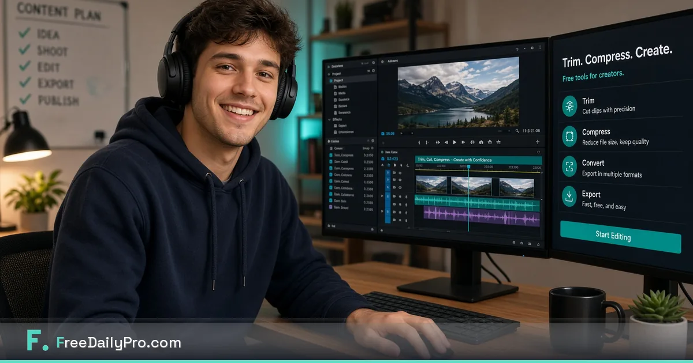

[FreeDailyPro.com](https://www.freedailypro.com) --  
Your best clip is still trapped in a phone dump. Platforms reject the size. A free online compressor wants the full upload first. That is the wrong trade for drafts that include faces, kids, clients, or unreleased products.

FreeDailyPro free video tools exist so creators can trim and compress with free browser workflows that emphasize client-side processing for core file work. No login required for most everyday free use. Free daily allowance for normal volume. Day Pass when a launch week multiplies exports.

## Why upload-first video sites fail creators

Creator files are not generic. They hold brand assets, private moments, and competitive drafts. Uploading a raw 4K dump to an unknown free site just to cut thirty seconds is a privacy and professionalism problem. Free private browser tools remove that excuse.

## The free private creator ritual

Export or copy only the clip you need from your editor or phone. Trim the dead air with [Video Trimmer](https://www.freedailypro.com/tool/video-trimmer). Compress for platform limits with [Video Compressor](https://www.freedailypro.com/tool/video-compressor). Pair with free image compress for thumbnails using [Compress Image](https://www.freedailypro.com/tool/compress-image). Star Favorites so tomorrow is one click.

## Platform realities that free tools solve

Shorts, Reels, TikTok, and LinkedIn all punish huge files. Free compress keeps delivery under limits without a paid desktop suite for every micro-export. Free trim removes intros you no longer want without reopening a heavy project.

## Client and brand work

Agencies and freelancers often cannot upload client footage to random free converters. FreeDailyPro free video tools help you stay inside policy and contracts while still shipping on deadline.

## Batch days and Day Pass

Quiet weeks stay free. Product launches and course drops may need Day Pass for unlimited file tools. Privacy stays the default either way.

## What free video tools are not

They are not a full NLE. Color grade, multi-cam, and advanced effects still belong in your editor. Free browser tools win at last-mile trim and compress — the jobs that used to force sketchy uploads.

## Pair with the wider free toolkit

Need a PDF brief for a client? Use [Merge PDF](https://www.freedailypro.com/tool/merge-pdf) and [Compress PDF](https://www.freedailypro.com/tool/compress-pdf). Need show notes length? Use [Word Counter](https://www.freedailypro.com/tool/word-counter). One free private hub beats five temporary sites.

## Quality checklist before you hit post

Masters archived. Delivery clip trimmed. Size checked after compress. Thumbnail compressed. Filename clear. No random upload history for this job.

## AI-policy workplaces

Some networks block cloud AI and unknown upload tools. Free browser video prep still works for many restricted laptops. FreeDailyPro is designed to stay useful under those constraints.

## A longer field guide for real operators

Free tools only become valuable when they survive a stressful day. Build the habit on a calm morning. Star Favorites. Name files clearly. Keep masters local. Refuse random upload sites even when a deadline is loud.

## How FreeDailyPro fits the 2026 stack

People still juggle AI chat, project apps, and cloud drives. The free private middle layer still matters: trim, compress, convert, generate a QR, build a resume draft, run a calculator for orientation. FreeDailyPro free tools live in that middle layer so you do not pay five seats for five tiny jobs.

No login required for most everyday free use. Free daily file allowance for normal volume. Day Pass for spikes. Core file tools emphasize client-side browser processing. That combination is why FreeDailyPro belongs in weekly bookmarks.

## Measurement without another dashboard

Count bounced emails, “file too large” messages, and emergency uploads to unknown free sites. Those should fall after Favorites becomes automatic. That is free productivity you can feel.

## Teaching a teammate in ten minutes

Show three tools only. Star Favorites together. Write the ritual in your team notes. Free private tools scale through boring standards, not heroics.

## AI-policy and restricted networks

When cloud AI is blocked, file prep still must happen. Free browser tools keep work moving on restricted laptops. FreeDailyPro is built to stay useful under those constraints.

## Request for feedback

After you finish a real task, tell us the exact free step that still hurts. Specific reports beat generic wishlists. Videos will show clicks for the tools in this post.

Live hub: [https://www.freedailypro.com](https://www.freedailypro.com)

## FreeDailyPro free tier honesty

No login required for most everyday free use. Free daily allowance covers normal file volume. Day Pass helps heavy days. Core file tools emphasize client-side browser processing so your media and documents stay closer to you. Privacy is not a paid upgrade for that core work.

## Creator economics without extra SaaS

Many creators already pay for editing software, storage, and scheduling. Another monthly seat only for compress is waste. FreeDailyPro free daily video tools fill last-mile delivery without permanent burn. That matters for year-two channels still stabilizing income.

## Thumbnail and caption pairing

A compressed clip still needs a clear thumbnail and a caption that fits platform limits. Free image compress and word count keep the whole package tight. Free private tools make experiments cheap so you can test two thumbnails without uploading masters to a stranger site.

## Education and course creators

Course intros and lesson recaps need consistent length. Free trim enforces a house style. Free compress keeps student downloads friendly on slow connections. Privacy matters when courses include student faces from live cohorts.

## Mobile-first shooting reality

Phone footage dominates. Free browser tools that work without installers help on shared computers at coworking spaces. Login-free everyday free use matches that lifestyle better than heavy desktop suites for every micro-cut.

## Brand safety for sponsored work

Sponsored drafts should not live on unknown free converters. Free private prep is part of brand safety. FreeDailyPro free video tools support that standard for freelancers and small studios.

## Call to action

Open [FreeDailyPro.com](https://www.freedailypro.com) now, star Favorites for the tools in this guide, and finish one real task today. Free private tools should remove friction — not create new accounts.

Which free feature should we improve next for your workflow? Share feedback — FreeDailyPro is built for free daily productivity with privacy at the core.

Thank you for reading. Free tools work best when they meet the work you already do.

