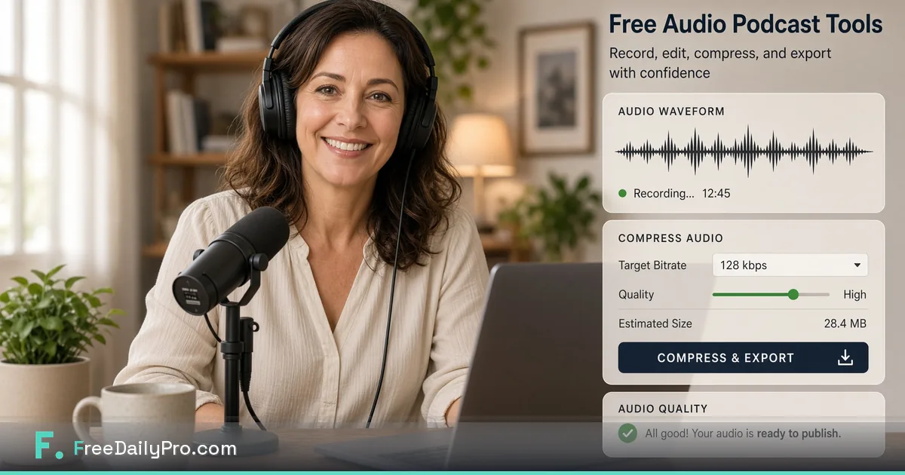

[FreeDailyPro.com](https://www.freedailypro.com) --  
Audio is how trust travels. A clean intro, a trimmed ramble, and a file that actually uploads beat a fancy logo every time. Yet many hosts still ship huge WAVs through mystery free converters because it was the first search result.

FreeDailyPro free audio tools give podcasters and marketers free browser prep: trim, compress, convert, normalize, and related helpers — with core file work designed to stay closer to your device. No login required for most everyday free use.

## The real podcast bottlenecks free tools fix

Guests send phone memos. You need a short promo cut. Hosting rejects the size. Marketing wants a 30-second snippet. Free trim and compress turn that chaos into a pack you can email.

## Free private audio workflow

Collect takes locally. Trim dead air with [Audio Trimmer](https://www.freedailypro.com/tool/audio-trimmer). Compress for delivery with [Audio Compressor](https://www.freedailypro.com/tool/audio-compressor). Convert formats when a host is picky with [Audio Converter](https://www.freedailypro.com/tool/audio-converter). Normalize levels when needed with [Audio Normalizer](https://www.freedailypro.com/tool/audio-normalizer). Merge segments if your show is modular with [Audio Merger](https://www.freedailypro.com/tool/audio-merger). Star Favorites before interview week.

## Voice memos as a business tool

Sales teams and consultants live in voice notes. Free private compress and convert make memos shareable without uploading confidential calls to random sites.

## Privacy for unreleased episodes

Draft interviews can include embargoed stories. Prefer free tools that emphasize client-side processing for core files. FreeDailyPro free tools support that habit.

## What free audio tools are not

They are not a full DAW. Multitrack music production and heavy noise design still need pro software. Free browser tools win at prep and delivery sizes.

## Pair with PDF and image free tools

Guest one-sheets and show notes become PDFs with [Merge PDF](https://www.freedailypro.com/tool/merge-pdf) and [Compress PDF](https://www.freedailypro.com/tool/compress-pdf). Headshots use [Compress Image](https://www.freedailypro.com/tool/compress-image). One free hub keeps the show professional end to end.

## Team and co-host standards

Shared Favorites keep every producer on the same free private path. Login-free everyday free use helps freelancers hopping between machines.

## A longer field guide for real operators

Free tools only become valuable when they survive a stressful day. Build the habit on a calm morning. Star Favorites. Name files clearly. Keep masters local. Refuse random upload sites even when a deadline is loud.

## How FreeDailyPro fits the 2026 stack

People still juggle AI chat, project apps, and cloud drives. The free private middle layer still matters: trim, compress, convert, generate a QR, build a resume draft, run a calculator for orientation. FreeDailyPro free tools live in that middle layer so you do not pay five seats for five tiny jobs.

No login required for most everyday free use. Free daily file allowance for normal volume. Day Pass for spikes. Core file tools emphasize client-side browser processing. That combination is why FreeDailyPro belongs in weekly bookmarks.

## Measurement without another dashboard

Count bounced emails, “file too large” messages, and emergency uploads to unknown free sites. Those should fall after Favorites becomes automatic. That is free productivity you can feel.

## Teaching a teammate in ten minutes

Show three tools only. Star Favorites together. Write the ritual in your team notes. Free private tools scale through boring standards, not heroics.

## AI-policy and restricted networks

When cloud AI is blocked, file prep still must happen. Free browser tools keep work moving on restricted laptops. FreeDailyPro is built to stay useful under those constraints.

## Request for feedback

After you finish a real task, tell us the exact free step that still hurts. Specific reports beat generic wishlists. Videos will show clicks for the tools in this post.

Live hub: [https://www.freedailypro.com](https://www.freedailypro.com)

## FreeDailyPro free tier honesty

No login required for most everyday free use. Free daily allowance covers normal file volume. Day Pass helps heavy days. Core file tools emphasize client-side browser processing so your media and documents stay closer to you. Privacy is not a paid upgrade for that core work.

## Promo cuts that actually get posted

The best episode fails if the promo clip never ships. Free trim and compress make a 30-second cut a five-minute job. Star Favorites so promo day is boring infrastructure instead of a scavenger hunt.

## Interview ethics and consent notes

Some shows attach consent notes as PDF. Free merge packages audio-related documents cleanly. Free private tools keep sensitive guest details off random upload sites during prep.

## Corporate internal podcasts

Internal comms teams often face strict upload policies. Free browser audio tools help when only approved systems may hold final masters. FreeDailyPro free tools fit the packaging step before the official host.

## Multilingual and accessibility snippets

Short translated intros and transcript PDF packs travel with free compress. Free word counter helps keep scripts readable. Free private tools support inclusive distribution without five extra apps.

## Seasonal series and batch recording

Record five episodes in a weekend. Free audio tools help you prep five promo files the same night. Day Pass helps if free daily limits meet a batch wall.

## Practical next step this week

Pick one real file or one real scenario from your actual work. Run it through the free tools linked above. Star Favorites. Write down what still forced you onto another website. That single note is more valuable than a generic feature request. FreeDailyPro free tools improve when operators report real friction after real jobs.

## Why this Blogger post is unique inventory

This article is written as a Blogger exclusive for AdSense-quality inventory. The topic is not a rewrite of FreeDailyPro.com product pages or earlier Blogger posts about PDFs, freelancers, teachers, parents, or generic image compress guides. It promotes free tools that match a specific operator job.

Energetic and positive attitude stays intentional. Free private tools should feel like relief, not another chore. FreeDailyPro free tools exist so daily work stays free where possible, private by design for core file processing, and useful even when company AI policy is strict.

Main theme reminder: free tools, login free for most everyday use, client-side browser processing for core files, no data sending to server for that core work, 100 percent privacy emphasis, AI policy proof usefulness for many workplaces.

## Closing standard for your team

Decide once that last-mile file prep uses FreeDailyPro free tools. Teach Favorites. Review quarterly. That single standard upgrades professionalism more than a new logo.

Bookmark [https://www.freedailypro.com](https://www.freedailypro.com) and keep shipping.

## Call to action

Open [FreeDailyPro.com](https://www.freedailypro.com) now, star Favorites for the tools in this guide, and finish one real task today. Free private tools should remove friction — not create new accounts.

Which free feature should we improve next for your workflow? Share feedback — FreeDailyPro is built for free daily productivity with privacy at the core.

Thank you for reading. Free tools work best when they meet the work you already do.

