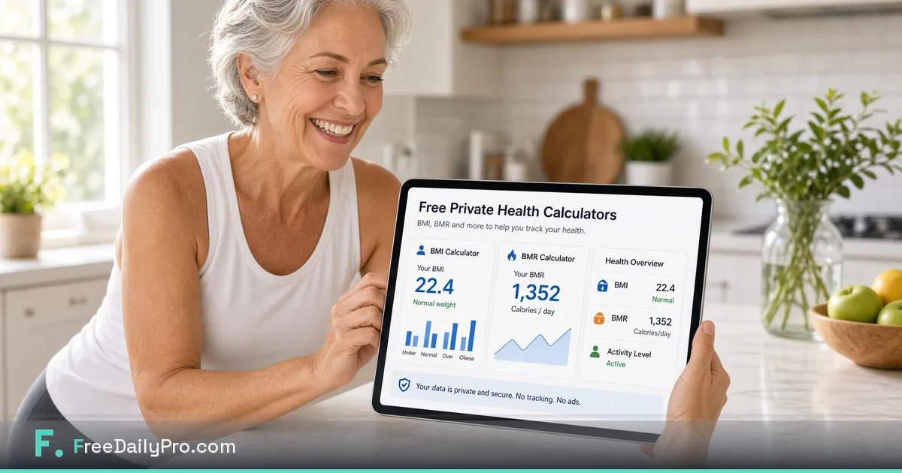

[FreeDailyPro.com](https://www.freedailypro.com) --  
Health numbers feel personal because they are. Free calculators should not require you to create an account and leave a trail just to estimate BMI or daily calorie needs for orientation. FreeDailyPro free health calculators run in the browser for personal exploration — and they are not medical advice.

Use them for rough personal orientation only. Decisions about health belong with qualified professionals.

## Why private orientation tools still matter

People compare plans, track habits, and prepare questions for clinicians. Free private calculators support curiosity without turning every estimate into a marketing profile.

## Free private calculator workflow

Explore [BMI Calculator](https://www.freedailypro.com/tool/bmi-calculator). Explore [BMR Macro Calculator](https://www.freedailypro.com/tool/bmr-macro-calculator). Use [Age Calculator](https://www.freedailypro.com/tool/age-calculator) when forms need quick math. Star Favorites if you revisit weekly. Pair notes with free text tools if you keep a private journal length check via [Word Counter](https://www.freedailypro.com/tool/word-counter).

## Clear boundary: not medical advice

These free tools do not diagnose, treat, or replace clinicians. If you have symptoms or conditions, talk to a professional. Free calculators are for orientation and education, not care plans.

## Privacy mindset

Prefer browser tools that keep everyday calculations local to your session. FreeDailyPro free tools are designed with that privacy emphasis for everyday utilities.

## Families and shared devices

Login-free free tools help households without creating extra accounts for every person. Still protect screen privacy on shared computers.

## Fitness coaches and accountability groups

Coaches can point clients to free private calculators for homework between sessions. The coach still owns professional judgment. The free tool owns the math utility.

## A longer field guide for real operators

Free tools only become valuable when they survive a stressful day. Build the habit on a calm morning. Star Favorites. Name files clearly. Keep masters local. Refuse random upload sites even when a deadline is loud.

## How FreeDailyPro fits the 2026 stack

People still juggle AI chat, project apps, and cloud drives. The free private middle layer still matters: trim, compress, convert, generate a QR, build a resume draft, run a calculator for orientation. FreeDailyPro free tools live in that middle layer so you do not pay five seats for five tiny jobs.

No login required for most everyday free use. Free daily file allowance for normal volume. Day Pass for spikes. Core file tools emphasize client-side browser processing. That combination is why FreeDailyPro belongs in weekly bookmarks.

## Measurement without another dashboard

Count bounced emails, “file too large” messages, and emergency uploads to unknown free sites. Those should fall after Favorites becomes automatic. That is free productivity you can feel.

## Teaching a teammate in ten minutes

Show three tools only. Star Favorites together. Write the ritual in your team notes. Free private tools scale through boring standards, not heroics.

## AI-policy and restricted networks

When cloud AI is blocked, file prep still must happen. Free browser tools keep work moving on restricted laptops. FreeDailyPro is built to stay useful under those constraints.

## Request for feedback

After you finish a real task, tell us the exact free step that still hurts. Specific reports beat generic wishlists. Videos will show clicks for the tools in this post.

Live hub: [https://www.freedailypro.com](https://www.freedailypro.com)

## FreeDailyPro free tier honesty

No login required for most everyday free use. Free daily allowance covers normal file volume. Day Pass helps heavy days. Core file tools emphasize client-side browser processing so your media and documents stay closer to you. Privacy is not a paid upgrade for that core work.

## How to use free calculators responsibly

Write down the question you want answered. Run the free calculator. Bring the result to a professional if decisions are involved. Free tools help curiosity. Clinicians help care.

## Habit tracking without surveillance apps

Some people only need occasional orientation numbers. Free private calculators avoid another always-on account. FreeDailyPro free tools fit that lighter approach.

## Coaches who respect boundaries

Point clients to free private calculators for homework. Do not overclaim what a BMI estimate means. Free tools plus professional ethics beat hype.

## Accessibility of free utilities

Login-free free tools help more people explore numbers without gatekeeping. Still, free calculators are not a substitute for accessible clinical care.

## Pairing with free document tools

If you prepare questions for a visit, free word counter and free PDF packs help you stay organized. Keep health documents private. Prefer free private browser tools for packaging.

## Practical next step this week

Pick one real file or one real scenario from your actual work. Run it through the free tools linked above. Star Favorites. Write down what still forced you onto another website. That single note is more valuable than a generic feature request. FreeDailyPro free tools improve when operators report real friction after real jobs.

## Call to action

Open [FreeDailyPro.com](https://www.freedailypro.com) now, star Favorites for the tools in this guide, and finish one real task today. Free private tools should remove friction — not create new accounts.

Which free feature should we improve next for your workflow? Share feedback — FreeDailyPro is built for free daily productivity with privacy at the core.

Thank you for reading. Free tools work best when they meet the work you already do.

