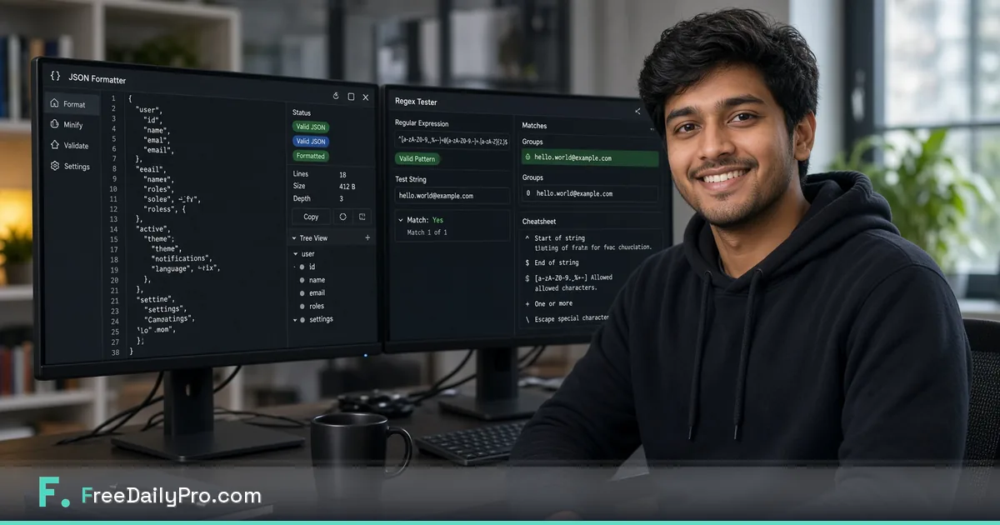

*Format JSON, test regex, and hash strings with free private browser utilities — plus free file tools for tickets.*

[FreeDailyPro.com](https://www.freedailypro.com) --
Developers do not need another revolutionary platform for the tiny jobs that steal focus. Format this JSON. Test that regex. Hash a string. Decode a JWT fragment for debugging. Compress a screenshot for a ticket. Those jobs used to open twelve tabs of unknown quality.

FreeDailyPro free developer utilities put them in one bookmark — free daily use for file volume, no login required for most everyday free use, client-side emphasis for core files.

## The bipartite toolkit

IDE and terminal on one side. Free browser utilities on the other. Pretending a free JSON formatter must be a desktop app is how dock icons multiply.

## Free private developer workflow

Format and validate with [JSON Formatter](https://www.freedailypro.com/tool/json-formatter). Test patterns with [Regex Tester](https://www.freedailypro.com/tool/regex-tester). Use hashing and encoding helpers in the FreeDailyPro developer set when debugging. Compress screenshots with [Compress Image](https://www.freedailypro.com/tool/compress-image). Package notes with [Merge PDF](https://www.freedailypro.com/tool/merge-pdf) and [Compress PDF](https://www.freedailypro.com/tool/compress-pdf). Star Favorites for incident weeks.

## Security hygiene that is non-negotiable

Never paste live secrets into any free tool. Redact. Use samples. Free utilities are not vaults. FreeDailyPro free tools are for productivity — not credential storage.

## Support and incident channels

Messy JSON from logs becomes readable. Regex extracts the field you need. Screenshots compress for tickets. Free private tools keep incident communication professional.

## Juniors and onboarding

Three bookmarks beat a pile of installers. Favorites with JSON, regex, and image compress makes new hires useful on tickets faster.

## What free developer tools are not

They are not your production observability stack. They are the glue between IDE sessions and human communication.

## A longer field guide for real operators

Free tools only become valuable when they survive a stressful day. Build the habit on a calm morning. Star Favorites. Name files clearly. Keep masters local. Refuse random upload sites even when a deadline is loud.

## How FreeDailyPro fits the 2026 stack

People still juggle AI chat, project apps, and cloud drives. The free private middle layer still matters: trim, compress, convert, generate a QR, build a resume draft, run a calculator for orientation. FreeDailyPro free tools live in that middle layer so you do not pay five seats for five tiny jobs.

No login required for most everyday free use. Free daily file allowance for normal volume. Day Pass for spikes. Core file tools emphasize client-side browser processing. That combination is why FreeDailyPro belongs in weekly bookmarks.

## Measurement without another dashboard

Count bounced emails, “file too large” messages, and emergency uploads to unknown free sites. Those should fall after Favorites becomes automatic. That is free productivity you can feel.

## Teaching a teammate in ten minutes

Show three tools only. Star Favorites together. Write the ritual in your team notes. Free private tools scale through boring standards, not heroics.

## AI-policy and restricted networks

When cloud AI is blocked, file prep still must happen. Free browser tools keep work moving on restricted laptops. FreeDailyPro is built to stay useful under those constraints.

## Request for feedback

After you finish a real task, tell us the exact free step that still hurts. Specific reports beat generic wishlists. Videos will show clicks for the tools in this post.

Live hub: [https://www.freedailypro.com](https://www.freedailypro.com)

## FreeDailyPro free tier honesty

No login required for most everyday free use. Free daily allowance covers normal file volume. Day Pass helps heavy days. Core file tools emphasize client-side browser processing so your media and documents stay closer to you. Privacy is not a paid upgrade for that core work.

## Incident channel culture

Paste samples, not secrets. Format JSON in free tools. Attach compressed screenshots. Drop a short PDF timeline if managers need it. Free private utilities keep incident communication professional without turning chat into a credential dump.

## API and webhook debugging days

Marketing engineers and backend developers both live in messy payloads. Free JSON tools reduce friction before data enters CRMs or queues. Keep PII discipline.

## Docs as PDFs without shame

Engineers mock PDF culture until a VP needs a one-pager. Free merge and compress make the one-pager cheap. FreeDailyPro free tools bridge repo culture and stakeholder culture.

## Security review of free tools

Even free private tools deserve caution with secrets. FreeDailyPro free tools are for productivity utilities. Production secrets stay in approved vaults.

## Team standards that stick

A shared Favorites list for JSON, regex, and image compress is a gift to future on-call engineers. Free private tools scale through standards.

## Practical next step this week

Pick one real file or one real scenario from your actual work. Run it through the free tools linked above. Star Favorites. Write down what still forced you onto another website. That single note is more valuable than a generic feature request. FreeDailyPro free tools improve when operators report real friction after real jobs.

## Call to action

Open [FreeDailyPro.com](https://www.freedailypro.com) now, star Favorites for the tools in this guide, and finish one real task today. Free private tools should remove friction — not create new accounts.

Which free feature should we improve next for your workflow? Share feedback — FreeDailyPro is built for free daily productivity with privacy at the core.

Thank you for reading. Free tools work best when they meet the work you already do.
