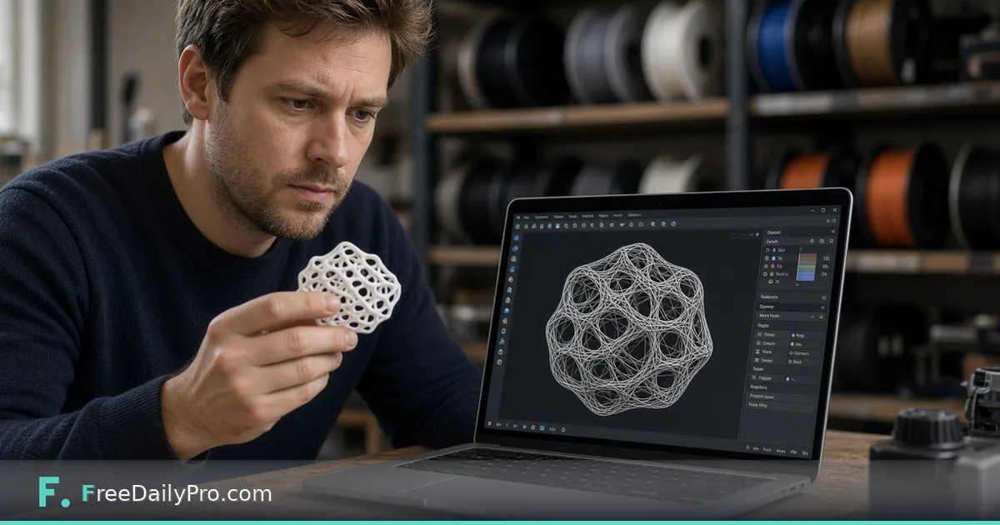

*Orbit a wireframe mesh in the browser and check bounding-box scale before printing*

[FreeDailyPro.com](https://www.freedailypro.com) --
The print fails at hour six because units were wrong—or the mesh was hollow junk you never inspected.

FreeDailyPro’s free [3D Mesh Viewer](https://www.freedailypro.com/tool/mesh-3d-viewer) is built for that moment. Drop STL, OBJ, or PLY, orbit a wireframe, read vertex/triangle counts and bounding-box dimensions in the browser. No install theater. No account required for normal free use on FreeDailyPro’s free tools. Work happens in the browser with FreeDailyPro’s privacy-first posture: everyday utilities without treating your files or numbers as marketing fuel.

## The real-world problem

Installing CAD on every club laptop is painful. Marketplace thumbnails hide missing faces and scale disasters. People do not need another subscription for a focused job. They need a trustworthy free tool they can open, finish, and close.

## What 3D Mesh Viewer actually does

Open [3D Mesh Viewer](https://www.freedailypro.com/tool/mesh-3d-viewer) and work through the obvious path without a tutorial marathon. Drop STL, OBJ, or PLY, orbit a wireframe, read vertex/triangle counts and bounding-box dimensions in the browser. Preview when the tool offers it. Download or copy only when the result looks right. That simple loop beats guessing in heavy desktop software you open twice a year.

## A practical workflow for makerspaces, classrooms, and home printers

1. Start with a real example from your week—not a toy sample you will ignore later.
2. Open [3D Mesh Viewer](https://www.freedailypro.com/tool/mesh-3d-viewer) in a normal browser tab.
3. Complete the steps slowly the first time and note one friction point.
4. Save outputs with clear names that include a date.
5. Pair nearby free tools only if the next step is truly necessary: [Mesh 3D Converter](https://www.freedailypro.com/tool/mesh-3d-converter), [Compress Image](https://www.freedailypro.com/tool/compress-image), [Universal File Converter](https://www.freedailypro.com/tool/universal-file-converter).

Printing, publishing, or sharing without a quick quality check is how small mistakes become public. Build a pause into the habit: look once, then send.

## Viewer before converter before slicer

Inspect scale first. Convert formats second. Slice third. Skipping steps is how spaghetti prints happen.

## Club hygiene

Filename notes like ok-scale-mm stop five people from re-checking the same mesh. Shared tools need shared habits.

## Privacy, logins, and corporate AI policies

FreeDailyPro’s free tools emphasize client-side browser work, no login for most utilities, and not shipping your everyday files to a mystery server for basic chores. That story matters for homework, side-gig receipts, and personal finance numbers alike. If your workplace blocks AI chat tools, remember many FreeDailyPro utilities are not generative models—they are calculators and file tools. The [corporate-safe tools](https://www.freedailypro.com/corporate-safe-tools) page explains the stance in plain language for IT-curious managers.

## Related free tools without a Rube Goldberg stack

Stay focused on [3D Mesh Viewer](https://www.freedailypro.com/tool/mesh-3d-viewer) as the hero. When you truly need a neighbor tool, use [Mesh 3D Converter](https://www.freedailypro.com/tool/mesh-3d-converter), [Compress Image](https://www.freedailypro.com/tool/compress-image), [Universal File Converter](https://www.freedailypro.com/tool/universal-file-converter). Browse the broader [3D tools](https://www.freedailypro.com/category/3d-tools) area or start from [FreeDailyPro.com](https://www.freedailypro.com/) if you are exploring categories for the first time.

## Honest limits

Not a slicer, not a mesh repair suite, and huge files may be slow in-browser. Free file-tool daily limits may apply depending on FreeDailyPro’s current free tier—plan busy days accordingly. Non-file calculators and text tools are typically unlimited, but always work from the live site rules.

## YouTube videos are coming

Tool-specific YouTube videos are on the roadmap so you can watch the clicks instead of only reading steps. Until those land, the free tool UI itself is the best teacher—open it with a real task and learn in minutes.

## Try it this week

Open [3D Mesh Viewer](https://www.freedailypro.com/tool/mesh-3d-viewer) with something real from your life. Finish the job. Save the result cleanly. Notice how much lighter the chore feels when the tool matches the problem.

What should FreeDailyPro build next for people in makerspaces, classrooms, and home printers? Tell us one concrete workflow. Free tools get better when readers report friction honestly. You’ve got this—small competent habits beat flashy software you never open.

## Why this beats a random search result

Search results for free tools are noisy. Ads, forced signups, and unclear privacy policies waste the time you saved by not installing software. FreeDailyPro’s free [3D Mesh Viewer](https://www.freedailypro.com/tool/mesh-3d-viewer) sits inside a larger free toolkit with a consistent story: browser-first, login-light, and honest about limits. That consistency is why a seven-day Blogger series can introduce different tools without teaching a new company’s rules every morning.

## A note for Blogger readers specifically

If you found this on Blogger, you probably like DIY energy and clear steps. Good. Use the live links, not screenshots of links. Publish your own tips if you adapt the workflow—and keep your angles unique so you are not cloning FreeDailyPro.com posts word for word. Cross-platform content works best when each platform gets a fresh story, which is exactly how this package was planned.

Extra practical note 1 for readers following the 2026-10-11-mesh-3d-viewer-check-before-print guide: set a five-minute timer, complete one real example end to end, and write a single sentence about what surprised you. That reflection turns a free tool click into a reusable skill you will actually remember next month when the same problem returns under time pressure. Detail seed: 2026-10-11-mesh-3d-viewer-check-before-print-pad-1.

Extra practical note 2 for readers following the 2026-10-11-mesh-3d-viewer-check-before-print guide: set a five-minute timer, complete one real example end to end, and write a single sentence about what surprised you. That reflection turns a free tool click into a reusable skill you will actually remember next month when the same problem returns under time pressure. Detail seed: 2026-10-11-mesh-3d-viewer-check-before-print-pad-2.

Extra practical note 3 for readers following the 2026-10-11-mesh-3d-viewer-check-before-print guide: set a five-minute timer, complete one real example end to end, and write a single sentence about what surprised you. That reflection turns a free tool click into a reusable skill you will actually remember next month when the same problem returns under time pressure. Detail seed: 2026-10-11-mesh-3d-viewer-check-before-print-pad-3.

Extra practical note 4 for readers following the 2026-10-11-mesh-3d-viewer-check-before-print guide: set a five-minute timer, complete one real example end to end, and write a single sentence about what surprised you. That reflection turns a free tool click into a reusable skill you will actually remember next month when the same problem returns under time pressure. Detail seed: 2026-10-11-mesh-3d-viewer-check-before-print-pad-4.
