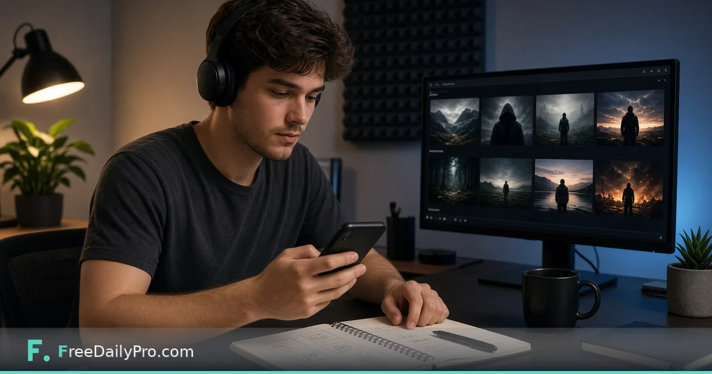

*Download available thumbnail resolutions without scrubbing a timeline for hours.*

[FreeDailyPro.com](https://www.freedailypro.com) -- You are rewriting a video title for the third time. The thumbnail is half the click. You want to study what worked on an old upload—or grab a clean frame reference for a redesign—without scrubbing a timeline for twenty minutes.

This post is about downloading YouTube thumbnails at available resolutions for review and creative reference. The primary tool is FreeDailyPro’s free [YouTube Thumbnail Downloader](https://www.freedailypro.com/tool/yt-thumbnail). Related tools: [Compress Image](https://www.freedailypro.com/tool/compress-image) when a thumbnail must fit an upload cap elsewhere, and [Remove Background](https://www.freedailypro.com/tool/remove-background) only if you are building a new composite (and have rights to do so). Browse [file and misc tools](https://www.freedailypro.com/category/file-tools) as needed.

## What the tool does—and does not do

Paste a YouTube URL into [YouTube Thumbnail Downloader](https://www.freedailypro.com/tool/yt-thumbnail). The tool lists thumbnail sizes YouTube actually generated for that video. Download the ones you need. Highest resolution is not guaranteed for every video; the page is honest that availability varies.

This is not a video downloader. It is not a license grant. Thumbnails are useful for:

- Competitive layout study (what text size works at small sizes)
- Your own channel’s archive when the studio file went missing
- Mood boards for a redesign you will shoot yourself

It is not a free pass to republish someone else’s thumbnail as your own content.

## A creator workflow that stays ethical

1. Collect URLs of your own past videos or public references you will only study.
2. Download candidates with [YouTube Thumbnail Downloader](https://www.freedailypro.com/tool/yt-thumbnail).
3. Label files clearly: `mine-2025-launch-maxres.jpg` vs `ref-study-only.jpg`.
4. For study, print or view at phone size—thumbnails live or die small.
5. Design your new thumbnail in your usual editor using your own footage and type.
6. If you must upload the final art somewhere with a size limit, run [Compress Image](https://www.freedailypro.com/tool/compress-image).

## Why “maxres” sometimes missing is normal

YouTube serves multiple thumbnail resolutions. Not every upload has every size. If only lower resolutions appear, that is the platform’s inventory for that video—not FreeDailyPro withholding a secret file. Use the largest available and redesign if you need sharper marketing art from your own masters.

## Team reviews without the “send me the Photoshop” delay

Editors and producers can pull thumbnails during standup, drop them into a shared board, and decide A/B tests without exporting from the YouTube Studio UI on one person’s login. Keep a dated folder per campaign. When a test wins, archive the winner’s URL and thumbnail file together.

## Honest limits

- Does not edit the thumbnail on YouTube for you
- Does not guarantee 1280×720 for all videos
- Does not replace brand design skill
- Does not grant copyright permission

If you need frame grabs from the video body, that is a different problem (local video tools or official studio downloads of your own content).

## Privacy and corporate policies

Public YouTube URLs are public. Still, work devices may restrict streaming sites. Follow IT policy. Do not paste unlisted video URLs into tools on shared screen recordings if the link was meant to stay quiet.

## Pairing with FreeDailyPro video tools when the job grows

When you move from thumbnail study to actual clip work, FreeDailyPro’s video category includes trim and compress workflows that run in the browser for files you own. Thumbnails start the conversation; the cut finishes it.

## Closing

Thumbnails are tiny billboards. FreeDailyPro’s [YouTube Thumbnail Downloader](https://www.freedailypro.com/tool/yt-thumbnail) pulls the sizes YouTube exposes so you can study or recover art quickly—then build your own. Paste the URL, pick a size that exists, download, label ethically, redesign with your footage.

## Building a swipe file the right way

Pros study composition: face crop, text contrast, left/right eye flow. Save references in a “study only” album. When you design, put your own talent, product, and type on the canvas. Inspiration is normal; pixel-for-pixel cloning of another channel’s art is not a growth strategy—it is a risk.

## A/B testing without losing the winners

Name files with dates and variants: `2026-10-10-thumb-a-yellow-text.jpg`. When analytics crown a winner, keep the file and the video URL together. Tools change; your folder structure is the long-term memory.

## Non-creator uses

Teachers pulling a thumbnail for a citation slide, journalists verifying what image accompanied a public video, and marketers checking brand misuse all benefit from a fast download of what YouTube actually serves. Still respect copyright when republishing.

## Image pipeline after download

If the thumbnail will be embedded in a newsletter, compress thoughtfully with [Compress Image](https://www.freedailypro.com/tool/compress-image). If you are mockups-only, keep the highest available resolution as the master study file and compress derivatives only.

## Channel audits in one afternoon

List your top ten videos by impressions. Download each thumbnail. Lay them out in a grid on a large monitor. Patterns appear: the same face crop every time, text that vanishes on mobile, too much clutter. An audit like this needs the actual served images—not memory of what you think you uploaded.

## Collaborations and guest features

When you guest on someone else’s channel, download the final public thumbnail for your portfolio page and media kit. Ask permission before reusing their art beyond fair editorial context. Your media kit should label the image as the video’s public thumbnail, not as your independent design sample, unless you designed it.

## Troubleshooting empty results

If no thumbnails appear, check the URL format, try the short `youtu.be` form or full watch URL, and confirm the video is public or otherwise reachable. Private videos you cannot access will not yield thumbnails through a public URL paste.

## From study to production checklist

- Download study refs
- Note three patterns to try
- Shoot or export new masters from your own footage
- Export 1280×720 (or current platform recommendation)
- Compress only for delivery targets that require it
- Upload and verify the live video shows the new art

## Mobile vs desktop perception

Always review downloaded thumbnails on a phone screen. Desktop monitors flatter tiny text. If the joke or the product name vanishes at phone size, the thumbnail fails its main job—even if it looks cinematic on a 27-inch display.

## Seasonal refreshes

Holiday variants of evergreen videos deserve fresh thumbnails. Download last year’s version for continuity cues (same face crop, new prop), then shoot the update. Keep both files so you can revert if the seasonal art underperforms.

**[Download a YouTube thumbnail](https://www.freedailypro.com/tool/yt-thumbnail)**
