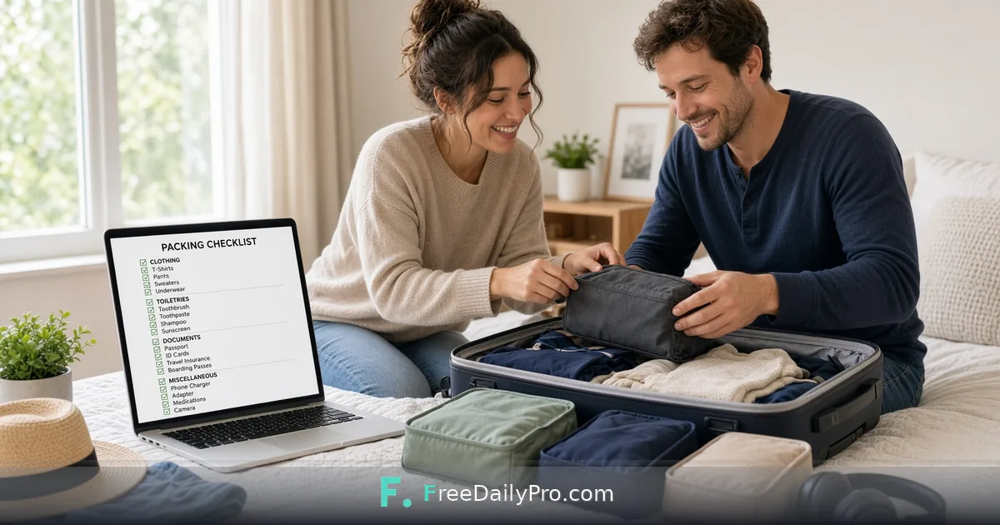

*Generate a checklist by trip type so you stop forgetting chargers and packing three extra jackets*

[FreeDailyPro.com](https://www.freedailypro.com) --
The suitcase is open. The flight is early. You are replaying the same mental checklist and still missing the outlet adapter. Panic packing is expensive—in luggage fees and in stress.

[FreeDailyPro.com](https://www.freedailypro.com) free [Travel Packing List](https://www.freedailypro.com/tool/travel-packing-list) generates a packing checklist by trip type so you start from a structured base and edit for your reality. No install. No account required for normal free use. Work stays in the browser with FreeDailyPro’s privacy-first posture—your itinerary details are not marketing fuel.

## The real-world problem

Every trip is different: beach weekend, winter city, business conference, family road trip. A generic list either underpacks essentials or overpacks “just in case” bulk. Spreadsheets help until you rebuild them every time.

Travelers need a fast starter list they can customize in minutes, then check off while packing.

## What the Travel Packing List tool actually does

Open [Travel Packing List](https://www.freedailypro.com/tool/travel-packing-list). Choose or describe a trip type. Generate a structured checklist. Edit items. Use it while you pack.

Nearby FreeDailyPro travel helpers complete the planning set:
- [Travel Budget Planner](https://www.freedailypro.com/tool/travel-budget-planner) for cost totals
- [Travel Itinerary Planner](https://www.freedailypro.com/tool/travel-itinerary-planner) for day-by-day plans
- [Travel Countdown & To-Do Planner](https://www.freedailypro.com/tool/travel-countdown-planner) when pre-trip tasks pile up
- [Moving Cost Estimator](https://www.freedailypro.com/tool/moving-cost-estimator) if the “trip” is actually a relocation

Explore [travel planning tools](https://www.freedailypro.com/category/travel-tools) when you want the full category.

## A practical packing workflow that reduces stress

1. Decide trip type and climate honestly.
2. Open [Travel Packing List](https://www.freedailypro.com/tool/travel-packing-list) and generate a base list.
3. Cut anything you always overpack.
4. Add personal non-negotiables: meds, chargers, documents, kids’ comfort items.
5. Pack by category (clothes, toiletries, documents, tech) instead of random piles.
6. Do a final “first night bag” mini-list for arrival.

The list is a tool, not a prison. Edit aggressively.

## Categories that save people repeatedly

Documents: ID, tickets, insurance cards, copies stored separately.

Tech: chargers, adapters, power banks, headphones.

Health: meds, basic first aid, any necessary devices.

Clothes: plan outfits by day instead of bulk guessing.

Kids/pets extras when relevant: never optional.

If an item is hard to replace at the destination, it rises on the list.

## Privacy for itineraries and personal details

Trip plans can include addresses, booking codes, and family details. FreeDailyPro’s free tools emphasize client-side browser work and login-light utilities. That is calmer than pasting everything into random travel apps you will never use again. See [corporate-safe tools](https://www.freedailypro.com/corporate-safe-tools) if you need the plain-language privacy stance for work travel devices.

## Common packing failure modes

Buying more clothes “for the trip” instead of planning mixes.

Forgetting climate (rain, humidity, formal dinner).

Leaving liquids packing until airport security.

Not separating dirty laundry strategy for multi-week trips.

No return-home bag for chargers and keys.

A checklist will not cure all habits, but it catches the repeatable misses.

## Related free tools without building a travel agency

Stay focused on [Travel Packing List](https://www.freedailypro.com/tool/travel-packing-list). Add [Travel Budget Planner](https://www.freedailypro.com/tool/travel-budget-planner), [Travel Itinerary Planner](https://www.freedailypro.com/tool/travel-itinerary-planner), and countdown tools when the next planning step is real. Start from [FreeDailyPro.com](https://www.freedailypro.com/) to explore.

## Honest limits

A generator cannot know airline bag rules for every carrier or your medical needs. Free tools follow live site rules. Always verify liquid limits, battery rules, and destination regulations yourself.

## A calm 48-hour packing plan

Two days out: generate list, gather documents, wash clothes.

One day out: pack clothes and tech, weigh bag if flying.

Night before: documents and meds in a fixed pocket. Stop rearranging.

Morning of: only the “last grab” tray (keys, wallet, phone, charger).

Calm packing is a schedule, not a talent.

## Family and group packing without chaos

When multiple people share a bag or a trip, assign categories: one person owns documents, another owns meds, another owns kids’ comfort items. Generate one master list in [Travel Packing List](https://www.freedailypro.com/tool/travel-packing-list), then split ownership in a shared note. Shared ownership without names is how chargers get left behind.

For road trips, add car-specific items: spare cable, paper maps backup, snacks that will not melt, trash bags. For flights, prioritize liquids strategy and battery rules early—not at the security line.

## Carry-on versus checked strategy

Pack a “survive if checked bag is delayed” set: one outfit, meds, chargers, documents, and any critical work gear. Put it in the bag that stays with you. The packing list should mark those items clearly so they never migrate to the checked suitcase at the last minute.

## After-trip debrief for better future lists

On the flight home or the next morning, note what you never used and what you desperately needed. Update your personal template. Over three trips the list becomes uniquely yours—and much shorter.

## YouTube videos are coming

Tool-specific YouTube videos are on the roadmap so you can watch the clicks instead of only reading steps. Until those land, the free tool UI itself is the best teacher—open it with a real upcoming trip and learn in minutes.

## Why this beats a random search result

Random packing blogs are endless and contradictory. FreeDailyPro’s free [Travel Packing List](https://www.freedailypro.com/tool/travel-packing-list) is immediate, private, and connected to related free travel planners. That is a better pre-trip ritual.

## A note for Blogger readers specifically

If you found this on Blogger, generate a list for your next real trip today. If you publish tips, keep them unique and grounded in your own packing lessons. Fresh stories beat cloned posts.

## Try it this week

Open [Travel Packing List](https://www.freedailypro.com/tool/travel-packing-list) for a trip on your calendar—or a pretend weekend getaway if you need practice. Customize. Pack with the list. Notice what you no longer forget.

What travel planning step should FreeDailyPro improve next? Tell us one concrete friction. Free tools get better when readers report honestly. You’ve got this—structured lists beat last-minute panic.

## Weather and laundry reality

Pack for the forecast and for one laundry cycle if the trip is long. Lists fail when they assume infinite suitcase volume. Rank items must / should / nice—cut from nice first.

## Documents packet

Passport, insurance card, booking PDFs: keep digital and one paper backup for border-critical IDs when appropriate. Pair packing list with a single merged PDF of tickets if that helps your travel style—using FreeDailyPro PDF tools you already know.
