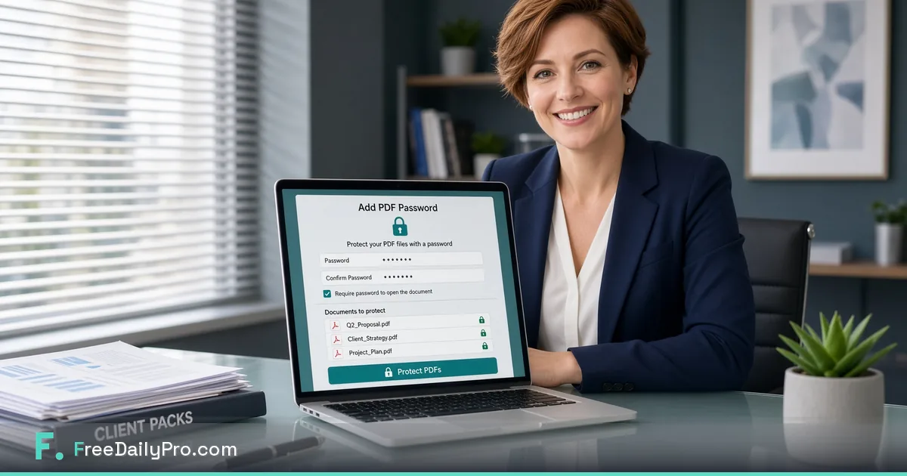

*Lock proposals and contracts with free Add PDF Password — no Adobe seat and no mystery upload site.*

[FreeDailyPro.com](https://www.freedailypro.com) --
You finished the proposal. The numbers are clean. The scope is clear. Then a quiet doubt hits: this PDF still opens for anyone who intercepts the email thread.

That doubt is rational. Client packs hold pricing, personal details, and unfinished strategy. Sending them wide open is a habit, not a standard. FreeDailyPro free [Add PDF Password](https://www.freedailypro.com/tool/pdf-password) exists so you can lock the file in the browser before you hit send — without an Adobe subscription and without trusting a random “encrypt PDF online” uploader.

## The send-button problem freelancers still ignore

Many freelancers obsess over design and under-invest in delivery hygiene. A beautiful deck that anyone can forward is not professional. A contract draft that sits unprotected in an inbox chain is not careful. Free password protection is the missing last mile between “ready” and “sent.”

Privacy here is practical, not theatrical. You are not hiding from clients. You are controlling first access so the right person opens the right version.

## What Add PDF Password is for

[Add PDF Password](https://www.freedailypro.com/tool/pdf-password) helps you place a password on a PDF you already own. Typical uses: proposals, statements of work, invoices with sensitive line items, portfolio samples under NDA, and internal rate cards that should not roam freely.

It is free for everyday volume. No login required for most everyday free use. Core file work is designed to stay in the client-side browser. That matches FreeDailyPro’s standing promise: free tools, privacy emphasis, and usefulness even when company AI policy is strict.

## A free private lock ritual that takes minutes

Build the pack first. Convert source docs with [Word to PDF](https://www.freedailypro.com/tool/word-to-pdf) when needed. Combine pieces with [Merge PDF](https://www.freedailypro.com/tool/merge-pdf). Shrink the delivery file with [Compress PDF](https://www.freedailypro.com/tool/compress-pdf). Then lock it with [Add PDF Password](https://www.freedailypro.com/tool/pdf-password).

Share the password on a separate channel when stakes are high — chat, call, or password manager link — not in the same email body as the attachment. That single discipline stops most casual leakage.

## Why upload-first encrypt sites fail the professionalism test

Search results still push free encrypt pages that demand a full upload. For client pricing and personal data, that is a weak story. Prefer free tools that emphasize client-side processing for core files. FreeDailyPro free tools are built for that habit.

You should be able to tell a client, honestly: the file was prepared with free private browser tools and was not parked on an unknown converter farm.

## Who this workflow serves best

Independent consultants shipping strategy decks. Designers sending concepts under review. Bookkeepers delivering monthly packs. Agencies routing work through freelancers who bounce between laptops. Anyone who needs login-free free tools on a borrowed machine the day before a deadline.

## What free password tools are not

They are not a full digital rights platform. They do not track every open or revoke access after the fact. They do not replace legal advice, NDAs, or secure client portals when the engagement requires them. Free Add PDF Password wins at a clear job: stop open attachment culture for everyday client PDFs.

## Pairing password with size and structure

A locked file that is still 40MB frustrates recipients on mobile. Free compress after merge keeps the pack polite. Free word-to-PDF keeps source formatting under control before you lock. One free private hub beats three temporary sites and one overdue Adobe invoice.

## Password craft that does not annoy clients

Use a strong unique password. Avoid birthdays and company names. Send it separately. If the client team is large, confirm who needs access before you lock. Professionalism is clarity, not friction for its own sake.

## AI-policy workplaces and shared machines

Some networks block cloud AI and unknown upload tools. Free browser PDF prep still moves work forward on restricted laptops. FreeDailyPro free tools stay useful under those constraints. Login-free everyday free use helps when you cannot install software.

## A Monday morning client-pack checklist

Sources converted. Pages merged in order. File compressed for email. Password added. Password shared on a second channel. Filename clear: Client_Project_Proposal_v3.pdf. Masters kept local. No mystery upload history for this job.

## Batch weeks and Day Pass honesty

Quiet weeks stay free. Launch weeks and agency handoff days may need Day Pass for unlimited file tools. Privacy remains the default either way. Free daily allowance covers normal volume. Ads help keep free use sustainable.

## Teaching a collaborator in ten minutes

Show [Add PDF Password](https://www.freedailypro.com/tool/pdf-password) once. Show merge and compress once. Star Favorites together. Write the ritual into your agency wiki. Free private tools scale through boring standards, not heroics.

## Common mistakes that still leak trust

Locking after the email already went out. Putting the password in the same message as the file. Skipping compress so mobile users struggle. Using the same password for every client. Uploading sensitive drafts to a free encrypt site “just this once.”

## FreeDailyPro free tier in plain language

No login required for most everyday free use. Free daily file allowance for normal work. Day Pass for spikes. Monthly options for continuous high volume. Core file tools emphasize client-side browser processing so documents stay closer to you. Privacy is not a paid upgrade for that core work.

## Why this post is not another generic PDF guide

This is not merge-split-compress 101. It is not an invoice template tour. It is not a “stop uploading everything” manifesto without a tool. The job is specific: add a password before client send, with free private browser tools you can bookmark today.

Live entry points stay simple. Open [Add PDF Password](https://www.freedailypro.com/tool/pdf-password). Browse more PDF helpers under [PDF tools](https://www.freedailypro.com/category/pdf-tools). Keep the whole free hub at [FreeDailyPro.com](https://www.freedailypro.com).

## Measurement without another SaaS dashboard

Count how often you used to send open PDFs “because it was faster.” Count how often clients asked for a safer share. After Favorites includes Add PDF Password, those numbers should move. That is free productivity you can feel.

## Seasonal reality for freelancers

Proposal season, tax adjacency months, and agency pitch weeks raise volume. Free private lock habits matter most when volume peaks and attention drops. Build the ritual on a calm day so stress days stay clean.

## Coming soon: short videos for exact clicks

We plan tool-specific YouTube videos so you can see Add PDF Password, merge, and compress in real time. Until then, the tools are live and free to try on a non-sensitive sample file first.

## Call to action

Open [Add PDF Password](https://www.freedailypro.com/tool/pdf-password) now. Lock one real client pack. Compress if it is heavy. Send the password on a separate channel. Star Favorites so next week’s send is automatic.

Which free PDF step still forces you onto another site after a real client job? Share feedback — FreeDailyPro is built for free daily productivity with privacy at the core.

Thank you for reading. Free tools work best when they protect the work you already ship with care.
