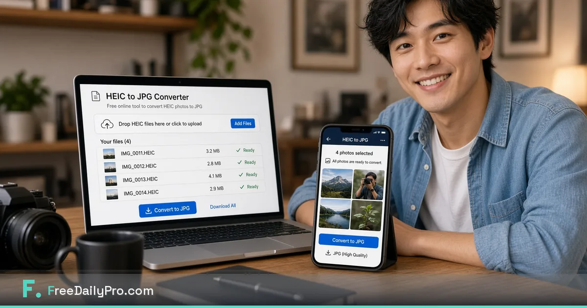

*Free HEIC to JPG in your browser when clients, insurers, and forms still demand JPEG.*

[FreeDailyPro.com](https://www.freedailypro.com) --
Your iPhone shot looks perfect. The portal rejects it. The insurer form wants JPG. The client Windows laptop shows a blank icon. HEIC is efficient on Apple devices and awkward everywhere else.

FreeDailyPro free [HEIC to JPG](https://www.freedailypro.com/tool/heic-to-jpg) exists so you can convert work photos in the browser without parking a full camera roll on a mystery free converter. No login required for most everyday free use. Free daily allowance for normal volume. Core file work emphasizes client-side processing so images stay closer to you.

## Why HEIC still breaks professional handoffs

Apple’s default format saves space. Portals, email systems, and older Windows setups often do not care. Freelancers, adjusters, support teams, and field workers burn time re-exporting from Photos instead of finishing the job.

Search demand for HEIC to JPG stays high for a reason. People need a free private path that does not require installing another desktop suite for a single conversion batch.

## The free private HEIC ritual

Keep masters in your phone library or archive. Export or share only the frames you must deliver. Convert with [HEIC to JPG](https://www.freedailypro.com/tool/heic-to-jpg). Compress for email or portals with [Compress Image](https://www.freedailypro.com/tool/compress-image). Star Favorites so the next claim pack is automatic.

## Who hits this wall every week

Photographers delivering to Windows clients. Customer support collecting damage photos. Sellers documenting products from an iPhone. Anyone whose workflow starts on iOS and ends on a picky form.

## Privacy for personal and work scenes

Phone photos often include home interiors, faces, plates, and unreleased products. Prefer free tools that emphasize client-side processing for core files. FreeDailyPro free tools support that habit.

## What free HEIC conversion is not

It is not a full photo editor. Color grading still belongs in your editor. Free browser conversion wins at last-mile format delivery — the job that used to force sketchy upload sites.

## Quality checklist before you submit

Masters archived. Deliverable is true JPG. Size acceptable after compress. Filename clear. Orientation correct. No mystery upload history for this batch.

## AI-policy and shared machines

Some workplaces block cloud AI and unknown upload tools. Free browser conversion still helps on restricted laptops. Login-free everyday free use helps on borrowed PCs.

## A practical standard for your team

Build the habit on a calm morning. Star Favorites. Keep masters local. Refuse random upload farms even when a deadline is loud.

FreeDailyPro free tools live in the middle layer of work: convert, label, lock, compress, track — without demanding another permanent seat for a five-minute job.

Count the bounced portals, confused stakeholders, and emergency uploads to unknown free sites. Those should fall after Favorites becomes automatic.

Show a collaborator three tools only. Write the ritual in your notes. Free private tools scale through boring standards, not heroics.

## Why FreeDailyPro fits this job

When cloud AI is blocked, file prep still must happen. Free browser tools keep work moving on restricted laptops. FreeDailyPro is designed to stay useful under those constraints.

Main theme reminder: free tools, login free for most everyday use, client-side browser processing for core files, strong privacy emphasis, useful under strict AI policy.

Name files clearly. Version them. Archive masters. Delivery copies should be intentional, not accidental exports from a rushed photo dump or live spreadsheet.

Quiet weeks stay free. Seasonal spikes may need Day Pass for unlimited file tools. Privacy remains the default either way. Ads help keep free use sustainable.

## FreeDailyPro free tier honesty

No login required for most everyday free use. Free daily allowance covers normal file volume. Day Pass helps heavy days. Core file tools emphasize client-side browser processing so your files stay closer to you. Privacy is not a paid upgrade for that core work.

## What is coming next

Short videos will show exact clicks for HEIC to JPG and related free tools. Tell us which free step still forces you onto another site after a real job. FreeDailyPro improves fastest from specific friction reports.

## Portal and email realities in 2026

Many forms still validate file extensions more strictly than they admit. A HEIC that opens on your phone can fail silently on a claims portal. Free conversion before upload prevents the support ticket loop.

Email clients and ticket systems also mishandle HEIC attachments. JPG remains the safe handoff format for mixed-device teams. FreeDailyPro free [HEIC to JPG](https://www.freedailypro.com/tool/heic-to-jpg) keeps that handoff inside a free private browser path.

## Field workflow that survives bad signal

Capture on iPhone. Convert when you reach stable Wi-Fi on your laptop. Compress for the portal. Do not convert on unknown public PCs with shady extensions. Login-free free tools help, but you still choose a trustworthy machine.

## Client education without lectures

A one-line note helps: “Deliverables are JPG for compatibility; HEIC masters stay in archive.” Free private tools make that standard easy to keep. Clients care about opening the file, not about format debates.

## Seasonal spikes

Storm seasons, move-in seasons, and product launch seasons multiply phone photos. Free daily allowance covers normal volume. Day Pass helps when a single week explodes. Privacy stays the default.

## Pairing with PDF packs

When photos must travel with a report, convert first, then place images into a PDF pack with free merge and compress tools on FreeDailyPro. The whole delivery stays free-private end to end.

## Practical next step this week

Pick one real file from your actual work. Run it through the free tools linked above. Star Favorites. Write down what still forced you onto another website. That single note is more valuable than a generic feature request. FreeDailyPro free tools improve when operators report real friction after real jobs.

Bookmark [https://www.freedailypro.com](https://www.freedailypro.com) and keep shipping with free private habits.

## Call to action

Open [HEIC to JPG](https://www.freedailypro.com/tool/heic-to-jpg) now, complete one real task today, and star Favorites. Free private tools should remove friction — not create new accounts.

Which free feature should we improve next for your workflow? Share feedback — FreeDailyPro is built for free daily productivity with privacy at the core.

Thank you for reading. Free tools work best when they meet the work you already do.
