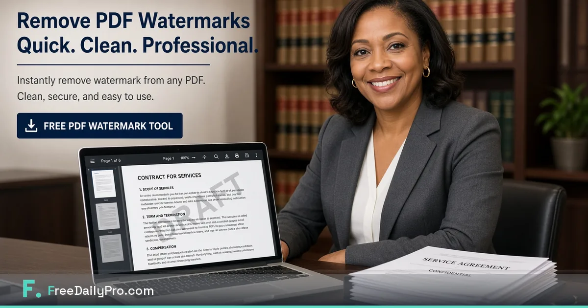

*Add free PDF watermarks to proposals and samples so early versions cannot be mistaken for finals.*

[FreeDailyPro.com](https://www.freedailypro.com) --
You sent a sample. Two weeks later it shows up in a thread as if it were the final. No watermark. No version mark. Just your work floating without a label.

FreeDailyPro free [PDF Watermark](https://www.freedailypro.com/tool/pdf-watermark) helps you stamp DRAFT, SAMPLE, or CONFIDENTIAL on PDFs in the browser before they leave your desk. No Adobe seat. No login required for most everyday free use. Client-side emphasis for core file work.

## Why watermarking is a professionalism habit

Watermarks are not paranoia. They are labels. Early pricing, incomplete scopes, and creative samples should not be treated as signed finals.

Freelancers and small teams who watermark drafts reduce awkward disputes. Free tools make the habit cheap enough to keep.

## The free private draft ritual

Build the pack with [Word to PDF](https://www.freedailypro.com/tool/word-to-pdf) and [Merge PDF](https://www.freedailypro.com/tool/merge-pdf). Compress with [Compress PDF](https://www.freedailypro.com/tool/compress-pdf). Stamp with [PDF Watermark](https://www.freedailypro.com/tool/pdf-watermark). When sensitive, lock with [Add PDF Password](https://www.freedailypro.com/tool/pdf-password). Star Favorites.

## Good watermark text that stays clear

DRAFT. SAMPLE. NOT FOR DISTRIBUTION. CONFIDENTIAL. Version dates when helpful. Keep text readable but not so heavy the document becomes unusable for review.

## What free watermark tools are not

They are not full DRM. They do not replace contracts or NDAs. They win at honest labeling for everyday professional delivery.

## Pair with password when stakes rise

Watermark labels the file. Password controls first open. Use both for rate cards and unreleased strategy. Free private tools on FreeDailyPro cover both jobs.

## Teams hopping machines

Login-free everyday free use helps when you finish work on a client site laptop. Favorites keeps the watermark step from being forgotten under deadline pressure.

## A practical standard for your team

Build the habit on a calm morning. Star Favorites. Keep masters local. Refuse random upload farms even when a deadline is loud.

FreeDailyPro free tools live in the middle layer of work: convert, label, lock, compress, track — without demanding another permanent seat for a five-minute job.

Count the bounced portals, confused stakeholders, and emergency uploads to unknown free sites. Those should fall after Favorites becomes automatic.

Show a collaborator three tools only. Write the ritual in your notes. Free private tools scale through boring standards, not heroics.

## Why FreeDailyPro fits this job

When cloud AI is blocked, file prep still must happen. Free browser tools keep work moving on restricted laptops. FreeDailyPro is designed to stay useful under those constraints.

Main theme reminder: free tools, login free for most everyday use, client-side browser processing for core files, strong privacy emphasis, useful under strict AI policy.

Name files clearly. Version them. Archive masters. Delivery copies should be intentional, not accidental exports from a rushed photo dump or live spreadsheet.

Quiet weeks stay free. Seasonal spikes may need Day Pass for unlimited file tools. Privacy remains the default either way. Ads help keep free use sustainable.

## FreeDailyPro free tier honesty

No login required for most everyday free use. Free daily allowance covers normal file volume. Day Pass helps heavy days. Core file tools emphasize client-side browser processing so your files stay closer to you. Privacy is not a paid upgrade for that core work.

## What is coming next

Short videos will show exact clicks for PDF Watermark and related free tools. Tell us which free step still forces you onto another site after a real job. FreeDailyPro improves fastest from specific friction reports.

## Version culture beats panic culture

Teams that watermark drafts argue less about which PDF was “the real one.” Free [PDF Watermark](https://www.freedailypro.com/tool/pdf-watermark) makes version culture cheap. Combine with clear filenames and a short changelog line in the email.

## Creative samples and portfolios

Designers and writers often share samples that should not be reused as final production assets. A SAMPLE watermark sets expectations without a legal essay in every message.

## Procurement and multi-stakeholder reviews

When five people review pricing, an early DRAFT stamp prevents someone from circulating numbers as approved. Free private tools support that control without enterprise DRM.

## Print and PDF both

If you print review copies, watermark still matters. People photograph pages. A visible DRAFT reduces accidental “final” screenshots in chat.

## Closing the loop when the final ships

Remove or replace watermarks for the signed final. Lock finals with [Add PDF Password](https://www.freedailypro.com/tool/pdf-password) when appropriate. FreeDailyPro free tools cover both the draft phase and the protected final phase.

## Practical next step this week

Pick one real file from your actual work. Run it through the free tools linked above. Star Favorites. Write down what still forced you onto another website. That single note is more valuable than a generic feature request. FreeDailyPro free tools improve when operators report real friction after real jobs.

Bookmark [https://www.freedailypro.com](https://www.freedailypro.com) and keep shipping with free private habits.

## Agency and contractor handoffs

When freelancers pass files through an agency, watermarks reduce accidental client distribution of unfinished work. Free private tools keep that control without another seat license.

## Educational and workshop materials

Trainers sharing sample decks can mark SAMPLE so slides are not treated as official policy. Free watermarking supports teaching without oversharing.

## International review cycles

Time zones multiply forward risk. A DRAFT stamp travels better than a verbal “do not share yet” that gets lost in email threads. FreeDailyPro free tools make the stamp automatic.

## Closing standard

Decide once that this job uses FreeDailyPro free tools. Teach Favorites. Review quarterly. Free private habits upgrade professionalism more than a new logo.

Live hub: [https://www.freedailypro.com](https://www.freedailypro.com). Start with one real file today and keep the workflow free, private, and bookmark-simple.

## Call to action

Open [PDF Watermark](https://www.freedailypro.com/tool/pdf-watermark) now, complete one real task today, and star Favorites. Free private tools should remove friction — not create new accounts.

Which free feature should we improve next for your workflow? Share feedback — FreeDailyPro is built for free daily productivity with privacy at the core.

Thank you for reading. Free tools work best when they meet the work you already do.
