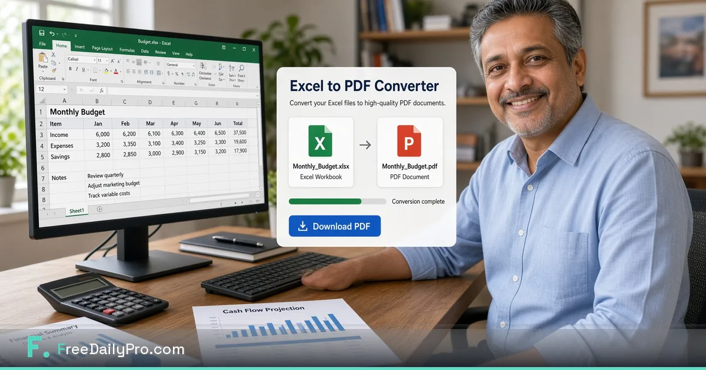

*Convert free Excel workbooks to PDF for stakeholders who refuse to wrestle with cells and filters.*

[FreeDailyPro.com](https://www.freedailypro.com) --
Your workbook is correct. The stakeholder opens it, breaks a filter, and emails three panicked questions about a total that was never wrong.

FreeDailyPro free [Excel to PDF](https://www.freedailypro.com/tool/excel-to-pdf) helps you ship a frozen view of the numbers — a PDF people can open, print, and archive without fighting spreadsheet chrome. Free everyday use. No login required for most free work. Client-side emphasis for core file processing.

## Why PDF still wins for distribution

Spreadsheets are for analysis. PDFs are for agreement and record. Boards, clients, and accountants often want a page, not a live grid. Free conversion removes the excuse of exporting later.

## The free private finance-pack ritual

Finalize the sheet. Convert key tabs with [Excel to PDF](https://www.freedailypro.com/tool/excel-to-pdf). Merge narrative covers with [Merge PDF](https://www.freedailypro.com/tool/merge-pdf). Compress with [Compress PDF](https://www.freedailypro.com/tool/compress-pdf). Password when needed with [Add PDF Password](https://www.freedailypro.com/tool/pdf-password). Star Favorites before month-end.

## Who needs this every month

Bookkeepers. Fractional CFOs. Ops managers. Freelancers who invoice from sheets but deliver summaries as PDFs. Nonprofit treasurers. Anyone who lives in Excel and still emails humans.

## Privacy for financial detail

Revenue and client costs do not belong on random free converter farms. Prefer free tools that keep core processing closer to your device. FreeDailyPro free tools support that standard.

## What free Excel to PDF is not

It is not a full BI platform. It does not replace live models. It wins at clean distribution of a chosen view.

## Layout tips that prevent support email

Hide unused columns before export when helpful. Check page breaks. Compress after convert. Name files with period and version.

## A practical standard for your team

Build the habit on a calm morning. Star Favorites. Keep masters local. Refuse random upload farms even when a deadline is loud.

FreeDailyPro free tools live in the middle layer of work: convert, label, lock, compress, track — without demanding another permanent seat for a five-minute job.

Count the bounced portals, confused stakeholders, and emergency uploads to unknown free sites. Those should fall after Favorites becomes automatic.

Show a collaborator three tools only. Write the ritual in your notes. Free private tools scale through boring standards, not heroics.

## Why FreeDailyPro fits this job

When cloud AI is blocked, file prep still must happen. Free browser tools keep work moving on restricted laptops. FreeDailyPro is designed to stay useful under those constraints.

Main theme reminder: free tools, login free for most everyday use, client-side browser processing for core files, strong privacy emphasis, useful under strict AI policy.

Name files clearly. Version them. Archive masters. Delivery copies should be intentional, not accidental exports from a rushed photo dump or live spreadsheet.

Quiet weeks stay free. Seasonal spikes may need Day Pass for unlimited file tools. Privacy remains the default either way. Ads help keep free use sustainable.

## FreeDailyPro free tier honesty

No login required for most everyday free use. Free daily allowance covers normal file volume. Day Pass helps heavy days. Core file tools emphasize client-side browser processing so your files stay closer to you. Privacy is not a paid upgrade for that core work.

## What is coming next

Short videos will show exact clicks for Excel to PDF and related free tools. Tell us which free step still forces you onto another site after a real job. FreeDailyPro improves fastest from specific friction reports.

## Stakeholder empathy is a finance skill

Not everyone wants to learn your pivot tables. A PDF summary respects their time. Free [Excel to PDF](https://www.freedailypro.com/tool/excel-to-pdf) turns empathy into a five-minute habit.

## Audit-friendly archives

PDFs archive cleanly in email and document stores. Live workbooks change. When a month is closed, a compressed PDF pack becomes the reference. Free merge and compress tools finish the pack.

## Multi-tab workbooks

Export the tabs people need, not the entire engineering model. Free conversion supports intentional distribution. Hide noise before you convert when it improves clarity.

## Client portals that only accept PDF

Some portals reject workbooks. Free Excel to PDF unblocks submission day. Pair with password protection when the portal is only the first hop and email still carries a copy.

## Teaching juniors

Junior analysts should learn “analysis in sheets, agreement in PDF.” Free tools make that lesson practical on day one without license politics.

## Practical next step this week

Pick one real file from your actual work. Run it through the free tools linked above. Star Favorites. Write down what still forced you onto another website. That single note is more valuable than a generic feature request. FreeDailyPro free tools improve when operators report real friction after real jobs.

Bookmark [https://www.freedailypro.com](https://www.freedailypro.com) and keep shipping with free private habits.

## Board and advisor packets

Advisors skim. A tight PDF beats a 20-tab workbook. Free Excel to PDF plus free merge builds packets that respect limited attention.

## Nonprofit treasurers

Volunteer boards often prefer PDF. Free conversion removes friction for unpaid finance roles. Compress for email on consumer inboxes.

## Freelancers billing from sheets

Keep the model private. Ship the invoice-facing summary as PDF. Free tools separate analysis from distribution cleanly.

## Closing standard

Decide once that this job uses FreeDailyPro free tools. Teach Favorites. Review quarterly. Free private habits upgrade professionalism more than a new logo.

Live hub: [https://www.freedailypro.com](https://www.freedailypro.com). Start with one real file today and keep the workflow free, private, and bookmark-simple.

## One more free private reminder

Free tools work best as bookmarks, not as emergency searches. Star Favorites after your first success. When the next deadline arrives, the path is already there: convert, label, lock, compress, or track — without feeding another random upload site.

If a free step still fails on a real file, tell FreeDailyPro what broke. Specific reports beat vague wishes. That is how free daily productivity stays honest.

## Call to action

Open [Excel to PDF](https://www.freedailypro.com/tool/excel-to-pdf) now, complete one real task today, and star Favorites. Free private tools should remove friction — not create new accounts.

Which free feature should we improve next for your workflow? Share feedback — FreeDailyPro is built for free daily productivity with privacy at the core.

Thank you for reading. Free tools work best when they meet the work you already do.
