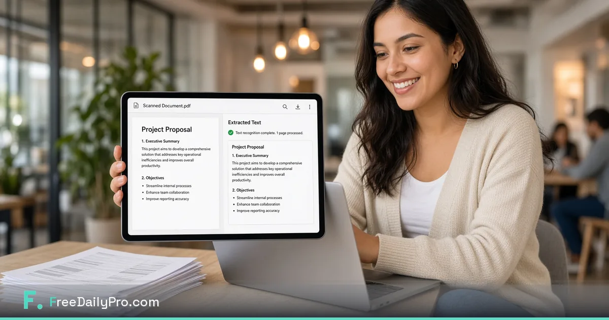

*Free OCR PDF so you can find text inside scans instead of retyping every page.*

[FreeDailyPro.com](https://www.freedailypro.com) --
The scan looks fine. Ctrl+F finds nothing. You retype names, totals, and clauses like it is 1998.

FreeDailyPro free [OCR PDF](https://www.freedailypro.com/tool/ocr-pdf) helps turn image-based PDFs into searchable files in a free browser workflow that emphasizes client-side processing for core work. No login required for most everyday free use.

## Why searchable beats pretty

A sharp scan that cannot be searched is only half done. Admin packs, contracts, and receipts become usable when text can be found and copied carefully.

## The free private OCR ritual

Scan or receive the PDF. Run [OCR PDF](https://www.freedailypro.com/tool/ocr-pdf). Merge related pages with [Merge PDF](https://www.freedailypro.com/tool/merge-pdf). Compress with [Compress PDF](https://www.freedailypro.com/tool/compress-pdf). Password when needed with [Add PDF Password](https://www.freedailypro.com/tool/pdf-password). Star Favorites.

## Who benefits immediately

Freelancers sorting client paperwork. Offices digitizing archives. Students organizing handouts. Anyone drowning in photo-PDFs from a phone scanner.

## Accuracy and human review

OCR is powerful and imperfect. Always review critical numbers and names. Free tools speed the pass; you still own the final check.

## Privacy for scanned life

Scans can include IDs, medical-adjacent admin, and financial detail. Prefer free private browser tools over unknown upload OCR farms when the content is sensitive.

## What free OCR is not

It is not a full document management system. It wins at making a scan searchable so you can work.

## A practical standard for your team

Build the habit on a calm morning. Star Favorites. Keep masters local. Refuse random upload farms even when a deadline is loud.

FreeDailyPro free tools live in the middle layer of work: convert, label, lock, compress, track — without demanding another permanent seat for a five-minute job.

Count the bounced portals, confused stakeholders, and emergency uploads to unknown free sites. Those should fall after Favorites becomes automatic.

Show a collaborator three tools only. Write the ritual in your notes. Free private tools scale through boring standards, not heroics.

## Why FreeDailyPro fits this job

When cloud AI is blocked, file prep still must happen. Free browser tools keep work moving on restricted laptops. FreeDailyPro is designed to stay useful under those constraints.

Main theme reminder: free tools, login free for most everyday use, client-side browser processing for core files, strong privacy emphasis, useful under strict AI policy.

Name files clearly. Version them. Archive masters. Delivery copies should be intentional, not accidental exports from a rushed photo dump or live spreadsheet.

Quiet weeks stay free. Seasonal spikes may need Day Pass for unlimited file tools. Privacy remains the default either way. Ads help keep free use sustainable.

## FreeDailyPro free tier honesty

No login required for most everyday free use. Free daily allowance covers normal file volume. Day Pass helps heavy days. Core file tools emphasize client-side browser processing so your files stay closer to you. Privacy is not a paid upgrade for that core work.

## What is coming next

Short videos will show exact clicks for OCR PDF and related free tools. Tell us which free step still forces you onto another site after a real job. FreeDailyPro improves fastest from specific friction reports.

## From paper pile to findable archive

Boxes of scans help no one if text is locked in pixels. Free [OCR PDF](https://www.freedailypro.com/tool/ocr-pdf) is the bridge from image to findable file. Then organize with clear names and folders you control.

## Contracts and vendor packets

When a counterparty sends a scan, OCR lets you locate clauses faster. Still review critical language with human eyes. Free tools accelerate; judgment remains yours.

## Receipt and admin bursts

Phone scanner apps produce image PDFs constantly. OCR in batches weekly beats panic before deadlines. Compress after OCR so packs email cleanly.

## Accessibility adjacent benefits

Searchable text helps more people work with documents. Free OCR is not a full accessibility program, but it is a meaningful step for internal packs.

## Limits to respect

Handwriting, stamps, and low-contrast scans reduce accuracy. Improve capture when you can. Free OCR is a helper, not magic.

## Practical next step this week

Pick one real file from your actual work. Run it through the free tools linked above. Star Favorites. Write down what still forced you onto another website. That single note is more valuable than a generic feature request. FreeDailyPro free tools improve when operators report real friction after real jobs.

Bookmark [https://www.freedailypro.com](https://www.freedailypro.com) and keep shipping with free private habits.

## Legal-adjacent admin without the listicle

Intake packets and signed scans become usable when searchable. Free OCR helps operations without claiming to replace counsel. Always verify critical text.

## Migration from paper

OCR is a step in digitization, not the whole program. Free tools lower the cost of the first pass so projects start instead of stalling.

## Closing standard

Decide once that this job uses FreeDailyPro free tools. Teach Favorites. Review quarterly. Free private habits upgrade professionalism more than a new logo.

Live hub: [https://www.freedailypro.com](https://www.freedailypro.com). Start with one real file today and keep the workflow free, private, and bookmark-simple.

## One more free private reminder

Free tools work best as bookmarks, not as emergency searches. Star Favorites after your first success. When the next deadline arrives, the path is already there: convert, label, lock, compress, or track — without feeding another random upload site.

If a free step still fails on a real file, tell FreeDailyPro what broke. Specific reports beat vague wishes. That is how free daily productivity stays honest.

## Keep the bar high

Professional delivery is a habit. Free private browser tools keep that standard simple enough to repeat weekly without new accounts or mystery uploads.

## Call to action

Open [OCR PDF](https://www.freedailypro.com/tool/ocr-pdf) now, complete one real task today, and star Favorites. Free private tools should remove friction — not create new accounts.

Which free feature should we improve next for your workflow? Share feedback — FreeDailyPro is built for free daily productivity with privacy at the core.

Thank you for reading. Free tools work best when they meet the work you already do.
