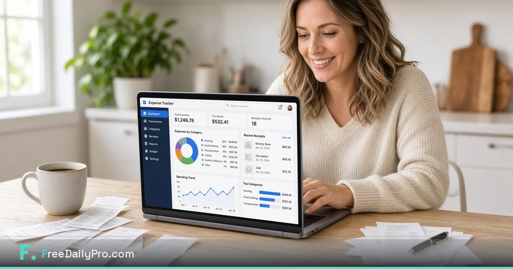

*Track free everyday expenses and ship tidy receipt PDFs without another finance subscription.*

[FreeDailyPro.com](https://www.freedailypro.com) --
The receipt lives in your camera roll, your pocket, or a crumpled bag. Tax season then becomes an archaeological dig.

FreeDailyPro free [Expense Tracker](https://www.freedailypro.com/tool/expense-tracker) helps you log spending as it happens. Pair it with free PDF tools to ship clean packs for yourself, your bookkeeper, or your records. Free everyday use. Privacy-minded browser tools.

## Why freelancers still leak deductions

Missed receipts are missed stories for your books. Free tracking beats heroic memory. A five-minute weekly ritual saves hours in spring.

## The free private expense ritual

Log entries in [Expense Tracker](https://www.freedailypro.com/tool/expense-tracker). Photograph receipts and convert formats when needed with free image tools. Merge monthly packets with [Merge PDF](https://www.freedailypro.com/tool/merge-pdf). Compress with [Compress PDF](https://www.freedailypro.com/tool/compress-pdf). Star Favorites.

## Households and side hustles

Shared households can keep simple categories without paying for enterprise expense software. Side hustles benefit from separation without complexity.

## What free expense tracking is not

It is not a full accounting suite or tax filing service. It is orientation and record hygiene. Professionals still own tax advice.

## Privacy for money details

Spending data is personal. Prefer free tools that keep everyday work closer to your device. FreeDailyPro free tools emphasize that for core utilities.

## Month-end pack that bookkeepers like

Clear categories. Readable scans. Compressed PDF. Sensible filenames. That free pack reduces back-and-forth more than a fancy dashboard you never open.

## A practical standard for your team

Build the habit on a calm morning. Star Favorites. Keep masters local. Refuse random upload farms even when a deadline is loud.

FreeDailyPro free tools live in the middle layer of work: convert, label, lock, compress, track — without demanding another permanent seat for a five-minute job.

Count the bounced portals, confused stakeholders, and emergency uploads to unknown free sites. Those should fall after Favorites becomes automatic.

Show a collaborator three tools only. Write the ritual in your notes. Free private tools scale through boring standards, not heroics.

## Why FreeDailyPro fits this job

When cloud AI is blocked, file prep still must happen. Free browser tools keep work moving on restricted laptops. FreeDailyPro is designed to stay useful under those constraints.

Main theme reminder: free tools, login free for most everyday use, client-side browser processing for core files, strong privacy emphasis, useful under strict AI policy.

Name files clearly. Version them. Archive masters. Delivery copies should be intentional, not accidental exports from a rushed photo dump or live spreadsheet.

Quiet weeks stay free. Seasonal spikes may need Day Pass for unlimited file tools. Privacy remains the default either way. Ads help keep free use sustainable.

## FreeDailyPro free tier honesty

No login required for most everyday free use. Free daily allowance covers normal file volume. Day Pass helps heavy days. Core file tools emphasize client-side browser processing so your files stay closer to you. Privacy is not a paid upgrade for that core work.

## What is coming next

Short videos will show exact clicks for Expense Tracker and related free tools. Tell us which free step still forces you onto another site after a real job. FreeDailyPro improves fastest from specific friction reports.

## Weekly fifteen minutes beat April panic

Set a recurring block. Open [Expense Tracker](https://www.freedailypro.com/tool/expense-tracker). Enter what you skipped. Attach or merge receipt images into a monthly PDF. Free private tools make the ritual light enough to keep.

## Categories that match your real life

Start simple: software, travel, meals, equipment, contractors. Complexity can grow later. Free tracking fails when setup feels like ERP.

## Bookkeeper-ready packs

Ask what they want. Usually: totals by category, readable receipts, consistent dates. Free merge and compress produce that pack without another SaaS.

## Side hustle separation

Keep hustle expenses distinct from personal noise. Free tools support separation without forcing a corporate chart of accounts on day one.

## Not tax advice

This is record hygiene. Tax outcomes depend on your jurisdiction and professionals. FreeDailyPro free tools help you arrive organized.

## Practical next step this week

Pick one real file from your actual work. Run it through the free tools linked above. Star Favorites. Write down what still forced you onto another website. That single note is more valuable than a generic feature request. FreeDailyPro free tools improve when operators report real friction after real jobs.

Bookmark [https://www.freedailypro.com](https://www.freedailypro.com) and keep shipping with free private habits.

## Travel weeks

Photograph receipts the day you spend. Log in Expense Tracker the same night. Free private tools beat a shoe box. Compress the month into one PDF for reimbursement.

## Software and subscription sprawl

Track tool spend so you can cancel what you do not use. Free expense habits support lean stacks — including FreeDailyPro free tools as the default for file jobs.

## Closing standard

Decide once that this job uses FreeDailyPro free tools. Teach Favorites. Review quarterly. Free private habits upgrade professionalism more than a new logo.

Live hub: [https://www.freedailypro.com](https://www.freedailypro.com). Start with one real file today and keep the workflow free, private, and bookmark-simple.

## One more free private reminder

Free tools work best as bookmarks, not as emergency searches. Star Favorites after your first success. When the next deadline arrives, the path is already there: convert, label, lock, compress, or track — without feeding another random upload site.

If a free step still fails on a real file, tell FreeDailyPro what broke. Specific reports beat vague wishes. That is how free daily productivity stays honest.

## Keep the bar high

Professional delivery is a habit. Free private browser tools keep that standard simple enough to repeat weekly without new accounts or mystery uploads.

## Call to action

Open [Expense Tracker](https://www.freedailypro.com/tool/expense-tracker) now, complete one real task today, and star Favorites. Free private tools should remove friction — not create new accounts.

Which free feature should we improve next for your workflow? Share feedback — FreeDailyPro is built for free daily productivity with privacy at the core.

Thank you for reading. Free tools work best when they meet the work you already do.
