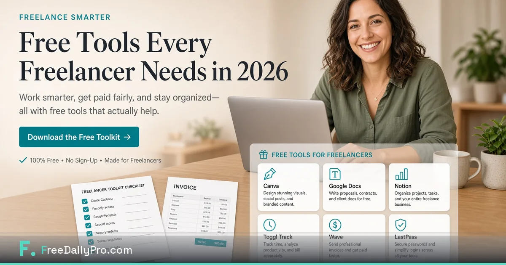

[FreeDailyPro.com](https://www.freedailypro.com) --  

I used to pay for tools I opened twice a month. A PDF merger. An image compressor. A “simple” invoice add-on. Each one felt cheap until the stack quietly cost more than a client lunch — and still asked me to upload files I should not upload.

In 2026 the freelancing stack that actually works for me is boring on purpose: free private browser tools for documents and images, one bookmark, Favorites for the five tools I touch weekly, and paid software only where it earns its seat (editing, accounting, CRM).

FreeDailyPro is that free private layer for me now.

## The freelancer tax nobody budgets for

Subscription hopping is a tax on attention. Every new free site is a new UI, a new privacy gamble, and a new chance to paste a client PDF into the wrong box. FreeDailyPro free tools cut that tax: merge, compress, convert, word count, image compress — free daily use for normal volume, Day Pass when launch week goes wild, no login required for most everyday free use.

## My actual weekly free private stack

1. Merge PDF for proposals and deliverables — https://www.freedailypro.com/tool/merge-pdf  
2. Compress PDF before email — https://www.freedailypro.com/tool/compress-pdf  
3. Compress Image for portfolio and social — https://www.freedailypro.com/tool/compress-image  
4. Word Counter before I send long scopes — https://www.freedailypro.com/tool/word-counter  
5. Convert tools when a portal is picky  

Star them in Favorites. That is the whole onboarding.

## What I still pay for (honestly)

I still pay for serious design when a brand needs it. I still pay for bookkeeping. I do not pay for the privilege of merging two PDFs. Free private tools won that category.

## Client privacy as a sales story

When a client asks how files are handled, I can say core prep runs in the browser with free private tools. That is a better answer than “I used whatever ranked first on Google.” FreeDailyPro’s client-side emphasis for core file tools is part of how I protect trust.

## The 2026 freelancing reality check

AI is everywhere and also blocked everywhere. Portals still reject large files. Clients still want one clean PDF. Free browser tools solve the unglamorous middle that eats hours.

## A one-week experiment

Day 1: bookmark FreeDailyPro.com.  
Day 2: process a real proposal pack.  
Day 3: compress a real image set.  
Day 4: teach the Favorites list to your future self.  
Day 5: cancel one tool you only open monthly.  

## Closing

Stop paying for separate apps that only exist to merge, compress, and convert. Free tools with privacy-minded design exist. Use them. Ship work. Keep the paid seats for work that actually needs them.

What free freelancer tool are you still missing? Tell us at FreeDailyPro — feedback after real client work shapes the roadmap.

Links: https://www.freedailypro.com · https://www.freedailypro.com/tool/merge-pdf · https://www.freedailypro.com/tool/compress-pdf · https://www.freedailypro.com/tool/compress-image · https://www.freedailypro.com/tool/word-counter

## Pricing my time means pricing my tool stack

Every subscription is a silent rate cut. When I audit tools quarterly, FreeDailyPro free private PDF and image tools survive because they replace paid seats I resented. The money stays in the business. The files stay closer to me.

## Client onboarding with fewer links

I used to send clients a graveyard of tool links. Now I send deliverables and keep FreeDailyPro as my backstage. Cleaner for them. Cleaner for me.

## A week in the life with free private tools

Monday: proposals and compress. Tuesday: image delivery. Wednesday: invoices. Thursday: admin PDFs. Friday: archive and Favorites cleanup. FreeDailyPro free tools turn that week into a single bookmark instead of five websites with five privacy policies.

## The emotional benefit nobody measures

There is a quiet relief in knowing you did not upload a client file to a stranger's compressor. That relief compounds. Free private browser tools are not only faster — they are calmer.

## How I recommend FreeDailyPro without sounding like an ad

I tell friends: try one real task. Merge something you would have paid to merge. Compress something that bounced from email. If it works, star Favorites. If a free feature is missing, say so. Free tools improve when real users report real friction.

## Limits I respect

Free daily use covers normal volume. Day Pass helps spikes. Pro software still owns specialized creative and accounting work. FreeDailyPro owns the free private middle: PDFs, images, text utilities, calculators for orientation.

## Privacy as a weekly practice

Redact samples. Keep masters. Prefer client-side free tools for core files. Never paste secrets into free utilities. FreeDailyPro free tools are for productivity hygiene — not for storing passwords or production keys.

## Closing invitation

If you found this because an older Medium post of mine aged out, welcome back. The stack is simpler now: free private tools for daily file work, honest limits, and a permanent home at https://www.freedailypro.com.

Star Favorites. Ship the next file without a random upload. Tell FreeDailyPro what to build next after you use a tool for real.

Thank you for reading. Free freelancing tools should protect your margins and your clients’ files.

## What I keep telling myself (and you)

Free tools only work if you actually use the same ones twice. Star Favorites on FreeDailyPro. Make the second time faster than the first. That is how free private productivity becomes a habit instead of a Google search.

Day Pass exists for the heavy days. Most everyday free use needs no login. Core file tools emphasize client-side processing. Privacy is not a slogan — it is the product design.

If this refreshed story replaced an older Medium draft of mine, good. Old posts get new images and new angles so readers (and Google) get something worth their time.

Try the free tools at https://www.freedailypro.com after you finish this piece — one real file, one real win.

Live free tools: https://www.freedailypro.com/tool/merge-pdf · https://www.freedailypro.com/tool/compress-pdf · https://www.freedailypro.com/tool/compress-image · https://www.freedailypro.com/tool/word-counter · https://www.freedailypro.com

## Extended notes for Medium readers

This refreshed post replaces an older, shorter Medium version with a deeper unique angle, a new hero image, and clearer free-tool links. FreeDailyPro free tools remain free for daily use with honest limits: free daily file allowance, optional Day Pass for spikes, no login required for most everyday free use, and privacy-minded client-side processing for core files. If you clap, try a real file next — that is the only review that counts.

Primary hub: https://www.freedailypro.com

Make free private tools your freelancing default this month.
