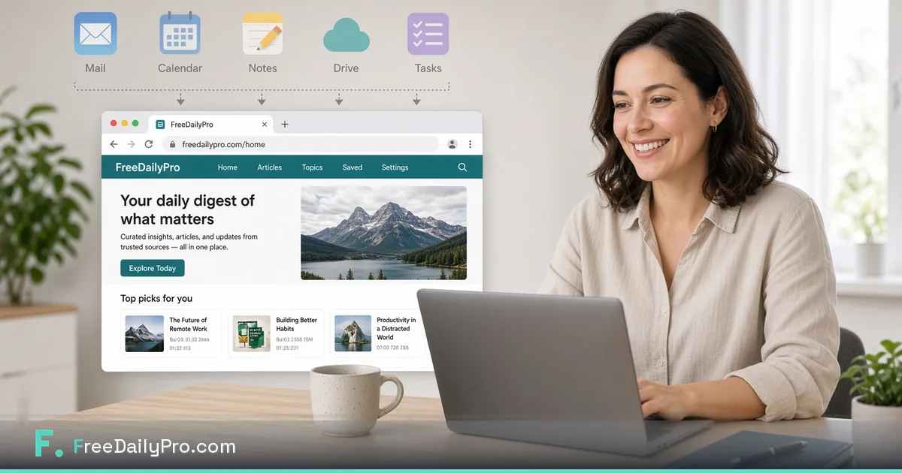

[FreeDailyPro.com](https://www.freedailypro.com) --  

I did not become a minimalist for aesthetic reasons. I became one because my laptop was a junk drawer of installers for jobs that should have been tabs.

Five apps used to handle: merge PDF, compress PDF, convert images, quick word count, and “whatever random utility I installed at midnight.” None of them talked to each other. Most of them wanted accounts. Some of them wanted uploads. All of them wanted attention.

Then the free private browser toolkit pattern clicked. FreeDailyPro put those jobs in one place — free daily use for normal volume, no login required for most everyday free use, core file tools emphasizing client-side processing. My dock got quieter. My privacy story got cleaner.

## What the browser should own

The browser should own lightweight, frequent, privacy-sensitive file prep: merge, split, compress, convert, simple text utilities. FreeDailyPro is built for that layer. Pro apps should own deep creative work, serious accounting, and specialized engineering environments.

## The five apps that left

1. A PDF merger I opened weekly and resented monthly.  
2. An image compressor with a free tier that felt like a trap.  
3. A converter site that became an app “for convenience.”  
4. A word-count widget.  
5. A miscellaneous utility I could never uninstall emotionally.

Replacements: https://www.freedailypro.com/tool/merge-pdf · compress-pdf · compress-image · convert-image · word-counter — starred in Favorites.

## What stayed installed

Photo editor. Code editor. Accounting. Communication. The browser did not replace those. It replaced the junk drawer.

## Privacy as declutter

Decluttering apps is also decluttering risk. Fewer upload paths. Fewer forgotten accounts. Free private tools make the ethical choice the easy choice.

## A practical migration weekend

Saturday: list every utility app. Sunday: attempt each job in FreeDailyPro. Star Favorites. Uninstall what you did not miss. Keep a Day Pass option for heavy weeks instead of permanent seats for rare spikes.

## For teams and families

Shared machines hate random installs. Browser free tools with login-free everyday use reduce IT friction and household friction.

## Closing

My browser replaced five apps because those apps never deserved to be apps. FreeDailyPro free private tools made the tab honest again. Try one real job at https://www.freedailypro.com and see which installer you can finally delete.

Thank you for reading. Free tools should lighten the machine — and the mind.

## A week in the life with free private tools

Monday: proposals and compress. Tuesday: image delivery. Wednesday: invoices. Thursday: admin PDFs. Friday: archive and Favorites cleanup. FreeDailyPro free tools turn that week into a single bookmark instead of five websites with five privacy policies.

## The emotional benefit nobody measures

There is a quiet relief in knowing you did not upload a client file to a stranger's compressor. That relief compounds. Free private browser tools are not only faster — they are calmer.

## How I recommend FreeDailyPro without sounding like an ad

I tell friends: try one real task. Merge something you would have paid to merge. Compress something that bounced from email. If it works, star Favorites. If a free feature is missing, say so. Free tools improve when real users report real friction.

## Limits I respect

Free daily use covers normal volume. Day Pass helps spikes. Pro software still owns specialized creative and accounting work. FreeDailyPro owns the free private middle: PDFs, images, text utilities, calculators for orientation.

## Privacy as a weekly practice

Redact samples. Keep masters. Prefer client-side free tools for core files. Never paste secrets into free utilities. FreeDailyPro free tools are for productivity hygiene — not for storing passwords or production keys.

## Closing invitation

If you found this because an older Medium post of mine aged out, welcome back. The stack is simpler now: free private tools for daily file work, honest limits, and a permanent home at https://www.freedailypro.com.

Star Favorites. Ship the next file without a random upload. Tell FreeDailyPro what to build next after you use a tool for real.

## Extended notes for Medium readers

This refreshed post replaces an older, shorter Medium version with a deeper unique angle, a new hero image, and clearer free-tool links. FreeDailyPro free tools remain free for daily use with honest limits: free daily file allowance, optional Day Pass for spikes, no login required for most everyday free use, and privacy-minded client-side processing for core files. If you clap, try a real file next — that is the only review that counts.

Primary hub: https://www.freedailypro.com

## Metrics after three months

Installers removed: five. Random free sites bookmarked: near zero. Average time to ship a proposal pack: down. Client questions about file handling: easier to answer. FreeDailyPro free tools did not make me a different person. They removed friction that made me a worse operator.

## For people who love apps

Keep apps that deserve love. Delete apps that exist only because browsers were inconvenient in 2014. Free private browser tools closed that gap for PDFs and images.

## Medium refresh note

This article is a 2026 refresh of an older FreeDailyPro Medium post: new hero image, expanded unique narrative, and updated free-tool links. It is intentionally not a copy of FreeDailyPro.com product docs or Blogger AdSense exclusives. Free daily productivity with privacy remains the theme — free tools, client-side core file processing, no login for most everyday free use, Day Pass for spikes.

https://www.freedailypro.com

## The psychology of the installer

Installers feel permanent. Tabs feel temporary. That psychology made me keep bad apps. Free private browser tools inverted it: the permanent thing is the bookmark to FreeDailyPro, not the installer. Favorites made the tab feel permanent enough to trust.

## Battery, disk, and update fatigue

Every app is updates, permissions, and disk. Free browser tools for PDFs and images reduced the tax. My machine feels lighter because it is.

## Family computer test

If a tool only works after an installer dance, it fails the family computer test. FreeDailyPro free tools pass: open browser, work, done. That matters for shared households and borrowed laptops.
