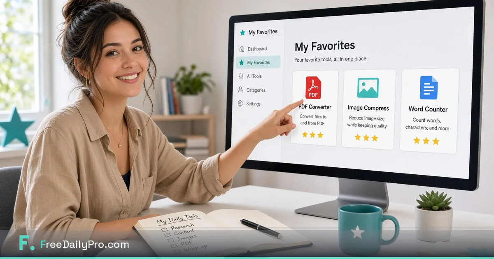

[FreeDailyPro.com](https://www.freedailypro.com) --  
You do not need 200 tools on screen when you only use eight of them every day. FreeDailyPro now lets you build your own page. Star the tools you love, open Favorites, and see only your personal toolkit — clean, fast, and ready.

This is one of the most requested features from people who live inside FreeDailyPro for PDF work, image prep, invoices, calculators, and writing. Now it is live.

## What Favorites actually does

- Click the star on any tool to add it to your Favorites.
- Open the Favorites section (or /favorites) to see your custom collection.
- Your starred tools appear on a personal page built just for you.
- Reorder or remove stars anytime.
- Come back tomorrow and your list is waiting.

No more scrolling through categories to find Compress Image, Merge PDF, or Word Counter. Your daily tools live in one place.

## Why a personal tools page changes daily work

Most of us have a small set of “always open” tools:

- Compress a PDF before email
- Resize and compress product photos
- Count words in a draft
- Merge client documents
- Generate a quick QR code
- Convert an image format

Until now you had to hunt for them. With Favorites you open one page and everything you need is already there. That is real time saved every single day.

## How to set up your Favorites in under a minute

1. Go to [FreeDailyPro.com](https://www.freedailypro.com).
2. Browse any category or search for a tool you use often.
3. Click the star icon on that tool.
4. Repeat for the 5–15 tools you use most.
5. Open Favorites (header star or /favorites path).
6. Enjoy your own clean tools page.

Your favorites stay available across visits. The experience still runs client-side for the tools themselves — privacy stays exactly as strong as before.

## Perfect for freelancers, students, sellers, and teams

- **Freelancers** star invoice, PDF merge/compress, image tools, and resume helpers.
- **Ecommerce sellers** keep image compress, convert, resize, and QR tools one click away.
- **Students** favorite word counter, PDF tools, citation helpers, and calculators.
- **Office teams** can each build a different favorites set for their role.
- **Writers & designers** keep text tools, color tools, and export helpers together.

Combine Favorites with language support so your personal page appears in the language you prefer. Work faster in the language you think in, with only the tools you actually use.

## Privacy and free use stay the same

Starring tools does not change how files are processed. FreeDailyPro still keeps file work in your browser whenever possible. No login is required for most daily use. Free daily allowance continues. Day Pass and Monthly options unlock unlimited when you need heavier days.

Everything you already loved about FreeDailyPro — free tools, client-side processing, no data sent to servers for core tools, 100% privacy, AI-policy proof — remains true. Favorites simply makes the same powerful toolkit feel personal.

## Power tips for your Favorites page

- Star tools in the order you usually work (example: compress image → convert → merge PDF).
- Keep the list short and focused — 8 to 12 tools often feels perfect.
- Revisit every few weeks and unstar anything you stopped using.
- Share FreeDailyPro with a colleague and let them build their own favorites list.
- Use Favorites as your new browser homepage for productivity.

## Videos are coming

We will publish short YouTube videos showing how to build a Favorites page and how power users organize their daily tools. You will be able to watch the exact clicks and copy the setups that work best.

## Create your personal toolkit today

Open [FreeDailyPro.com](https://www.freedailypro.com), star the tools you reach for most often, then visit your Favorites page. Feel how much cleaner and faster daily work becomes when the site shows only what you need.

What tools did you star first? What would make the Favorites page even better (folders, shared lists, export)? Tell us — we build FreeDailyPro for the people who use it every day. Your own free tools page is ready. Make it yours.
