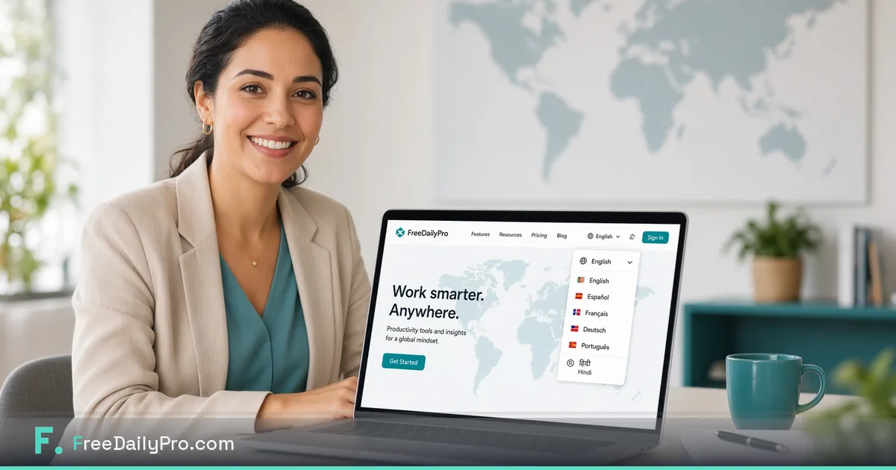

[FreeDailyPro.com](https://www.freedailypro.com) --  
You should not have to translate every button just to compress a PDF or resize a photo. Today FreeDailyPro takes a big step: full language support across the platform so you can use every free tool in the language that feels natural to you.

Look for the language icon in the header. One click opens the language menu. Choose your preferred language and the interface updates instantly. Labels, menus, tool names, and helper text follow you — while every file still stays on your device.

## Why language support matters for free tools

Most free online tools only speak English. That creates friction for millions of people who think and work in Spanish, French, German, Portuguese, Hindi, and many other languages. When the interface matches how you already think, you finish tasks faster and make fewer mistakes.

FreeDailyPro already runs 200+ tools entirely in the browser with strong privacy. Adding language support means the same privacy-first experience is now available to a much wider global audience. No install. No forced account for most tools. No data leaving your computer.

## How to switch language in seconds

1. Open [FreeDailyPro.com](https://www.freedailypro.com).
2. Click the language / globe icon in the top bar.
3. Select your language from the list.
4. The whole site updates — categories, tool pages, buttons, and messages.

Your choice is remembered for next visits so you do not have to pick it every time. You can change it again whenever you need.

## What stays the same (and why that is great)

- All tools still process files **client-side** inside your browser.
- No uploads to our servers for core file work.
- Free daily use for file-based tools remains the same.
- Day Pass and Monthly options still unlock unlimited when you need them.
- Privacy promise is unchanged: 100% client-side for the tools that matter most, AI-policy proof for workplaces that restrict cloud AI.

Language support makes FreeDailyPro more inclusive without weakening the privacy model that users already love.

## Perfect for teams, freelancers, students, and families

- **Freelancers** who work with international clients can switch languages when preparing documents.
- **Students** can use calculators and PDF tools in the language of their courses.
- **Small businesses** can train staff in the language they prefer.
- **Families** sharing a computer can each keep their own language preference.
- **Remote workers** on restricted networks still get a full toolkit that speaks their language.

Combine language support with tools such as [Compress PDF](https://www.freedailypro.com/tool/compress-pdf), [Compress Image](https://www.freedailypro.com/tool/compress-image), [Merge PDF](https://www.freedailypro.com/tool/merge-pdf), [Word Counter](https://www.freedailypro.com/tool/word-counter), and the growing design and calculator suites.

## Tips to get the most from multi-language FreeDailyPro

- Set your language once and pin FreeDailyPro to your browser.
- Share the link with friends or colleagues who prefer another language — they will feel at home immediately.
- Use language switch when you need to check how a label appears for a client who speaks differently.
- Keep using Favorites (see our separate post) so your most-used tools stay one click away in any language.

We are continuing to improve translations and will add more languages over time based on real user demand.

## Coming soon: video walkthroughs in multiple languages

We are preparing short YouTube videos that show the tools in action. As language support expands, we plan language-friendly video guides so everyone can see the exact clicks in a language they understand.

## Try it right now

Open [FreeDailyPro.com](https://www.freedailypro.com), click the language icon, switch to your preferred language, and run any tool you need — compress an image, merge a PDF, or calculate something useful. Feel how natural it is when the whole free toolkit speaks your language.

What language would you like us to prioritize next? Which tool translations matter most to you? Send feedback and help us make FreeDailyPro truly global while keeping every file private and free for daily work. We are building this with you.
