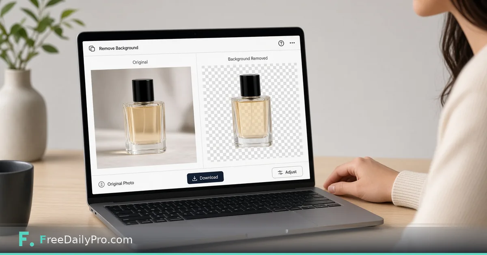

*Remove busy backgrounds without learning full Photoshop*

[FreeDailyPro.com](https://www.freedailypro.com) -- Marketplace photos with kitchen clutter convert worse than clean cutouts. You do not need a studio career to isolate a product for a listing—just a clear photo and a background removal step.

This post is about removing image backgrounds for side-hustle listings. The tool is FreeDailyPro’s [Remove Background](https://www.freedailypro.com/tool/remove-background).

## Shoot for success

Use even light. Avoid busy patterns behind the item. Fill the frame. Glass, hair, and mesh are harder; simple solid products work best.

## Workflow

1. Photograph the product.
2. Open [Remove Background](https://www.freedailypro.com/tool/remove-background) and process the image.
3. Download the transparent or plain result and place it on your listing template.
4. For how-to overlays, [Screenshot Tool](https://www.freedailypro.com/tool/screenshot-tool) helps; for multi-image catalogs, [Image to PDF](https://www.freedailypro.com/tool/image-to-pdf) can package pages.

See [multitool apps](https://www.freedailypro.com/multitool-apps).

## Listing checklist

Check edges at zoom. Confirm marketplace size and background rules. Keep an original photo in case you need to re-edit.

## Honest limits

Not a full creative suite. Hard edges may need manual touch-up elsewhere. Always follow each marketplace’s image policy.

## Closing

Cleaner product images look more trustworthy. FreeDailyPro’s [Remove Background](https://www.freedailypro.com/tool/remove-background) is a free browser step between a phone photo and a listing-ready cutout. Process, inspect edges, upload.

## Related habits that keep the workflow clean

After you finish with the primary tool, take thirty seconds to file the output where you will find it again. A clear filename and a dated folder beat a desktop full of exports. If you work with a partner, agree once on where final files live so nobody hunts chat history for the “real” version.

When something looks off in the result, fix the source input rather than stacking workarounds. Re-running a clean pass is faster than explaining a messy file to a client or classmate later.

## Privacy and common sense

Only process files and text you are allowed to handle in a browser tool. Payroll, medical, and confidential legal material may require approved systems only—follow your policy even when a free tool is convenient. Close the tab when you are done on a shared computer. Do not leave client data on a screen in a café.

If your organization blocks third-party tools, use the path IT provides. This guide assumes you are allowed to use FreeDailyPro for the task described.

## What “done” looks like

You should leave with a file or a number you can act on: send the PDF, paste the result, or record the figure in your notes. If you cannot state the next action in one sentence, the workflow is not finished. Open [Remove Background](https://www.freedailypro.com/tool/remove-background) only when you know what success means for this task.

## Teaching someone else the same steps

If a teammate will repeat this job, write the five steps in your internal doc with the live tool link. Do not screenshot a dozen menus from other products. The value of a narrow browser tool is that the path stays short enough to teach in minutes.

## When to stop and use a heavier product

If you need automation across hundreds of files, multi-user approvals, or regulated audit trails, graduate to software built for that scale. Free browser utilities shine for one-off and light-repeat work. Knowing the ceiling is part of using the tool honestly.

## Related habits that keep the workflow clean

After you finish with the primary tool, take thirty seconds to file the output where you will find it again. A clear filename and a dated folder beat a desktop full of exports. If you work with a partner, agree once on where final files live so nobody hunts chat history for the “real” version.

When something looks off in the result, fix the source input rather than stacking workarounds. Re-running a clean pass is faster than explaining a messy file to a client or classmate later.

## Privacy and common sense

Only process files and text you are allowed to handle in a browser tool. Payroll, medical, and confidential legal material may require approved systems only—follow your policy even when a free tool is convenient. Close the tab when you are done on a shared computer. Do not leave client data on a screen in a café.

If your organization blocks third-party tools, use the path IT provides. This guide assumes you are allowed to use FreeDailyPro for the task described.

## What “done” looks like

You should leave with a file or a number you can act on: send the PDF, paste the result, or record the figure in your notes. If you cannot state the next action in one sentence, the workflow is not finished. Open [Remove Background](https://www.freedailypro.com/tool/remove-background) only when you know what success means for this task.

## Teaching someone else the same steps

If a teammate will repeat this job, write the five steps in your internal doc with the live tool link. Do not screenshot a dozen menus from other products. The value of a narrow browser tool is that the path stays short enough to teach in minutes.

## When to stop and use a heavier product

If you need automation across hundreds of files, multi-user approvals, or regulated audit trails, graduate to software built for that scale. Free browser utilities shine for one-off and light-repeat work. Knowing the ceiling is part of using the tool honestly.

## Related habits that keep the workflow clean

After you finish with the primary tool, take thirty seconds to file the output where you will find it again. A clear filename and a dated folder beat a desktop full of exports. If you work with a partner, agree once on where final files live so nobody hunts chat history for the “real” version.

When something looks off in the result, fix the source input rather than stacking workarounds. Re-running a clean pass is faster than explaining a messy file to a client or classmate later.
