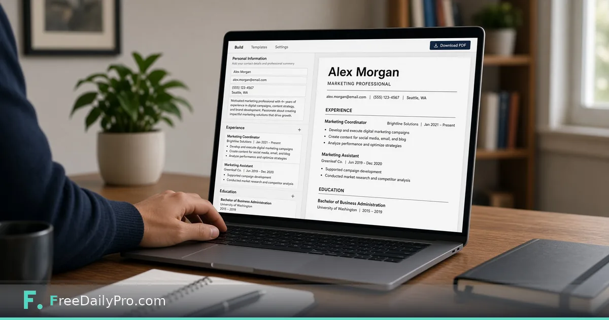

*A free resume builder when you need a PDF tonight*

[FreeDailyPro.com](https://www.freedailypro.com) -- Word resume templates break when you change one line. Tables shift. Margins collapse. You need a clean one-page PDF tonight, not a design project.

This post is about building a simple resume and exporting PDF. The tool is FreeDailyPro’s [Resume Builder](https://www.freedailypro.com/tool/resume-builder).

## Gather content first

Roles, dates, and measurable results. Honest titles. Education and skills that match the jobs you want. The builder formats; it does not invent your history.

## Workflow

1. Open [Resume Builder](https://www.freedailypro.com/tool/resume-builder) and fill sections.
2. Keep it one page when possible for early-career roles unless the field expects longer CVs.
3. Check length with [Word Counter](https://www.freedailypro.com/tool/word-counter) if a posting caps summary length.
4. Polish with [Grammar Checker](https://www.freedailypro.com/tool/grammar-checker).
5. Export PDF as `Firstname_Lastname_Resume.pdf`.

See [text tools](https://www.freedailypro.com/category/text-tools) and [multitool apps](https://www.freedailypro.com/multitool-apps).

## Tailoring without chaos

Save a master version. Adjust the summary and top bullets per application. Do not maintain twenty wildly different files with no labels.

## Honest limits

A builder does not guarantee interviews. Some portals ignore your PDF and force their own form—still keep a strong PDF for email and referrals. Never invent employers or degrees.

## Closing

Clean structure helps humans skim. FreeDailyPro’s [Resume Builder](https://www.freedailypro.com/tool/resume-builder) is a free path to a one-page PDF when Word templates fight back. Fill, tighten, export, apply.

## Related habits that keep the workflow clean

After you finish with the primary tool, take thirty seconds to file the output where you will find it again. A clear filename and a dated folder beat a desktop full of exports. If you work with a partner, agree once on where final files live so nobody hunts chat history for the “real” version.

When something looks off in the result, fix the source input rather than stacking workarounds. Re-running a clean pass is faster than explaining a messy file to a client or classmate later.

## Privacy and common sense

Only process files and text you are allowed to handle in a browser tool. Payroll, medical, and confidential legal material may require approved systems only—follow your policy even when a free tool is convenient. Close the tab when you are done on a shared computer. Do not leave client data on a screen in a café.

If your organization blocks third-party tools, use the path IT provides. This guide assumes you are allowed to use FreeDailyPro for the task described.

## What “done” looks like

You should leave with a file or a number you can act on: send the PDF, paste the result, or record the figure in your notes. If you cannot state the next action in one sentence, the workflow is not finished. Open [Resume Builder](https://www.freedailypro.com/tool/resume-builder) only when you know what success means for this task.

## Teaching someone else the same steps

If a teammate will repeat this job, write the five steps in your internal doc with the live tool link. Do not screenshot a dozen menus from other products. The value of a narrow browser tool is that the path stays short enough to teach in minutes.

## When to stop and use a heavier product

If you need automation across hundreds of files, multi-user approvals, or regulated audit trails, graduate to software built for that scale. Free browser utilities shine for one-off and light-repeat work. Knowing the ceiling is part of using the tool honestly.

## Related habits that keep the workflow clean

After you finish with the primary tool, take thirty seconds to file the output where you will find it again. A clear filename and a dated folder beat a desktop full of exports. If you work with a partner, agree once on where final files live so nobody hunts chat history for the “real” version.

When something looks off in the result, fix the source input rather than stacking workarounds. Re-running a clean pass is faster than explaining a messy file to a client or classmate later.

## Privacy and common sense

Only process files and text you are allowed to handle in a browser tool. Payroll, medical, and confidential legal material may require approved systems only—follow your policy even when a free tool is convenient. Close the tab when you are done on a shared computer. Do not leave client data on a screen in a café.

If your organization blocks third-party tools, use the path IT provides. This guide assumes you are allowed to use FreeDailyPro for the task described.

## What “done” looks like

You should leave with a file or a number you can act on: send the PDF, paste the result, or record the figure in your notes. If you cannot state the next action in one sentence, the workflow is not finished. Open [Resume Builder](https://www.freedailypro.com/tool/resume-builder) only when you know what success means for this task.

## Teaching someone else the same steps

If a teammate will repeat this job, write the five steps in your internal doc with the live tool link. Do not screenshot a dozen menus from other products. The value of a narrow browser tool is that the path stays short enough to teach in minutes.

## When to stop and use a heavier product

If you need automation across hundreds of files, multi-user approvals, or regulated audit trails, graduate to software built for that scale. Free browser utilities shine for one-off and light-repeat work. Knowing the ceiling is part of using the tool honestly.

## Related habits that keep the workflow clean

After you finish with the primary tool, take thirty seconds to file the output where you will find it again. A clear filename and a dated folder beat a desktop full of exports. If you work with a partner, agree once on where final files live so nobody hunts chat history for the “real” version.

When something looks off in the result, fix the source input rather than stacking workarounds. Re-running a clean pass is faster than explaining a messy file to a client or classmate later.
