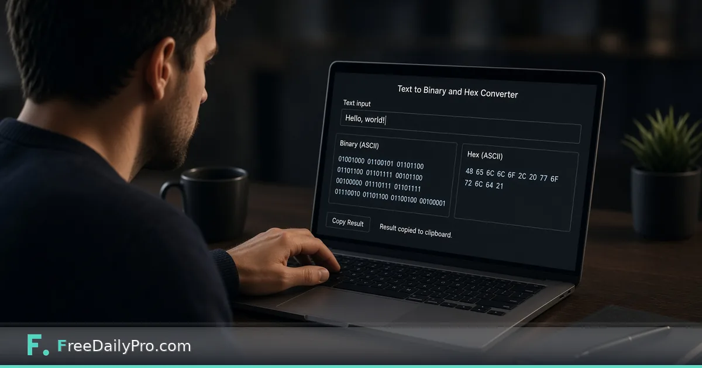

*Convert text to binary and hex without installing coding software*

[FreeDailyPro.com](https://www.freedailypro.com) -- Students meet binary as abstract 1s and 0s on a slide. Seeing “Hello” turn into bits makes the idea concrete. You do not need a full IDE for that demo.

This post is about converting text to binary and hex for learning. The tool is FreeDailyPro’s [Binary ASCII Converter](https://www.freedailypro.com/tool/binary-ascii-converter).

## Classroom demo flow

1. Type a short word into [Binary ASCII Converter](https://www.freedailypro.com/tool/binary-ascii-converter).
2. Show binary and hex outputs.
3. Change one letter; show how the bits change.
4. Connect later lessons to [Hash Generator](https://www.freedailypro.com/tool/hash-generator) for fingerprints and [JSON Formatter](https://www.freedailypro.com/tool/json-formatter) for structured data.

Browse [developer tools](https://www.freedailypro.com/category/developer-tools) and [multitool apps](https://www.freedailypro.com/multitool-apps).

## What students should take away

Computers store symbols as numbers. Encoding choices matter. One flipped bit changes meaning. Curiosity beats memorizing charts alone.

## Honest limits

This is an educational converter—not a full assembler toolkit. Non-English text may involve UTF-8 details beyond basic ASCII. Advanced courses will need deeper tools.

## Closing

Visible bits teach faster than abstract charts alone. FreeDailyPro’s [Binary ASCII Converter](https://www.freedailypro.com/tool/binary-ascii-converter) is a free demo aid for class or self-study. Type, observe, change one character, discuss.

## Related habits that keep the workflow clean

After you finish with the primary tool, take thirty seconds to file the output where you will find it again. A clear filename and a dated folder beat a desktop full of exports. If you work with a partner, agree once on where final files live so nobody hunts chat history for the “real” version.

When something looks off in the result, fix the source input rather than stacking workarounds. Re-running a clean pass is faster than explaining a messy file to a client or classmate later.

## Privacy and common sense

Only process files and text you are allowed to handle in a browser tool. Payroll, medical, and confidential legal material may require approved systems only—follow your policy even when a free tool is convenient. Close the tab when you are done on a shared computer. Do not leave client data on a screen in a café.

If your organization blocks third-party tools, use the path IT provides. This guide assumes you are allowed to use FreeDailyPro for the task described.

## What “done” looks like

You should leave with a file or a number you can act on: send the PDF, paste the result, or record the figure in your notes. If you cannot state the next action in one sentence, the workflow is not finished. Open [Binary Ascii Converter](https://www.freedailypro.com/tool/binary-ascii-converter) only when you know what success means for this task.

## Teaching someone else the same steps

If a teammate will repeat this job, write the five steps in your internal doc with the live tool link. Do not screenshot a dozen menus from other products. The value of a narrow browser tool is that the path stays short enough to teach in minutes.

## When to stop and use a heavier product

If you need automation across hundreds of files, multi-user approvals, or regulated audit trails, graduate to software built for that scale. Free browser utilities shine for one-off and light-repeat work. Knowing the ceiling is part of using the tool honestly.

## Related habits that keep the workflow clean

After you finish with the primary tool, take thirty seconds to file the output where you will find it again. A clear filename and a dated folder beat a desktop full of exports. If you work with a partner, agree once on where final files live so nobody hunts chat history for the “real” version.

When something looks off in the result, fix the source input rather than stacking workarounds. Re-running a clean pass is faster than explaining a messy file to a client or classmate later.

## Privacy and common sense

Only process files and text you are allowed to handle in a browser tool. Payroll, medical, and confidential legal material may require approved systems only—follow your policy even when a free tool is convenient. Close the tab when you are done on a shared computer. Do not leave client data on a screen in a café.

If your organization blocks third-party tools, use the path IT provides. This guide assumes you are allowed to use FreeDailyPro for the task described.

## What “done” looks like

You should leave with a file or a number you can act on: send the PDF, paste the result, or record the figure in your notes. If you cannot state the next action in one sentence, the workflow is not finished. Open [Binary Ascii Converter](https://www.freedailypro.com/tool/binary-ascii-converter) only when you know what success means for this task.

## Teaching someone else the same steps

If a teammate will repeat this job, write the five steps in your internal doc with the live tool link. Do not screenshot a dozen menus from other products. The value of a narrow browser tool is that the path stays short enough to teach in minutes.

## When to stop and use a heavier product

If you need automation across hundreds of files, multi-user approvals, or regulated audit trails, graduate to software built for that scale. Free browser utilities shine for one-off and light-repeat work. Knowing the ceiling is part of using the tool honestly.

## Related habits that keep the workflow clean

After you finish with the primary tool, take thirty seconds to file the output where you will find it again. A clear filename and a dated folder beat a desktop full of exports. If you work with a partner, agree once on where final files live so nobody hunts chat history for the “real” version.

When something looks off in the result, fix the source input rather than stacking workarounds. Re-running a clean pass is faster than explaining a messy file to a client or classmate later.
