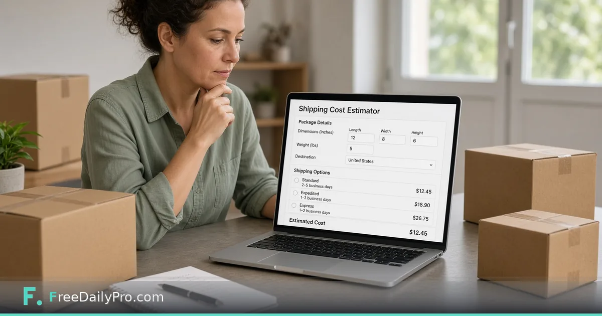

*A simple estimator workflow for ecommerce and ops teams*

[FreeDailyPro.com](https://www.freedailypro.com) -- Marketing loves “free shipping.” Finance loves knowing what that costs. If you promise free shipping on a bulky SKU without measuring a typical parcel, margin disappears in corrugated cardboard and DIM weight.

This post is about estimating package cost from size and weight before the promise goes live. The tool is FreeDailyPro’s [Shipping Cost Estimator](https://www.freedailypro.com/tool/shipping-cost-estimator).

## Why ops and marketing need the same number

Campaigns scale failures. A weekend promotion on heavy items can erase profit if postage was wishful. Estimate first, then set thresholds, then write the banner.

## Workflow

1. Measure a typical parcel for the SKU family.
2. Enter dimensions and weight in [Shipping Cost Estimator](https://www.freedailypro.com/tool/shipping-cost-estimator).
3. Convert units with [Unit Converter](https://www.freedailypro.com/tool/unit-converter) if your tape measure and carrier form disagree.
4. Model discount or threshold impact with [Percentage Calculator](https://www.freedailypro.com/tool/percentage-calculator).
5. Decide free-shipping rules with eyes open; document assumptions.

See [calculators](https://www.freedailypro.com/category/calculators) and [multitool apps](https://www.freedailypro.com/multitool-apps).

## Dimensional weight still applies

Carriers may charge by space, not only scale weight. A light pillow in a huge box is not cheap. Estimation tools help you see the problem; packaging redesign may be the fix.

## Honest limits

Carrier contracts, surcharges, and residential fees vary. This is estimation—not a binding rate from your negotiated account. Always confirm with your carrier tools before filing prices in the cart.

## Closing

Promise shipping costs you have modeled. FreeDailyPro’s [Shipping Cost Estimator](https://www.freedailypro.com/tool/shipping-cost-estimator) gives teams a free, shared starting number. Measure, estimate, set policy, then market.

## Related habits that keep the workflow clean

After you finish with the primary tool, take thirty seconds to file the output where you will find it again. A clear filename and a dated folder beat a desktop full of exports. If you work with a partner, agree once on where final files live so nobody hunts chat history for the “real” version.

When something looks off in the result, fix the source input rather than stacking workarounds. Re-running a clean pass is faster than explaining a messy file to a client or classmate later.

## Privacy and common sense

Only process files and text you are allowed to handle in a browser tool. Payroll, medical, and confidential legal material may require approved systems only—follow your policy even when a free tool is convenient. Close the tab when you are done on a shared computer. Do not leave client data on a screen in a café.

If your organization blocks third-party tools, use the path IT provides. This guide assumes you are allowed to use FreeDailyPro for the task described.

## What “done” looks like

You should leave with a file or a number you can act on: send the PDF, paste the result, or record the figure in your notes. If you cannot state the next action in one sentence, the workflow is not finished. Open [Shipping Cost Estimator](https://www.freedailypro.com/tool/shipping-cost-estimator) only when you know what success means for this task.

## Teaching someone else the same steps

If a teammate will repeat this job, write the five steps in your internal doc with the live tool link. Do not screenshot a dozen menus from other products. The value of a narrow browser tool is that the path stays short enough to teach in minutes.

## When to stop and use a heavier product

If you need automation across hundreds of files, multi-user approvals, or regulated audit trails, graduate to software built for that scale. Free browser utilities shine for one-off and light-repeat work. Knowing the ceiling is part of using the tool honestly.

## Related habits that keep the workflow clean

After you finish with the primary tool, take thirty seconds to file the output where you will find it again. A clear filename and a dated folder beat a desktop full of exports. If you work with a partner, agree once on where final files live so nobody hunts chat history for the “real” version.

When something looks off in the result, fix the source input rather than stacking workarounds. Re-running a clean pass is faster than explaining a messy file to a client or classmate later.

## Privacy and common sense

Only process files and text you are allowed to handle in a browser tool. Payroll, medical, and confidential legal material may require approved systems only—follow your policy even when a free tool is convenient. Close the tab when you are done on a shared computer. Do not leave client data on a screen in a café.

If your organization blocks third-party tools, use the path IT provides. This guide assumes you are allowed to use FreeDailyPro for the task described.

## What “done” looks like

You should leave with a file or a number you can act on: send the PDF, paste the result, or record the figure in your notes. If you cannot state the next action in one sentence, the workflow is not finished. Open [Shipping Cost Estimator](https://www.freedailypro.com/tool/shipping-cost-estimator) only when you know what success means for this task.

## Teaching someone else the same steps

If a teammate will repeat this job, write the five steps in your internal doc with the live tool link. Do not screenshot a dozen menus from other products. The value of a narrow browser tool is that the path stays short enough to teach in minutes.

## When to stop and use a heavier product

If you need automation across hundreds of files, multi-user approvals, or regulated audit trails, graduate to software built for that scale. Free browser utilities shine for one-off and light-repeat work. Knowing the ceiling is part of using the tool honestly.

## Related habits that keep the workflow clean

After you finish with the primary tool, take thirty seconds to file the output where you will find it again. A clear filename and a dated folder beat a desktop full of exports. If you work with a partner, agree once on where final files live so nobody hunts chat history for the “real” version.

When something looks off in the result, fix the source input rather than stacking workarounds. Re-running a clean pass is faster than explaining a messy file to a client or classmate later.
