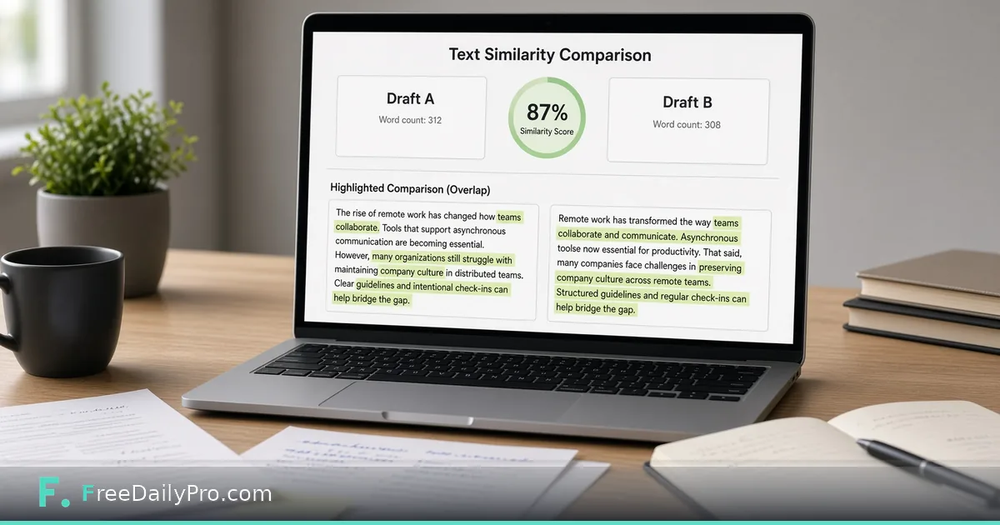

*A pairwise text similarity check for marketing teams*

[FreeDailyPro.com](https://www.freedailypro.com) -- Two landing pages that say almost the same thing confuse buyers and waste SEO effort. It often happens when campaigns fork from the same brief and nobody compares final copy.

This post is about a pairwise similarity check for drafts—not a courtroom plagiarism verdict. The tool is FreeDailyPro’s [Text Similarity Checker](https://www.freedailypro.com/tool/text-similarity-checker).

## Where near-duplicates come from

Shared templates, rushed localization, and “just tweak the headline” instructions. Teams need a quick compare before publish, not a week-long content audit every time.

## Workflow

1. Paste Draft A and Draft B into [Text Similarity Checker](https://www.freedailypro.com/tool/text-similarity-checker).
2. Review the score and overlapping regions.
3. Rewrite shared claims so each page has a job.
4. Confirm lengths with [Word Counter](https://www.freedailypro.com/tool/word-counter); use [Diff Checker](https://www.freedailypro.com/tool/diff-checker) for line-level edits.

See [text tools](https://www.freedailypro.com/category/text-tools) and [multitool apps](https://www.freedailypro.com/multitool-apps).

## Editorial standards

Product names will always overlap—that is fine. Boilerplate legal lines may match on purpose. Focus on differentiating value props and proof points.

## Honest limits

Similarity is not legal originality proof. Short strings inflate scores. Human judgment still owns brand voice and compliance review.

## Closing

Publish pages that earn their URL. FreeDailyPro’s [Text Similarity Checker](https://www.freedailypro.com/tool/text-similarity-checker) is a free gate before two campaigns ship the same paragraph. Compare, differentiate, then launch.

## Related habits that keep the workflow clean

After you finish with the primary tool, take thirty seconds to file the output where you will find it again. A clear filename and a dated folder beat a desktop full of exports. If you work with a partner, agree once on where final files live so nobody hunts chat history for the “real” version.

When something looks off in the result, fix the source input rather than stacking workarounds. Re-running a clean pass is faster than explaining a messy file to a client or classmate later.

## Privacy and common sense

Only process files and text you are allowed to handle in a browser tool. Payroll, medical, and confidential legal material may require approved systems only—follow your policy even when a free tool is convenient. Close the tab when you are done on a shared computer. Do not leave client data on a screen in a café.

If your organization blocks third-party tools, use the path IT provides. This guide assumes you are allowed to use FreeDailyPro for the task described.

## What “done” looks like

You should leave with a file or a number you can act on: send the PDF, paste the result, or record the figure in your notes. If you cannot state the next action in one sentence, the workflow is not finished. Open [Text Similarity Checker](https://www.freedailypro.com/tool/text-similarity-checker) only when you know what success means for this task.

## Teaching someone else the same steps

If a teammate will repeat this job, write the five steps in your internal doc with the live tool link. Do not screenshot a dozen menus from other products. The value of a narrow browser tool is that the path stays short enough to teach in minutes.

## When to stop and use a heavier product

If you need automation across hundreds of files, multi-user approvals, or regulated audit trails, graduate to software built for that scale. Free browser utilities shine for one-off and light-repeat work. Knowing the ceiling is part of using the tool honestly.

## Related habits that keep the workflow clean

After you finish with the primary tool, take thirty seconds to file the output where you will find it again. A clear filename and a dated folder beat a desktop full of exports. If you work with a partner, agree once on where final files live so nobody hunts chat history for the “real” version.

When something looks off in the result, fix the source input rather than stacking workarounds. Re-running a clean pass is faster than explaining a messy file to a client or classmate later.

## Privacy and common sense

Only process files and text you are allowed to handle in a browser tool. Payroll, medical, and confidential legal material may require approved systems only—follow your policy even when a free tool is convenient. Close the tab when you are done on a shared computer. Do not leave client data on a screen in a café.

If your organization blocks third-party tools, use the path IT provides. This guide assumes you are allowed to use FreeDailyPro for the task described.

## What “done” looks like

You should leave with a file or a number you can act on: send the PDF, paste the result, or record the figure in your notes. If you cannot state the next action in one sentence, the workflow is not finished. Open [Text Similarity Checker](https://www.freedailypro.com/tool/text-similarity-checker) only when you know what success means for this task.

## Teaching someone else the same steps

If a teammate will repeat this job, write the five steps in your internal doc with the live tool link. Do not screenshot a dozen menus from other products. The value of a narrow browser tool is that the path stays short enough to teach in minutes.

## When to stop and use a heavier product

If you need automation across hundreds of files, multi-user approvals, or regulated audit trails, graduate to software built for that scale. Free browser utilities shine for one-off and light-repeat work. Knowing the ceiling is part of using the tool honestly.

## Related habits that keep the workflow clean

After you finish with the primary tool, take thirty seconds to file the output where you will find it again. A clear filename and a dated folder beat a desktop full of exports. If you work with a partner, agree once on where final files live so nobody hunts chat history for the “real” version.

When something looks off in the result, fix the source input rather than stacking workarounds. Re-running a clean pass is faster than explaining a messy file to a client or classmate later.
