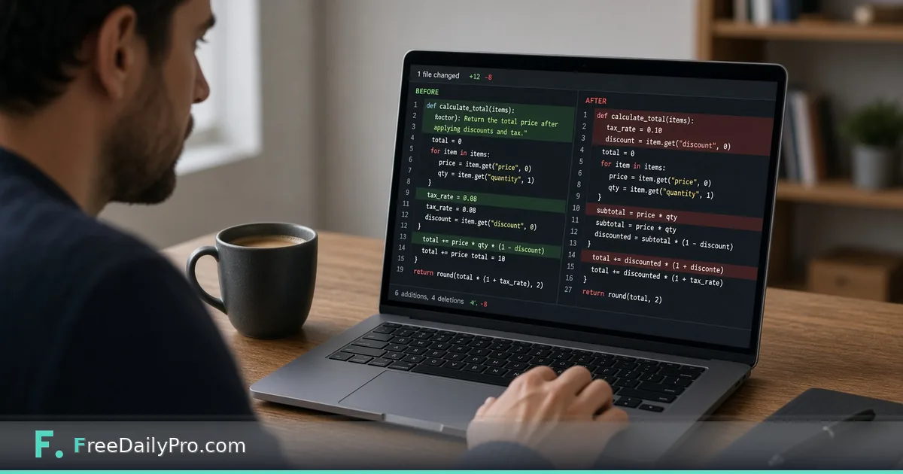

*Side-by-side diff for teams that live in docs and JSON*

[FreeDailyPro.com](https://www.freedailypro.com) -- “What changed?” should not be a scroll-and-squint exercise. Whether you are reviewing contract wording or a config snippet, side-by-side difference highlighting saves meetings.

This post is about using a free diff view for text and configs. The tool is FreeDailyPro’s [Diff Checker](https://www.freedailypro.com/tool/diff-checker).

## RevOps and docs workflows

Paste the previous clause and the new clause. Read every highlighted change. Do not approve on trust when numbers, dates, or liability language moved.

For overall prose overlap across long drafts, [Text Similarity Checker](https://www.freedailypro.com/tool/text-similarity-checker) helps. For JSON configs, format first with [JSON Formatter](https://www.freedailypro.com/tool/json-formatter), then diff.

See [developer tools](https://www.freedailypro.com/category/developer-tools) and [multitool apps](https://www.freedailypro.com/multitool-apps).

## Workflow

1. Collect before and after text from the same source of truth.
2. Paste into [Diff Checker](https://www.freedailypro.com/tool/diff-checker).
3. Walk each change with the owner.
4. Record decisions in your system of record—not only in chat.

## Honest limits

Not a full legal redline platform with identity and audit trails. Huge files may be better in desktop diff tools. Diff does not replace counsel for binding agreements.

## Closing

Shared visibility beats verbal summaries of “minor edits.” FreeDailyPro’s [Diff Checker](https://www.freedailypro.com/tool/diff-checker) makes changes visible before you accept them. Paste, review, decide.

## Related habits that keep the workflow clean

After you finish with the primary tool, take thirty seconds to file the output where you will find it again. A clear filename and a dated folder beat a desktop full of exports. If you work with a partner, agree once on where final files live so nobody hunts chat history for the “real” version.

When something looks off in the result, fix the source input rather than stacking workarounds. Re-running a clean pass is faster than explaining a messy file to a client or classmate later.

## Privacy and common sense

Only process files and text you are allowed to handle in a browser tool. Payroll, medical, and confidential legal material may require approved systems only—follow your policy even when a free tool is convenient. Close the tab when you are done on a shared computer. Do not leave client data on a screen in a café.

If your organization blocks third-party tools, use the path IT provides. This guide assumes you are allowed to use FreeDailyPro for the task described.

## What “done” looks like

You should leave with a file or a number you can act on: send the PDF, paste the result, or record the figure in your notes. If you cannot state the next action in one sentence, the workflow is not finished. Open [Diff Checker](https://www.freedailypro.com/tool/diff-checker) only when you know what success means for this task.

## Teaching someone else the same steps

If a teammate will repeat this job, write the five steps in your internal doc with the live tool link. Do not screenshot a dozen menus from other products. The value of a narrow browser tool is that the path stays short enough to teach in minutes.

## When to stop and use a heavier product

If you need automation across hundreds of files, multi-user approvals, or regulated audit trails, graduate to software built for that scale. Free browser utilities shine for one-off and light-repeat work. Knowing the ceiling is part of using the tool honestly.

## Related habits that keep the workflow clean

After you finish with the primary tool, take thirty seconds to file the output where you will find it again. A clear filename and a dated folder beat a desktop full of exports. If you work with a partner, agree once on where final files live so nobody hunts chat history for the “real” version.

When something looks off in the result, fix the source input rather than stacking workarounds. Re-running a clean pass is faster than explaining a messy file to a client or classmate later.

## Privacy and common sense

Only process files and text you are allowed to handle in a browser tool. Payroll, medical, and confidential legal material may require approved systems only—follow your policy even when a free tool is convenient. Close the tab when you are done on a shared computer. Do not leave client data on a screen in a café.

If your organization blocks third-party tools, use the path IT provides. This guide assumes you are allowed to use FreeDailyPro for the task described.

## What “done” looks like

You should leave with a file or a number you can act on: send the PDF, paste the result, or record the figure in your notes. If you cannot state the next action in one sentence, the workflow is not finished. Open [Diff Checker](https://www.freedailypro.com/tool/diff-checker) only when you know what success means for this task.

## Teaching someone else the same steps

If a teammate will repeat this job, write the five steps in your internal doc with the live tool link. Do not screenshot a dozen menus from other products. The value of a narrow browser tool is that the path stays short enough to teach in minutes.

## When to stop and use a heavier product

If you need automation across hundreds of files, multi-user approvals, or regulated audit trails, graduate to software built for that scale. Free browser utilities shine for one-off and light-repeat work. Knowing the ceiling is part of using the tool honestly.

## Related habits that keep the workflow clean

After you finish with the primary tool, take thirty seconds to file the output where you will find it again. A clear filename and a dated folder beat a desktop full of exports. If you work with a partner, agree once on where final files live so nobody hunts chat history for the “real” version.

When something looks off in the result, fix the source input rather than stacking workarounds. Re-running a clean pass is faster than explaining a messy file to a client or classmate later.
