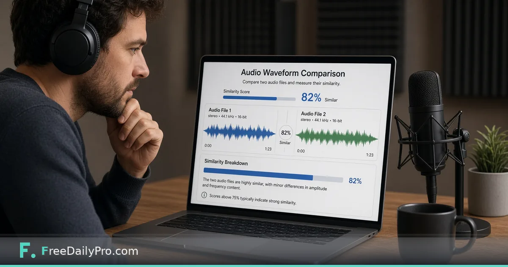

*Compare two audio clips when filenames lie*

[FreeDailyPro.com](https://www.freedailypro.com) -- Filenames lie. `final_v3.mp3` might be yesterday’s take. Publishing the wrong audio wastes audience trust and ad inventory. A quick compare before the scheduler runs is cheaper than a takedown.

This post is about comparing two clips before publish. The tool is FreeDailyPro’s [Audio Comparer](https://www.freedailypro.com/tool/audio-comparer).

## Production workflow

1. Load clip A and clip B into [Audio Comparer](https://www.freedailypro.com/tool/audio-comparer).
2. Review similarity and listen to differences.
3. Keep show-note lengths honest with [Word Counter](https://www.freedailypro.com/tool/word-counter) when needed.
4. Hash archives with [Hash Generator](https://www.freedailypro.com/tool/hash-generator) if chain-of-custody matters for agencies.

See [multitool apps](https://www.freedailypro.com/multitool-apps).

## Naming discipline still required

Comparers catch mistakes; good names prevent many of them. Include date, show, episode, and take in filenames. Lock the approved file in your DAM or drive with clear permissions.

## Honest limits

Not a full DAW. Not forensic lab grade. Heavy compression for social exports may score differently than masters. Always do a human listen on the release candidate.

## Closing

Wrong takes should die in review, not in public. FreeDailyPro’s [Audio Comparer](https://www.freedailypro.com/tool/audio-comparer) is a free check when two files might be swapped. Compare, listen, then schedule.

## Related habits that keep the workflow clean

After you finish with the primary tool, take thirty seconds to file the output where you will find it again. A clear filename and a dated folder beat a desktop full of exports. If you work with a partner, agree once on where final files live so nobody hunts chat history for the “real” version.

When something looks off in the result, fix the source input rather than stacking workarounds. Re-running a clean pass is faster than explaining a messy file to a client or classmate later.

## Privacy and common sense

Only process files and text you are allowed to handle in a browser tool. Payroll, medical, and confidential legal material may require approved systems only—follow your policy even when a free tool is convenient. Close the tab when you are done on a shared computer. Do not leave client data on a screen in a café.

If your organization blocks third-party tools, use the path IT provides. This guide assumes you are allowed to use FreeDailyPro for the task described.

## What “done” looks like

You should leave with a file or a number you can act on: send the PDF, paste the result, or record the figure in your notes. If you cannot state the next action in one sentence, the workflow is not finished. Open [Audio Comparer](https://www.freedailypro.com/tool/audio-comparer) only when you know what success means for this task.

## Teaching someone else the same steps

If a teammate will repeat this job, write the five steps in your internal doc with the live tool link. Do not screenshot a dozen menus from other products. The value of a narrow browser tool is that the path stays short enough to teach in minutes.

## When to stop and use a heavier product

If you need automation across hundreds of files, multi-user approvals, or regulated audit trails, graduate to software built for that scale. Free browser utilities shine for one-off and light-repeat work. Knowing the ceiling is part of using the tool honestly.

## Related habits that keep the workflow clean

After you finish with the primary tool, take thirty seconds to file the output where you will find it again. A clear filename and a dated folder beat a desktop full of exports. If you work with a partner, agree once on where final files live so nobody hunts chat history for the “real” version.

When something looks off in the result, fix the source input rather than stacking workarounds. Re-running a clean pass is faster than explaining a messy file to a client or classmate later.

## Privacy and common sense

Only process files and text you are allowed to handle in a browser tool. Payroll, medical, and confidential legal material may require approved systems only—follow your policy even when a free tool is convenient. Close the tab when you are done on a shared computer. Do not leave client data on a screen in a café.

If your organization blocks third-party tools, use the path IT provides. This guide assumes you are allowed to use FreeDailyPro for the task described.

## What “done” looks like

You should leave with a file or a number you can act on: send the PDF, paste the result, or record the figure in your notes. If you cannot state the next action in one sentence, the workflow is not finished. Open [Audio Comparer](https://www.freedailypro.com/tool/audio-comparer) only when you know what success means for this task.

## Teaching someone else the same steps

If a teammate will repeat this job, write the five steps in your internal doc with the live tool link. Do not screenshot a dozen menus from other products. The value of a narrow browser tool is that the path stays short enough to teach in minutes.

## When to stop and use a heavier product

If you need automation across hundreds of files, multi-user approvals, or regulated audit trails, graduate to software built for that scale. Free browser utilities shine for one-off and light-repeat work. Knowing the ceiling is part of using the tool honestly.

## Related habits that keep the workflow clean

After you finish with the primary tool, take thirty seconds to file the output where you will find it again. A clear filename and a dated folder beat a desktop full of exports. If you work with a partner, agree once on where final files live so nobody hunts chat history for the “real” version.

When something looks off in the result, fix the source input rather than stacking workarounds. Re-running a clean pass is faster than explaining a messy file to a client or classmate later.
