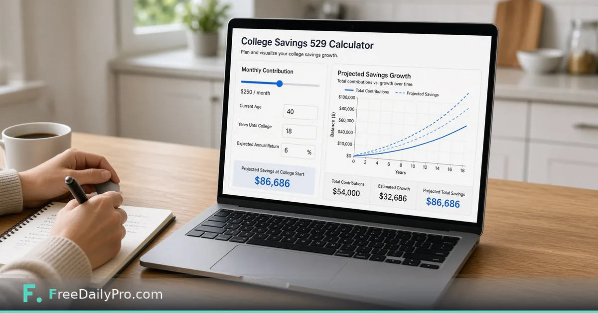

*A calculator HR can share for education-savings education—not tax advice*

[FreeDailyPro.com](https://www.freedailypro.com) -- Employees ask what monthly education savings might look like over time. HR can share a simple visual without pretending to be a financial advisor. Clarity helps; overclaiming harms trust.

This post is about illustrating contribution growth assumptions for education-savings conversations. The tool is FreeDailyPro’s [College 529 Calculator](https://www.freedailypro.com/tool/college-529-calculator).

## How to use it responsibly in benefits comms

Frame outputs as educational examples. State that returns are assumptions. Point employees to plan documents and qualified advisors. Do not personalize tax outcomes in a blog CTA.

## Workflow

1. Open [College 529 Calculator](https://www.freedailypro.com/tool/college-529-calculator) with sample monthly amounts.
2. Show sensitivity using [Percentage Calculator](https://www.freedailypro.com/tool/percentage-calculator).
3. When families compare save-versus-borrow narratives at a high level, [Loan Calculator](https://www.freedailypro.com/tool/loan-calculator) can illustrate payment shapes—not recommendations.

See [calculators](https://www.freedailypro.com/category/calculators) and [multitool apps](https://www.freedailypro.com/multitool-apps).

## Honest limits

Not tax, legal, or investment advice. Plan rules vary by state and provider. Markets vary. This is a conversation aid.

## Closing

Benefits education works better with simple pictures than with jargon alone. FreeDailyPro’s [College 529 Calculator](https://www.freedailypro.com/tool/college-529-calculator) helps HR illustrate contribution scenarios carefully. Show the math, state the limits, refer out for advice.

## Related habits that keep the workflow clean

After you finish with the primary tool, take thirty seconds to file the output where you will find it again. A clear filename and a dated folder beat a desktop full of exports. If you work with a partner, agree once on where final files live so nobody hunts chat history for the “real” version.

When something looks off in the result, fix the source input rather than stacking workarounds. Re-running a clean pass is faster than explaining a messy file to a client or classmate later.

## Privacy and common sense

Only process files and text you are allowed to handle in a browser tool. Payroll, medical, and confidential legal material may require approved systems only—follow your policy even when a free tool is convenient. Close the tab when you are done on a shared computer. Do not leave client data on a screen in a café.

If your organization blocks third-party tools, use the path IT provides. This guide assumes you are allowed to use FreeDailyPro for the task described.

## What “done” looks like

You should leave with a file or a number you can act on: send the PDF, paste the result, or record the figure in your notes. If you cannot state the next action in one sentence, the workflow is not finished. Open [College 529 Calculator](https://www.freedailypro.com/tool/college-529-calculator) only when you know what success means for this task.

## Teaching someone else the same steps

If a teammate will repeat this job, write the five steps in your internal doc with the live tool link. Do not screenshot a dozen menus from other products. The value of a narrow browser tool is that the path stays short enough to teach in minutes.

## When to stop and use a heavier product

If you need automation across hundreds of files, multi-user approvals, or regulated audit trails, graduate to software built for that scale. Free browser utilities shine for one-off and light-repeat work. Knowing the ceiling is part of using the tool honestly.

## Related habits that keep the workflow clean

After you finish with the primary tool, take thirty seconds to file the output where you will find it again. A clear filename and a dated folder beat a desktop full of exports. If you work with a partner, agree once on where final files live so nobody hunts chat history for the “real” version.

When something looks off in the result, fix the source input rather than stacking workarounds. Re-running a clean pass is faster than explaining a messy file to a client or classmate later.

## Privacy and common sense

Only process files and text you are allowed to handle in a browser tool. Payroll, medical, and confidential legal material may require approved systems only—follow your policy even when a free tool is convenient. Close the tab when you are done on a shared computer. Do not leave client data on a screen in a café.

If your organization blocks third-party tools, use the path IT provides. This guide assumes you are allowed to use FreeDailyPro for the task described.

## What “done” looks like

You should leave with a file or a number you can act on: send the PDF, paste the result, or record the figure in your notes. If you cannot state the next action in one sentence, the workflow is not finished. Open [College 529 Calculator](https://www.freedailypro.com/tool/college-529-calculator) only when you know what success means for this task.

## Teaching someone else the same steps

If a teammate will repeat this job, write the five steps in your internal doc with the live tool link. Do not screenshot a dozen menus from other products. The value of a narrow browser tool is that the path stays short enough to teach in minutes.

## When to stop and use a heavier product

If you need automation across hundreds of files, multi-user approvals, or regulated audit trails, graduate to software built for that scale. Free browser utilities shine for one-off and light-repeat work. Knowing the ceiling is part of using the tool honestly.

## Related habits that keep the workflow clean

After you finish with the primary tool, take thirty seconds to file the output where you will find it again. A clear filename and a dated folder beat a desktop full of exports. If you work with a partner, agree once on where final files live so nobody hunts chat history for the “real” version.

When something looks off in the result, fix the source input rather than stacking workarounds. Re-running a clean pass is faster than explaining a messy file to a client or classmate later.
