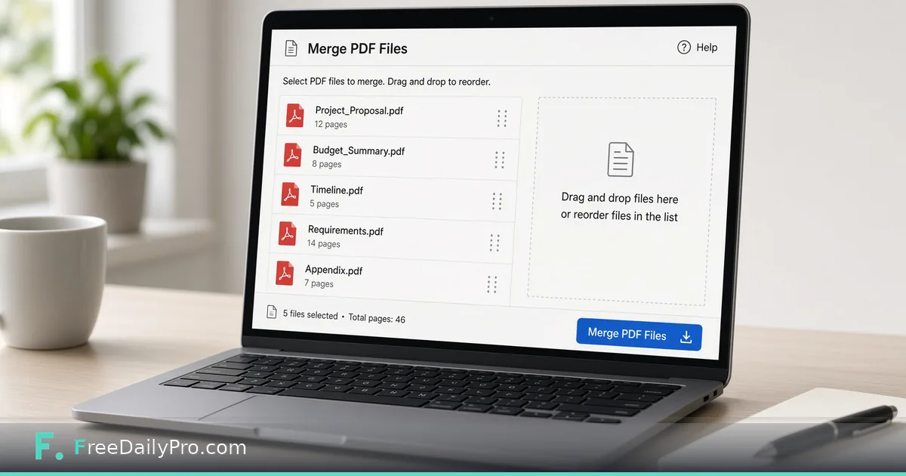

*Merge proposals, budgets, and appendices into one client-ready file*

[FreeDailyPro.com](https://www.freedailypro.com) -- Clients rarely want five attachments. They want one packet: proposal, budget, timeline, and appendix. You finish the work in different apps, export three or four PDFs, and email the pile. Someone always opens the wrong file first.

This post is about one narrow job: combining those files into a single, intentional PDF before you send. The tool is FreeDailyPro’s [Merge PDF](https://www.freedailypro.com/tool/merge-pdf). It will not redesign your layout. It will put the pages in order so the client can read once.

## Why separate attachments feel sloppy

When a design export, a spreadsheet printout, and a scope note arrive as three files, the client has to reconstruct your story. They may miss the budget. They may reply on the wrong thread. You spend the next morning re-sending “the full pack.”

One merged file is professional hygiene. Cover story first. Numbers next. Evidence last. One filename that matches the project. Your sent folder should still make sense a month later when someone asks what went out.

## What Merge PDF actually does

Open [Merge PDF](https://www.freedailypro.com/tool/merge-pdf). Add the PDFs you already exported. Reorder them if the upload order is wrong. Run the merge. Download the result and open it end to end.

If the merged file is too large for email, run [Compress PDF](https://www.freedailypro.com/tool/compress-pdf) next. If one section needs text edits and you only have a PDF, convert that section with [PDF to Word](https://www.freedailypro.com/tool/pdf-to-word), edit, re-export, and merge again. More options live under [PDF tools](https://www.freedailypro.com/category/pdf-tools) and the [multitool apps](https://www.freedailypro.com/multitool-apps) hub.

## A practical merge workflow

1. Export each section as its own clean PDF from the source app when you can.
2. Open Merge PDF and add files in the order the client should read them.
3. Reorder in the tool if needed—proposal first, appendix last.
4. Merge and open the full result. Check page count, orientation, and obvious blank pages.
5. Compress if the attachment still exceeds the email or portal limit.
6. Name the file clearly, for example `Acme_Q4_Proposal_Packet.pdf`, then send.

Do not merge first and fix quality later if a source page is already a blurry scan. Fix the source, then merge.

## Naming and version discipline

Merged files multiply on disk. Use a pattern with client, project, and date. Avoid `final_merge_3_REALLY.pdf`. Keep pre-merge originals in a folder labeled sources so a last-minute fix does not require reverse-engineering a flat packet.

## Quality checks before send

Zoom to 100% on fine print or signature lines. Confirm every intended file is present and none is duplicated. Confirm page order matches the agenda in your email body. If the portal requires separate uploads per field, do not merge—follow the portal.

## Honest limits

Merge does not redesign layouts, OCR scans into perfect text, or repair corrupt PDFs. Password-protected inputs may need unlocking under your security rules. Extremely large production files may need desktop tools. If legal requires separately signed instruments, do not combine them into one file that breaks signature workflows.

## When this approach is enough

Freelance proposals with budget and timeline addenda, agency creative plus estimate packets, and internal review decks where one file beats a zip. It is not enough for regulated filings with strict file separation rules.

## Closing

One packet beats five attachments. FreeDailyPro’s [Merge PDF](https://www.freedailypro.com/tool/merge-pdf) is a free browser way to stack the files you already trust, in the order you choose. Merge, spot-check, compress if needed, send once.

## Related habits that keep the workflow clean

After you finish with the primary tool, take thirty seconds to file the output where you will find it again. A clear filename and a dated folder beat a desktop full of exports. If you work with a partner, agree once on where final files live so nobody hunts chat history for the “real” version.

When something looks off in the result, fix the source input rather than stacking workarounds. Re-running a clean pass is faster than explaining a messy file to a client or classmate later.

## Privacy and common sense

Only process files and text you are allowed to handle in a browser tool. Payroll, medical, and confidential legal material may require approved systems only—follow your policy even when a free tool is convenient. Close the tab when you are done on a shared computer. Do not leave client data on a screen in a café.

If your organization blocks third-party tools, use the path IT provides. This guide assumes you are allowed to use FreeDailyPro for the task described.

## What “done” looks like

You should leave with a file or a number you can act on: send the PDF, paste the result, or record the figure in your notes. If you cannot state the next action in one sentence, the workflow is not finished. Open [Merge Pdf](https://www.freedailypro.com/tool/merge-pdf) only when you know what success means for this task.

## Teaching someone else the same steps

If a teammate will repeat this job, write the five steps in your internal doc with the live tool link. Do not screenshot a dozen menus from other products. The value of a narrow browser tool is that the path stays short enough to teach in minutes.

## When to stop and use a heavier product

If you need automation across hundreds of files, multi-user approvals, or regulated audit trails, graduate to software built for that scale. Free browser utilities shine for one-off and light-repeat work. Knowing the ceiling is part of using the tool honestly.

## Related habits that keep the workflow clean

After you finish with the primary tool, take thirty seconds to file the output where you will find it again. A clear filename and a dated folder beat a desktop full of exports. If you work with a partner, agree once on where final files live so nobody hunts chat history for the “real” version.

When something looks off in the result, fix the source input rather than stacking workarounds. Re-running a clean pass is faster than explaining a messy file to a client or classmate later.
