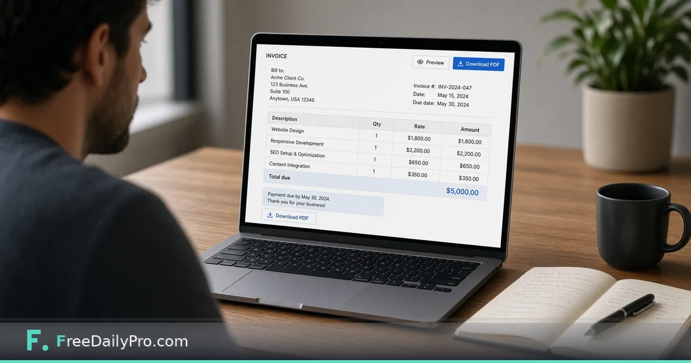

*A clean browser invoice when you are too small for full accounting software*

[FreeDailyPro.com](https://www.freedailypro.com) -- You do not need a full accounting suite to send a clean invoice. You need line items, a total, a due date, and a PDF the client can pay against. Spreadsheet invoices drift: wrong logo, forgotten tax line, inconsistent numbers. Clients notice.

This post covers one job: producing a professional invoice PDF when volume is still low. The tool is FreeDailyPro’s [Invoice Generator](https://www.freedailypro.com/tool/invoice-generator).

## Why the spreadsheet stops working

Early freelancing often starts in a sheet: copy last month’s tab, change the date, hope the formula still sums. Then a discount appears. Then two projects share one invoice. The sheet becomes a museum of special cases.

A simple generator enforces structure. Bill-to. Invoice number. Dates. Lines. Total. You still own the business rules; the tool stops the layout from falling apart.

## What the invoice generator covers

Open [Invoice Generator](https://www.freedailypro.com/tool/invoice-generator). Fill seller and client fields, invoice number, dates, and line items. Review the total. Download the PDF. Store a copy before you send.

If you apply a percent discount, confirm the math with the [Percentage Calculator](https://www.freedailypro.com/tool/percentage-calculator). If a notes field has a character cap, check length with the [Word Counter](https://www.freedailypro.com/tool/word-counter). See [calculators](https://www.freedailypro.com/category/calculators) and [multitool apps](https://www.freedailypro.com/multitool-apps).

## A billing-night workflow

1. Confirm the work is accepted and the rate matches the agreement.
2. Enter line items with clear descriptions.
3. Apply tax or discount only when your agreement and local rules require it—and you understand those rules.
4. Download the PDF and save it with a real sequence number in the filename.
5. Send from your business email with payment instructions that match how you actually get paid.
6. Log the invoice number so you never reuse numbers.

## Numbering and records

Pick a scheme and stick to it. Save PDFs in a dated folder. If a client asks for a revision after money moved, use a proper credit or new invoice process—do not silently overwrite history.

## Honest limits

This is not payroll, multi-entity ERP, or automatic tax filing. Local invoice and tax requirements remain your responsibility. When volume and reporting needs grow, move to proper accounting software and export history first.

## Closing

Clean invoices reduce payment friction. FreeDailyPro’s [Invoice Generator](https://www.freedailypro.com/tool/invoice-generator) produces a structured PDF when a full accounting suite is still more than you need. Number it, save it, send it, track it.

## Related habits that keep the workflow clean

After you finish with the primary tool, take thirty seconds to file the output where you will find it again. A clear filename and a dated folder beat a desktop full of exports. If you work with a partner, agree once on where final files live so nobody hunts chat history for the “real” version.

When something looks off in the result, fix the source input rather than stacking workarounds. Re-running a clean pass is faster than explaining a messy file to a client or classmate later.

## Privacy and common sense

Only process files and text you are allowed to handle in a browser tool. Payroll, medical, and confidential legal material may require approved systems only—follow your policy even when a free tool is convenient. Close the tab when you are done on a shared computer. Do not leave client data on a screen in a café.

If your organization blocks third-party tools, use the path IT provides. This guide assumes you are allowed to use FreeDailyPro for the task described.

## What “done” looks like

You should leave with a file or a number you can act on: send the PDF, paste the result, or record the figure in your notes. If you cannot state the next action in one sentence, the workflow is not finished. Open [Invoice Generator](https://www.freedailypro.com/tool/invoice-generator) only when you know what success means for this task.

## Teaching someone else the same steps

If a teammate will repeat this job, write the five steps in your internal doc with the live tool link. Do not screenshot a dozen menus from other products. The value of a narrow browser tool is that the path stays short enough to teach in minutes.

## When to stop and use a heavier product

If you need automation across hundreds of files, multi-user approvals, or regulated audit trails, graduate to software built for that scale. Free browser utilities shine for one-off and light-repeat work. Knowing the ceiling is part of using the tool honestly.

## Related habits that keep the workflow clean

After you finish with the primary tool, take thirty seconds to file the output where you will find it again. A clear filename and a dated folder beat a desktop full of exports. If you work with a partner, agree once on where final files live so nobody hunts chat history for the “real” version.

When something looks off in the result, fix the source input rather than stacking workarounds. Re-running a clean pass is faster than explaining a messy file to a client or classmate later.

## Privacy and common sense

Only process files and text you are allowed to handle in a browser tool. Payroll, medical, and confidential legal material may require approved systems only—follow your policy even when a free tool is convenient. Close the tab when you are done on a shared computer. Do not leave client data on a screen in a café.

If your organization blocks third-party tools, use the path IT provides. This guide assumes you are allowed to use FreeDailyPro for the task described.

## What “done” looks like

You should leave with a file or a number you can act on: send the PDF, paste the result, or record the figure in your notes. If you cannot state the next action in one sentence, the workflow is not finished. Open [Invoice Generator](https://www.freedailypro.com/tool/invoice-generator) only when you know what success means for this task.
