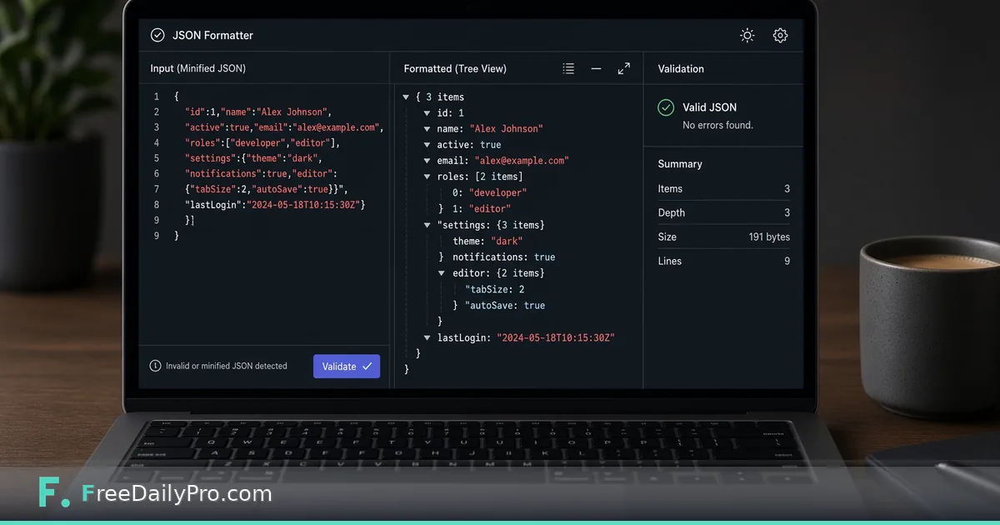

*When minified payloads hide the bug in plain sight*

[FreeDailyPro.com](https://www.freedailypro.com) -- Minified JSON is efficient for machines and hostile to humans. During an API debug, a one-line payload can hide a missing field, a wrong type, or a nested object you did not expect. You do not always want to install another IDE plugin on a locked-down laptop.

This post is about one job: formatting and validating JSON quickly in the browser. The tool is FreeDailyPro’s [JSON / YAML Formatter](https://www.freedailypro.com/tool/json-formatter).

## The debug pattern that keeps repeating

The error says parse failed, or the field you need sits three levels deep. You paste the body into a formatter, validate, expand the path, and compare it to the docs. Half the time the bug is a trailing comma, a quote issue, or a null where a list should be.

Pretty-printing does not fix the server. It makes the evidence readable so you stop guessing.

## What the formatter does

Open [JSON Formatter](https://www.freedailypro.com/tool/json-formatter). Paste the raw request or response body. Validate. Read the structured tree. Fix structural mistakes if the payload is yours to edit, then retry the call.

If a URL inside the payload is mangled, check the [URL Encoder](https://www.freedailypro.com/tool/url-encoder). If you need a fingerprint of a body for logs, use the [Hash Generator](https://www.freedailypro.com/tool/hash-generator). More utilities sit under [developer tools](https://www.freedailypro.com/category/developer-tools) and [multitool apps](https://www.freedailypro.com/multitool-apps).

## A short debug workflow

1. Copy the raw body from your network panel or log.
2. Paste into the formatter and run validation.
3. Expand the path the API docs describe.
4. Compare types and required fields to the specification.
5. Retry with a corrected payload only when you own that side of the contract.

## Honest limits

Formatting does not fix authentication, rate limits, or schema drift on the server. It is a poor fit for multi-megabyte streaming logs—use local CLI tools there. Encrypted blobs will not become readable by pretty-printing.

## Closing

Readable JSON shortens debug sessions. FreeDailyPro’s [JSON Formatter](https://www.freedailypro.com/tool/json-formatter) is a free browser step between “opaque string” and “I can see the field.” Validate, inspect, fix what you control, retry.

## Related habits that keep the workflow clean

After you finish with the primary tool, take thirty seconds to file the output where you will find it again. A clear filename and a dated folder beat a desktop full of exports. If you work with a partner, agree once on where final files live so nobody hunts chat history for the “real” version.

When something looks off in the result, fix the source input rather than stacking workarounds. Re-running a clean pass is faster than explaining a messy file to a client or classmate later.

## Privacy and common sense

Only process files and text you are allowed to handle in a browser tool. Payroll, medical, and confidential legal material may require approved systems only—follow your policy even when a free tool is convenient. Close the tab when you are done on a shared computer. Do not leave client data on a screen in a café.

If your organization blocks third-party tools, use the path IT provides. This guide assumes you are allowed to use FreeDailyPro for the task described.

## What “done” looks like

You should leave with a file or a number you can act on: send the PDF, paste the result, or record the figure in your notes. If you cannot state the next action in one sentence, the workflow is not finished. Open [Json Formatter](https://www.freedailypro.com/tool/json-formatter) only when you know what success means for this task.

## Teaching someone else the same steps

If a teammate will repeat this job, write the five steps in your internal doc with the live tool link. Do not screenshot a dozen menus from other products. The value of a narrow browser tool is that the path stays short enough to teach in minutes.

## When to stop and use a heavier product

If you need automation across hundreds of files, multi-user approvals, or regulated audit trails, graduate to software built for that scale. Free browser utilities shine for one-off and light-repeat work. Knowing the ceiling is part of using the tool honestly.

## Related habits that keep the workflow clean

After you finish with the primary tool, take thirty seconds to file the output where you will find it again. A clear filename and a dated folder beat a desktop full of exports. If you work with a partner, agree once on where final files live so nobody hunts chat history for the “real” version.

When something looks off in the result, fix the source input rather than stacking workarounds. Re-running a clean pass is faster than explaining a messy file to a client or classmate later.

## Privacy and common sense

Only process files and text you are allowed to handle in a browser tool. Payroll, medical, and confidential legal material may require approved systems only—follow your policy even when a free tool is convenient. Close the tab when you are done on a shared computer. Do not leave client data on a screen in a café.

If your organization blocks third-party tools, use the path IT provides. This guide assumes you are allowed to use FreeDailyPro for the task described.

## What “done” looks like

You should leave with a file or a number you can act on: send the PDF, paste the result, or record the figure in your notes. If you cannot state the next action in one sentence, the workflow is not finished. Open [Json Formatter](https://www.freedailypro.com/tool/json-formatter) only when you know what success means for this task.

## Teaching someone else the same steps

If a teammate will repeat this job, write the five steps in your internal doc with the live tool link. Do not screenshot a dozen menus from other products. The value of a narrow browser tool is that the path stays short enough to teach in minutes.
