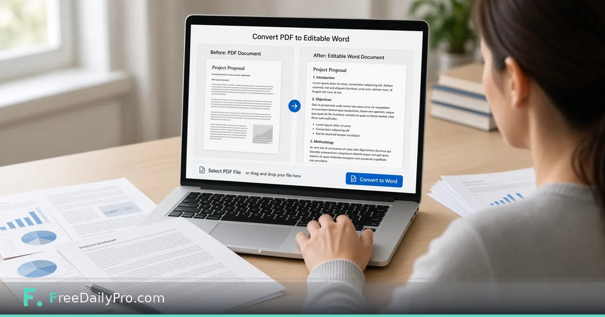

*A practical PDF-to-Word path for light edits—not magic OCR miracles*

[FreeDailyPro.com](https://www.freedailypro.com) -- Someone sent a PDF. You need to change two sentences. They no longer have the source file. Rebuilding the document from scratch would waste the afternoon.

This post covers one rescue path: convert the PDF to an editable Word file for light edits, then export again if you must deliver PDF. The tool is FreeDailyPro’s [PDF to Word](https://www.freedailypro.com/tool/pdf-to-word).

## Set expectations early

Complex multi-column designs, heavy tables, and scanned pages will not become pristine Word files. Text-forward PDFs convert better. Always proofread. Conversion is a bridge, not a promise of perfect layout fidelity.

## Workflow

1. Convert with [PDF to Word](https://www.freedailypro.com/tool/pdf-to-word).
2. Edit only what you must; avoid restyling the entire document unless you have time.
3. Export back to PDF for distribution when the recipient expects PDF.
4. If size balloons, use [Compress PDF](https://www.freedailypro.com/tool/compress-pdf). If you need several sections as one file later, use [Merge PDF](https://www.freedailypro.com/tool/merge-pdf).

Explore [PDF tools](https://www.freedailypro.com/category/pdf-tools) and [multitool apps](https://www.freedailypro.com/multitool-apps).

## Proofreading checklist

Check headings, lists, and tables. Confirm that numbers and names did not shift. Watch for hyphenation glitches and text boxes that became plain paragraphs. If the PDF was a scan, treat OCR text as untrusted until you read it.

## Honest limits

Fonts substitute. Legal documents may require proper redline tools and counsel. Confidential files need policy-compliant handling. Conversion quality varies with how the PDF was built.

## Closing

When the source file is gone, FreeDailyPro’s [PDF to Word](https://www.freedailypro.com/tool/pdf-to-word) is a free way to make light edits possible. Convert, edit carefully, proofread, re-export.

## Related habits that keep the workflow clean

After you finish with the primary tool, take thirty seconds to file the output where you will find it again. A clear filename and a dated folder beat a desktop full of exports. If you work with a partner, agree once on where final files live so nobody hunts chat history for the “real” version.

When something looks off in the result, fix the source input rather than stacking workarounds. Re-running a clean pass is faster than explaining a messy file to a client or classmate later.

## Privacy and common sense

Only process files and text you are allowed to handle in a browser tool. Payroll, medical, and confidential legal material may require approved systems only—follow your policy even when a free tool is convenient. Close the tab when you are done on a shared computer. Do not leave client data on a screen in a café.

If your organization blocks third-party tools, use the path IT provides. This guide assumes you are allowed to use FreeDailyPro for the task described.

## What “done” looks like

You should leave with a file or a number you can act on: send the PDF, paste the result, or record the figure in your notes. If you cannot state the next action in one sentence, the workflow is not finished. Open [Pdf To Word](https://www.freedailypro.com/tool/pdf-to-word) only when you know what success means for this task.

## Teaching someone else the same steps

If a teammate will repeat this job, write the five steps in your internal doc with the live tool link. Do not screenshot a dozen menus from other products. The value of a narrow browser tool is that the path stays short enough to teach in minutes.

## When to stop and use a heavier product

If you need automation across hundreds of files, multi-user approvals, or regulated audit trails, graduate to software built for that scale. Free browser utilities shine for one-off and light-repeat work. Knowing the ceiling is part of using the tool honestly.

## Related habits that keep the workflow clean

After you finish with the primary tool, take thirty seconds to file the output where you will find it again. A clear filename and a dated folder beat a desktop full of exports. If you work with a partner, agree once on where final files live so nobody hunts chat history for the “real” version.

When something looks off in the result, fix the source input rather than stacking workarounds. Re-running a clean pass is faster than explaining a messy file to a client or classmate later.

## Privacy and common sense

Only process files and text you are allowed to handle in a browser tool. Payroll, medical, and confidential legal material may require approved systems only—follow your policy even when a free tool is convenient. Close the tab when you are done on a shared computer. Do not leave client data on a screen in a café.

If your organization blocks third-party tools, use the path IT provides. This guide assumes you are allowed to use FreeDailyPro for the task described.

## What “done” looks like

You should leave with a file or a number you can act on: send the PDF, paste the result, or record the figure in your notes. If you cannot state the next action in one sentence, the workflow is not finished. Open [Pdf To Word](https://www.freedailypro.com/tool/pdf-to-word) only when you know what success means for this task.

## Teaching someone else the same steps

If a teammate will repeat this job, write the five steps in your internal doc with the live tool link. Do not screenshot a dozen menus from other products. The value of a narrow browser tool is that the path stays short enough to teach in minutes.

## When to stop and use a heavier product

If you need automation across hundreds of files, multi-user approvals, or regulated audit trails, graduate to software built for that scale. Free browser utilities shine for one-off and light-repeat work. Knowing the ceiling is part of using the tool honestly.

## Related habits that keep the workflow clean

After you finish with the primary tool, take thirty seconds to file the output where you will find it again. A clear filename and a dated folder beat a desktop full of exports. If you work with a partner, agree once on where final files live so nobody hunts chat history for the “real” version.

When something looks off in the result, fix the source input rather than stacking workarounds. Re-running a clean pass is faster than explaining a messy file to a client or classmate later.
