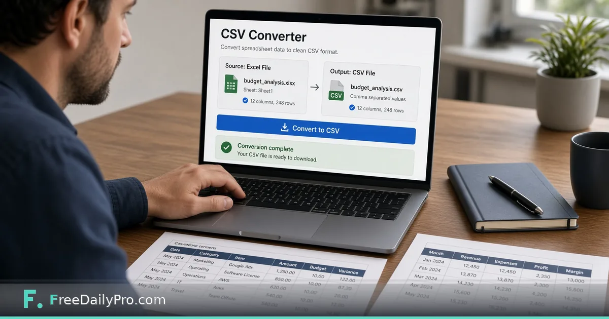

*A narrow workflow from spreadsheet chaos to import-ready CSV*

[FreeDailyPro.com](https://www.freedailypro.com) -- Imports fail when “CSV” is actually a semi-colon file, a UTF-16 export, or a sheet with three header rows. Your CRM, ESP, or finance tool rejects the upload. The afternoon disappears into delimiter archaeology.

This post is about one job: getting to a clean CSV other systems accept. The tool is FreeDailyPro’s [CSV Converter](https://www.freedailypro.com/tool/csv-converter).

## The import desk reality

Every platform wants slightly different CSV. Your job is a clean intermediate file, not a perfect warehouse model. Start by knowing the target system’s rules: delimiter, encoding, header row, date format.

## Workflow

1. Export or upload your source into [CSV Converter](https://www.freedailypro.com/tool/csv-converter).
2. Preview columns; fix delimiter and header assumptions.
3. Download CSV and open it in a plain text editor to confirm.
4. If companion JSON configs are needed, use [JSON Formatter](https://www.freedailypro.com/tool/json-formatter).
5. Import into the target system and verify row counts.

Browse [developer tools](https://www.freedailypro.com/category/developer-tools) and [multitool apps](https://www.freedailypro.com/multitool-apps).

## QA before import

Check for extra blank columns, merged header leftovers, and truncated rows. Confirm encoding for non-English names. Keep a copy of the pre-import file so you can diff if the system mangles data.

## Honest limits

Converters do not clean dirty semantics—duplicate customers, bad emails, or wrong product IDs. They do not replace dedicated ETL for heavy transforms. Very large files may need local tools.

## Closing

Clean CSV is boring and valuable. FreeDailyPro’s [CSV Converter](https://www.freedailypro.com/tool/csv-converter) helps you produce an import-ready file without fighting every desktop export menu. Preview, verify, import, confirm.

## Related habits that keep the workflow clean

After you finish with the primary tool, take thirty seconds to file the output where you will find it again. A clear filename and a dated folder beat a desktop full of exports. If you work with a partner, agree once on where final files live so nobody hunts chat history for the “real” version.

When something looks off in the result, fix the source input rather than stacking workarounds. Re-running a clean pass is faster than explaining a messy file to a client or classmate later.

## Privacy and common sense

Only process files and text you are allowed to handle in a browser tool. Payroll, medical, and confidential legal material may require approved systems only—follow your policy even when a free tool is convenient. Close the tab when you are done on a shared computer. Do not leave client data on a screen in a café.

If your organization blocks third-party tools, use the path IT provides. This guide assumes you are allowed to use FreeDailyPro for the task described.

## What “done” looks like

You should leave with a file or a number you can act on: send the PDF, paste the result, or record the figure in your notes. If you cannot state the next action in one sentence, the workflow is not finished. Open [Csv Converter](https://www.freedailypro.com/tool/csv-converter) only when you know what success means for this task.

## Teaching someone else the same steps

If a teammate will repeat this job, write the five steps in your internal doc with the live tool link. Do not screenshot a dozen menus from other products. The value of a narrow browser tool is that the path stays short enough to teach in minutes.

## When to stop and use a heavier product

If you need automation across hundreds of files, multi-user approvals, or regulated audit trails, graduate to software built for that scale. Free browser utilities shine for one-off and light-repeat work. Knowing the ceiling is part of using the tool honestly.

## Related habits that keep the workflow clean

After you finish with the primary tool, take thirty seconds to file the output where you will find it again. A clear filename and a dated folder beat a desktop full of exports. If you work with a partner, agree once on where final files live so nobody hunts chat history for the “real” version.

When something looks off in the result, fix the source input rather than stacking workarounds. Re-running a clean pass is faster than explaining a messy file to a client or classmate later.

## Privacy and common sense

Only process files and text you are allowed to handle in a browser tool. Payroll, medical, and confidential legal material may require approved systems only—follow your policy even when a free tool is convenient. Close the tab when you are done on a shared computer. Do not leave client data on a screen in a café.

If your organization blocks third-party tools, use the path IT provides. This guide assumes you are allowed to use FreeDailyPro for the task described.

## What “done” looks like

You should leave with a file or a number you can act on: send the PDF, paste the result, or record the figure in your notes. If you cannot state the next action in one sentence, the workflow is not finished. Open [Csv Converter](https://www.freedailypro.com/tool/csv-converter) only when you know what success means for this task.

## Teaching someone else the same steps

If a teammate will repeat this job, write the five steps in your internal doc with the live tool link. Do not screenshot a dozen menus from other products. The value of a narrow browser tool is that the path stays short enough to teach in minutes.

## When to stop and use a heavier product

If you need automation across hundreds of files, multi-user approvals, or regulated audit trails, graduate to software built for that scale. Free browser utilities shine for one-off and light-repeat work. Knowing the ceiling is part of using the tool honestly.

## Related habits that keep the workflow clean

After you finish with the primary tool, take thirty seconds to file the output where you will find it again. A clear filename and a dated folder beat a desktop full of exports. If you work with a partner, agree once on where final files live so nobody hunts chat history for the “real” version.

When something looks off in the result, fix the source input rather than stacking workarounds. Re-running a clean pass is faster than explaining a messy file to a client or classmate later.
