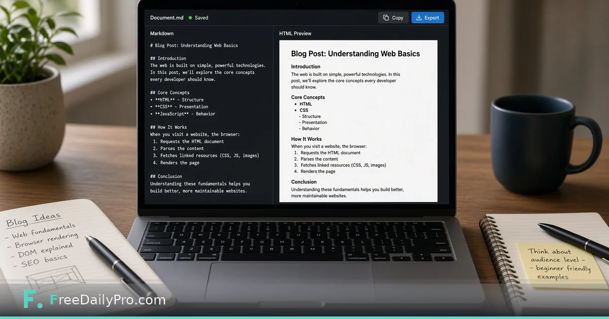

*A creator workflow that keeps drafts portable across newsletters and blogs*

[FreeDailyPro.com](https://www.freedailypro.com) -- Writers love Markdown. Many CMS boxes want HTML. Hand-writing tags wastes time and introduces mistakes. You want portable drafts that still paste cleanly into the publisher.

This post is about converting Markdown to clean HTML for CMS paste. The tool is FreeDailyPro’s [Markdown HTML Converter](https://www.freedailypro.com/tool/markdown-html-converter).

## Why keep Markdown as source

Markdown stays readable in git, email, and plain editors. HTML is often the delivery format. Convert at the last mile so you are not maintaining two divergent drafts.

## Workflow

1. Write and revise in Markdown.
2. Convert with [Markdown HTML Converter](https://www.freedailypro.com/tool/markdown-html-converter).
3. Check length targets with the [Word Counter](https://www.freedailypro.com/tool/word-counter).
4. If two HTML versions differ oddly, compare sources with [Diff Checker](https://www.freedailypro.com/tool/diff-checker).
5. Paste into the CMS and spot-check headings, lists, and links in preview.

See [text tools](https://www.freedailypro.com/category/text-tools) and [multitool apps](https://www.freedailypro.com/multitool-apps).

## CMS quirks

Theme CSS still controls final look. Complex shortcodes and blocks may need manual placement. Strip junk wrappers if your CMS double-wraps paragraphs.

## Honest limits

This is not a full static-site generator. It will not deploy your site. It will not replace a design system. It converts structure so you can publish faster.

## Closing

Portable drafts reduce friction. FreeDailyPro’s [Markdown HTML Converter](https://www.freedailypro.com/tool/markdown-html-converter) turns Markdown into paste-ready HTML when the CMS demands tags. Convert, preview, publish, keep the `.md` as source of truth.

## Related habits that keep the workflow clean

After you finish with the primary tool, take thirty seconds to file the output where you will find it again. A clear filename and a dated folder beat a desktop full of exports. If you work with a partner, agree once on where final files live so nobody hunts chat history for the “real” version.

When something looks off in the result, fix the source input rather than stacking workarounds. Re-running a clean pass is faster than explaining a messy file to a client or classmate later.

## Privacy and common sense

Only process files and text you are allowed to handle in a browser tool. Payroll, medical, and confidential legal material may require approved systems only—follow your policy even when a free tool is convenient. Close the tab when you are done on a shared computer. Do not leave client data on a screen in a café.

If your organization blocks third-party tools, use the path IT provides. This guide assumes you are allowed to use FreeDailyPro for the task described.

## What “done” looks like

You should leave with a file or a number you can act on: send the PDF, paste the result, or record the figure in your notes. If you cannot state the next action in one sentence, the workflow is not finished. Open [Markdown Html Converter](https://www.freedailypro.com/tool/markdown-html-converter) only when you know what success means for this task.

## Teaching someone else the same steps

If a teammate will repeat this job, write the five steps in your internal doc with the live tool link. Do not screenshot a dozen menus from other products. The value of a narrow browser tool is that the path stays short enough to teach in minutes.

## When to stop and use a heavier product

If you need automation across hundreds of files, multi-user approvals, or regulated audit trails, graduate to software built for that scale. Free browser utilities shine for one-off and light-repeat work. Knowing the ceiling is part of using the tool honestly.

## Related habits that keep the workflow clean

After you finish with the primary tool, take thirty seconds to file the output where you will find it again. A clear filename and a dated folder beat a desktop full of exports. If you work with a partner, agree once on where final files live so nobody hunts chat history for the “real” version.

When something looks off in the result, fix the source input rather than stacking workarounds. Re-running a clean pass is faster than explaining a messy file to a client or classmate later.

## Privacy and common sense

Only process files and text you are allowed to handle in a browser tool. Payroll, medical, and confidential legal material may require approved systems only—follow your policy even when a free tool is convenient. Close the tab when you are done on a shared computer. Do not leave client data on a screen in a café.

If your organization blocks third-party tools, use the path IT provides. This guide assumes you are allowed to use FreeDailyPro for the task described.

## What “done” looks like

You should leave with a file or a number you can act on: send the PDF, paste the result, or record the figure in your notes. If you cannot state the next action in one sentence, the workflow is not finished. Open [Markdown Html Converter](https://www.freedailypro.com/tool/markdown-html-converter) only when you know what success means for this task.

## Teaching someone else the same steps

If a teammate will repeat this job, write the five steps in your internal doc with the live tool link. Do not screenshot a dozen menus from other products. The value of a narrow browser tool is that the path stays short enough to teach in minutes.

## When to stop and use a heavier product

If you need automation across hundreds of files, multi-user approvals, or regulated audit trails, graduate to software built for that scale. Free browser utilities shine for one-off and light-repeat work. Knowing the ceiling is part of using the tool honestly.

## Related habits that keep the workflow clean

After you finish with the primary tool, take thirty seconds to file the output where you will find it again. A clear filename and a dated folder beat a desktop full of exports. If you work with a partner, agree once on where final files live so nobody hunts chat history for the “real” version.

When something looks off in the result, fix the source input rather than stacking workarounds. Re-running a clean pass is faster than explaining a messy file to a client or classmate later.
