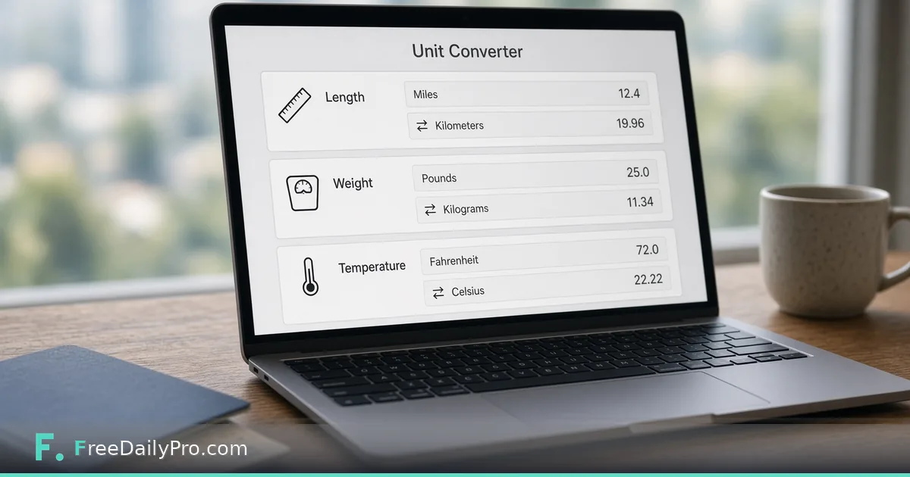

*Miles, kilograms, Celsius, and package sizes in one browser tab*

[FreeDailyPro.com](https://www.freedailypro.com) -- The hotel lists distances in kilometers. Your packing list is in pounds. The recipe is in Celsius. Carrier forms want package dimensions in inches. Installing another converter app for a weekend trip is noise.

This guide is one job: convert common units quickly in the browser with FreeDailyPro’s [Unit Converter](https://www.freedailypro.com/tool/unit-converter).

## When units block the real task

Travel, cooking, shipping, and school labs all cross unit systems. Phone OS converters work until you are on a laptop without the phone, or the phone is offline in airplane mode with a half-charged battery.

A single web tab that handles length, weight, and temperature covers most civilian needs. That is enough for trip planning and small-business shipping labels without turning the article into an engineering handbook.

## Using the converter

Open the [Unit Converter](https://www.freedailypro.com/tool/unit-converter), pick the quantity type, enter a value, and read the target unit. Verify with a known anchor so a mis-click does not ship a box at the wrong size:

- Water freezes at 0°C / 32°F
- 1 mile is about 1.6 kilometers
- 1 kilogram is about 2.2 pounds

Related: [Shipping Cost Estimator](https://www.freedailypro.com/tool/shipping-cost-estimator) when size and weight become carrier cost, and [Percentage Calculator](https://www.freedailypro.com/tool/percentage-calculator) for duty or discount overlays. Browse [calculators](https://www.freedailypro.com/category/calculators) or [multitool apps](https://www.freedailypro.com/multitool-apps).

## Travel scenarios

- Road signs in km while your car’s trip computer thinks in miles
- Weather apps showing C while your comfort sense is F
- Pharmacy guidance or cooking temperatures on holiday

Convert twice if the number matters: once in the tool, once with a rough mental check. Jet lag multiplies unit errors.

## Shipping and marketplace listings

Marketplaces flip between imperial and metric depending on the buyer’s locale. Listing a package as 2 lb when the form wanted kg—or the reverse—creates support tickets and return labels.

Measure with a tape and scale you trust, convert carefully, and round according to the carrier’s rules (some always round up dimensional weight). The converter helps the arithmetic; the carrier’s rate book still wins arguments.

## Kitchen and home

Oven temperatures and food weights are classic mix-ups. A 180°C recipe is not 180°F. If you are converting for baking, prefer weight over volume when the recipe allows—it survives unit conversion with less drama.

## Limits

Specialized units (BTU, lux, obscure torque grades) may not all appear. Scientific precision work belongs in domain software. Always re-check legal-for-trade measurements with certified equipment—web converters are for planning, not certification or lab compliance.

Network outages happen. For critical fieldwork, keep a small reference card of the units you use most. The browser tool is for convenience, not for life-support systems.

## Multi-platform note

This external post targets travelers and shippers. It is intentionally not a catalog of every FreeDailyPro calculator. That keeps it unique versus site hub pages and helps Medium or HubSpot readers finish with one clear action.

## Closing

Unit friction wastes trips and mis-labels boxes. FreeDailyPro’s [unit converter](https://www.freedailypro.com/tool/unit-converter) keeps length, weight, and temperature conversions in one free browser page when you do not want another app.

## Dimensional weight is waiting for you

Carriers charge by actual weight or dimensional weight, whichever is greater. Converting units correctly still leaves you exposed if you ignore volume. Use the unit converter for cm↔in and kg↔lb, then apply the carrier’s dim divisor in their calculator or FreeDailyPro’s [Shipping Cost Estimator](https://www.freedailypro.com/tool/shipping-cost-estimator) when relevant.

A perfectly converted weight does not save a fluffy pillow in a huge box.

## Lab and classroom safety note

Chemistry and physics labs may require significant figures and instrument calibration. A web unit converter is fine for homework intuition, not for preparing regulated mixtures. Follow lab SOP when precision protects people.

## International house hunting and relocation

Floor plans in square meters versus square feet confuse even experienced buyers. Convert area carefully: it is not the same operation as linear feet to meters. If the converter’s category list includes area, use it; if you only have length, do not improvise diagonal tricks—use a proper area conversion.

## Aviation and specialty contexts

Pilots and clinicians use regulated converters and charts. This article deliberately stays in travel, kitchen, and parcel territory. Do not use a general web page as the sole authority for medication dosing or flight planning.

## Building a personal cheat strip

Write five conversions you use weekly on a card. The browser tool handles the long tail; the card covers offline moments. Example: marathon distance, typical checked-bag weight limits, oven pizza temperature, laptop sleeve inches, water bottle ml.

## Consistency in content teams

If your blog publishes both US and UK measurement styles, decide which system is primary and convert the other in parentheses. Use the same tool every time so 5 km does not become three different mile approximations across posts.

## Phone versus laptop moments

Airports, kitchens, and warehouses split attention. Bookmark FreeDailyPro’s [Unit Converter](https://www.freedailypro.com/tool/unit-converter) on both phone and laptop browsers so you are not hunting app stores on guest Wi‑Fi. Progressive web use beats another native install you will forget.

## Mistakes that cost money

- Confusing ounces (weight) with fluid ounces (volume)
- Entering centimeters into an inches field on a carrier form
- Assuming board feet or clothing sizes convert like simple length

When a category feels ambiguous, slow down. Wrong unit families produce confident nonsense.

## Pairing with cost tools

After units are clean, estimate postage with [Shipping Cost Estimator](https://www.freedailypro.com/tool/shipping-cost-estimator) and sanity-check fees with [Percentage Calculator](https://www.freedailypro.com/tool/percentage-calculator) for duties or discounts. The converter is step one in a short chain, not a whole logistics stack.

## Content creators and thumbnails

Thumbnail dimensions and print bleed sizes show up in mixed units across design tools. Convert once, write the pixel and inch pair in your template doc, stop re-converting every Monday.
