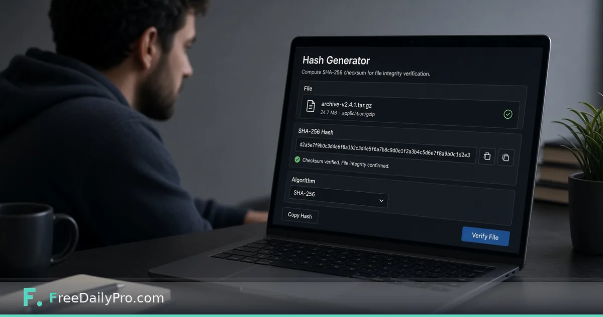

*MD5, SHA-1, and SHA-256 in the browser for one practical integrity check*

[FreeDailyPro.com](https://www.freedailypro.com) -- The project page publishes a SHA-256 checksum next to the download. Most people skip it. Skipping is how corrupted installers and mirror mistakes get run. You do not need a full security lab—you need one hash comparison.

This article teaches one habit: verify a file hash with FreeDailyPro’s [Hash Generator](https://www.freedailypro.com/tool/hash-generator) before you install.

## Why checksums exist

A hash is a fingerprint. Change one byte of the file and the fingerprint changes. Publishers post expected hashes so you can detect incomplete downloads and some tampering.

Checksums are not a full supply-chain security program. They are the seatbelt: simple, fast, and foolish to ignore when available.

## Practical steps

1. Download the file from the official source whenever possible.
2. Open the [Hash Generator](https://www.freedailypro.com/tool/hash-generator) and select the algorithm the publisher used (often SHA-256; older projects still show MD5 or SHA-1).
3. Hash the file (or paste content when the tool mode matches what you need).
4. Compare every character to the published value. Mismatch means do not install—redownload or stop.

Related hygiene: [Password Generator](https://www.freedailypro.com/tool/password-generator) for new account secrets, and [JSON / YAML Formatter](https://www.freedailypro.com/tool/json-formatter) when config files are part of the same setup. See [developer tools](https://www.freedailypro.com/category/developer-tools) and [multitool apps](https://www.freedailypro.com/multitool-apps).

## How to compare without fooling yourself

Do not compare only the first and last four characters. Skim the whole string, or paste both into a diff-minded look. One wrong nibble means the files differ.

If the publisher provides multiple algorithms, prefer the strongest modern option they list—typically SHA-256 over MD5.

## When a mismatch happens

- Incomplete download: try again on a stable connection.
- Wrong file: you grabbed the ARM build instead of x64, or the source tarball instead of the installer.
- Wrong algorithm displayed: you hashed with MD5 while the site showed SHA-256.
- Mirror problems: fall back to the primary origin.
- Suspicious mismatch on an official-looking page: stop and investigate; do not “force install.”

## Limits

Hashes do not prove the publisher is trustworthy—only that your bits match what they posted. Prefer HTTPS official sites and, when available, signed releases (GPG, sigstore, OS package signatures).

MD5 and SHA-1 are weak for collision resistance; use them only when the vendor provides nothing stronger and you understand the risk. Browser hashing of multi-gigabyte ISOs can be slower than native `sha256sum`; use CLI tools for huge images when you live in a terminal anyway.

## Building a lightweight habit

Pick one weekly download—browser, IDE plugin, CLI tool—and verify it. Habits stick when they are small. Teams can add “checksum verified” to internal install checklists for anything that touches production laptops.

## Multi-platform note

This Day-7 post is intentionally developer-leaning for HubSpot tech blogs, dev.to-style Medium republication, and WordPress engineering blogs. It stays separate from FreeDailyPro marketing pages by teaching a single verification ritual.

## Closing

One mismatched checksum is cheaper than one malware cleanup. FreeDailyPro’s [hash generator](https://www.freedailypro.com/tool/hash-generator) makes the check available in a free browser tab so verifying downloads can become routine instead of optional.

## Publishers: how to post checksums well

If you ship software, post the algorithm name and the hash on the same HTTPS page as the download. Avoid images of hashes (hard to copy). Prefer copy-paste friendly monospace. If you offer multiple files, label each hash clearly—people absolutely hash the wrong asset.

## Mirrors and CDNs

CDNs sometimes serve stale objects during misconfiguration. A sudden hash mismatch after a release is a reason to freeze installs and check the origin bucket. Encourage users to report mismatches; treat reports as production signals.

## Education lab exercise

Workshop idea: distribute a file and its SHA-256, then a second file with one flipped byte. Students use FreeDailyPro’s [Hash Generator](https://www.freedailypro.com/tool/hash-generator) to see avalanche effects. It teaches integrity better than a slide alone.

## Containers and packages

Container digests and lockfiles are cousins of this habit. Learning to care about a SHA-256 on a public binary is training for caring about image digests in deployment pipelines.

## What hashing is not

Hashing a password you typed into a web box is not a substitute for proper password hashing with salt and slow algorithms on a server. The hash generator here is for integrity fingerprints of content and files—not for designing an authentication system.

## Incident response snippet

If malware is suspected, hashing alone will not clean a machine. It can help confirm whether a downloaded artifact matches a known-bad hash from threat intel, or whether it matches the vendor. Escalate to your security process when stakes are high.

## Clipboard hygiene

After you copy a hash, avoid pasting it into random chat rooms next to the file. Treat hashes as operational data. Clearing the clipboard on shared machines is basic manners.

## Reproducible research downloads

Researchers can document “file X, SHA-256 Y, URL Z, date” in appendices. FreeDailyPro’s [Hash Generator](https://www.freedailypro.com/tool/hash-generator) lowers the friction of that footnote so it actually happens.

## Pair with password hygiene

New tools often mean new accounts. After you verify the installer hash, create the account password with the [Password Generator](https://www.freedailypro.com/tool/password-generator) rather than recycling an old one. Integrity of bits and integrity of credentials are neighboring habits.

## Stay calm on mismatch

Panic installs “because the team needs it today” are how bad binaries spread. A mismatch is a stop sign. Escalate, redownload, or wait for the vendor. Speed is not a virtue when the artifact is wrong.

## CI idea for small teams

Even without fancy supply-chain tooling, a README section “Verify downloads” with the expected SHA-256 raises the bar for contributors. Point them at the [Hash Generator](https://www.freedailypro.com/tool/hash-generator) for a zero-install option on Windows laptops that lack `sha256sum`.

## Final checklist before install

1. Official URL  
2. HTTPS  
3. Hash match  
4. Code signature if provided  
5. Password for new account via [Password Generator](https://www.freedailypro.com/tool/password-generator)  

Five steps, fewer regrets.
