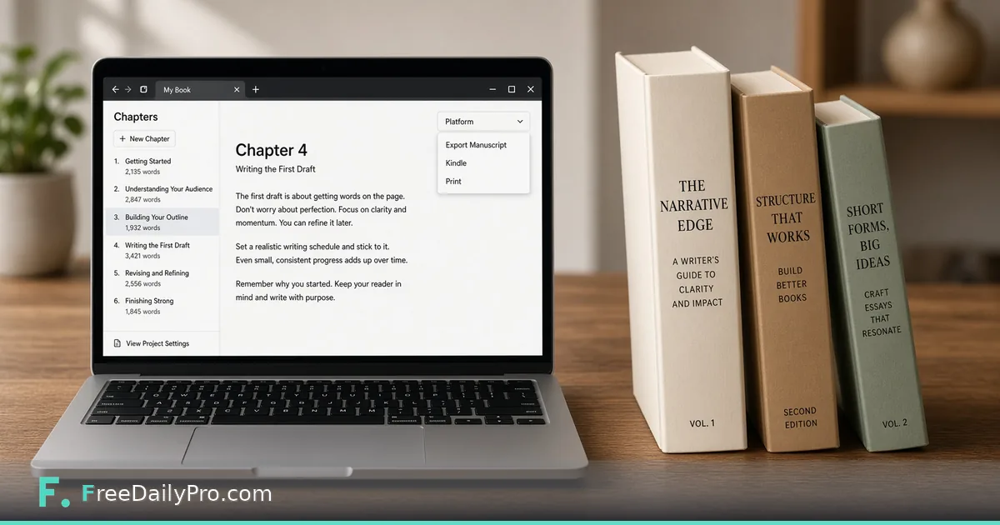

*Write, preview, and pre-flight a real book in the browser—before you spend a download credit.*

[FreeDailyPro.com](https://www.freedailypro.com) --
You type “The End,” then stare at a mess of questions that have nothing to do with character arcs. What trim size? Which margin? Does this platform give you a free ISBN—or charge you for one? Your manuscript is done. The storefront paperwork is just getting started.

FreeDailyPro’s free [Book Writing Toolbox](https://www.freedailypro.com/tool/book-writing-toolbox) is built for that stretch. Write chapters in a real rich-text editor in the browser, pick the platform you actually plan to use, preview a real typeset render for free, run a free pre-flight check, and download when you are ready. No install. No account required to write or preview.

## The wall after “The End”

Most writers assume “print-ready PDF” means one file shape. It does not. Amazon KDP, IngramSpark, Barnes & Noble Press, and Lulu disagree on free ISBN policy, margin rules, and which trim sizes they accept. Ebook routes like Draft2Digital, Apple Books, and Kobo Writing Life ignore trim size entirely.

If you typeset for one platform’s defaults and later expand distribution, you can pay twice—once for the interior, again for the cover spine. Platform rules belong at the front of the workflow, not the night before launch.

## A real workflow you can follow

1. Pick a publishing platform—or leave Default if you are still deciding. You can switch later without losing chapters.
2. Set up covers and identifiers. ISBN guidance updates with the platform you chose.
3. Write in chapters: headings, bold/italic/underline, lists, tables, images with alt text, scene breaks.
4. Toggle front and back matter for your edition.
5. Run free, unlimited Preview—a real typeset render with a watermark, not a vague mockup.
6. Run free, unlimited Pre-flight Check—real render plus real EPUB build against the selected platform.
7. Download: clean PDF/manuscript via the credit pool when you need them; EPUB follows its own free rules below.

## What the editor actually is

This is a real chapter editor, not a plain text box. You get formatting tools authors actually use, plus multi-project support under My Books. Drafts autosave locally in the browser on your device.

Privacy note, said honestly: drafts stay local while you write. Preview, Pre-flight, and Download send content briefly so the server can do real typesetting; nothing is stored afterward by design. Treat that like any typesetting step—do not paste secrets that do not belong in a manuscript. Local autosave is per device, so move important drafts carefully if you switch machines.

## Platform picker: the real differentiator

The platform picker is not decoration. Choosing Amazon KDP, IngramSpark, Barnes & Noble Press, Lulu, Draft2Digital, Apple Books, Kobo Writing Life—or Default—changes live behavior.

- Trim size lists filter to what that platform supports (custom entry when allowed).
- Margin math in the real typeset render follows that platform’s rules.
- ISBN guidance updates: free platform-exclusive where it exists, or buy-your-own messaging for IngramSpark.
- Irrelevant fields hide so you are not filling print-only metadata for an ebook path.

**KDP:** 15 real trim sizes, page-count-scaled gutter, free platform-exclusive ISBN.  
**IngramSpark:** flat 0.5in margin, no free ISBN (buy your own or pay IngramSpark’s fee, commonly discussed around $25–$49).  
**Barnes & Noble Press:** flat margins (0.5in, 0.75in inside), fixed trim list—no custom sizes—free platform-exclusive ISBN.  
**Lulu:** flat 0.5in margin, free platform-exclusive ISBN.  
**Ebook-only platforms:** print geometry drops away.

> **Tip:** Write on Default if you are still deciding. Switch the picker before Pre-flight so checks match the storefront you will actually use.

## Free Preview and free Pre-flight

Preview is free and unlimited—a real typeset render with a watermark. Pre-flight is free and unlimited too: real render, real EPUB build, checks for trim size, page count, margin, ISBN, cover resolution, EPUB file size, and accessibility signals against the selected platform.

That is the concrete benefit: catch problems before you spend a download credit. Cover Preview shows a real connected front + spine + back wraparound (watermarked). After a trim change, look at the spine—jackets that no longer fit the book block are an expensive surprise.

## Exports that match real gates

- **Shunn Standard Manuscript Format** as .docx and .pdf for agents and publishers: 12pt Times New Roman, double-spaced, 1in margins, real running head, honest word count.
- **ONIX metadata** for retailers and distributors, filled from title, author, ISBN, publisher, and related fields you already entered.
- **EPUB 3** with real semantic structure. EPUB Accessibility 1.1 / WCAG AA is claimed only when every image has alt text—an honest, checkable rule.

## Pricing without the fog

Writing, Preview, Pre-flight, and watermarked work stay free as described. Book PDF and manuscript downloads share one credit pool: **$6.99 for 1**, **$17.99 for 3**, **$49.99 for 10**. EPUB is always free and unlimited. Only watermark removal needs the **EPUB & Manuscript Pass ($3.99 for 24 hours)** of unlimited clean EPUB + manuscript downloads. EPUB never burns a print PDF credit.

Ebook-first authors can iterate on EPUB without draining the print pool. Print authors should Pre-flight until green, then buy credits once.

## Who this is for

If you need a massive library of boutique interior themes, a mature desktop suite may still win. If you want a free browser path from chapters to platform-aware files—with unlimited free preview and pre-flight—Book Writing Toolbox is built for that job.

Name projects clearly (title + target platform). Fix Pre-flight issues in order: trim and margins, then ISBN and cover resolution, then EPUB size and alt text. Switch platforms anytime—the text stays; re-run Preview and Pre-flight before you spend credits.

## A day-in-the-life path (first book)

Morning: open My Books, create a project named after the working title, leave platform on Default, and dump chapter drafts from wherever they lived—notes app, Word, email to yourself. Use the rich-text editor to restore headings and scene breaks so the book is not one endless blob.

Afternoon: pick KDP if that is your year-one plan. Set trim. Add a placeholder cover if you have one. Run free Preview and actually scroll the middle of the book—not only chapter one. Gutter and page count surprises hide in long chapters.

Evening: run free Pre-flight. Fix whatever it flags. Do not buy credits until the checklist is green. If you only need an EPUB for beta readers, export free EPUB and skip the print pool entirely.

That rhythm—write free, preview free, pre-flight free, pay only for clean production files—is the economic point of the tool.

## What FreeDailyPro’s free tools promise here

No login required to write or preview. Client-side draft autosave while you work. When typesetting must be real, content goes to the server briefly, then is not stored afterward by design. That is the same privacy posture FreeDailyPro aims for across free browser tools: useful without an account, honest about the steps that need a render engine.

YouTube walkthroughs for individual tools are on the roadmap so you can see clicks, not only read about them. Until then, the free Preview is the best teacher—open it early, not the night before upload.

**[Start in Book Writing Toolbox](https://www.freedailypro.com/tool/book-writing-toolbox)**

