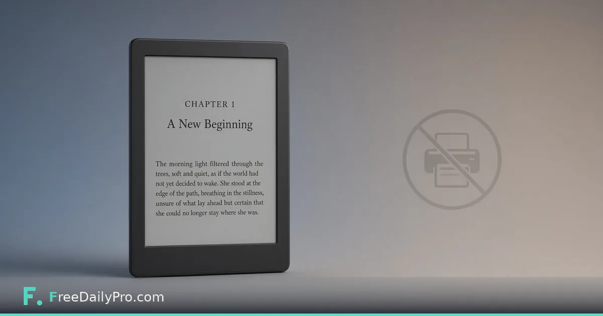

*Publish ebook-only with Book Writing Toolbox: free unlimited EPUB, honest accessibility rules, and free pre-flight without wading through print settings.*

[FreeDailyPro.com](https://www.freedailypro.com) --

If you are publishing ebook only, print settings are noise. Trim size, spine width, cover bleed, and gutter math do not apply—yet many formatters still make you walk past those fields like a theme park queue you never asked to join.

Book Writing Toolbox has a real ebook-oriented path. Selecting Draft2Digital, Apple Books, or Kobo Writing Life switches behavior for ebook work. Print-only sections such as trim size, spine, and back cover hide rather than sit around unused. You can also aim the tool at ebook-only work directly when that is all you need.

## The real pain: print UI for a digital book

Ebook readers reflow text. They do not care that your fantasy novel almost fit a 6×9 trade paperback. What they care about is structure, navigation, images that still make sense on a small screen, and files that validate.

When a tool assumes print first, authors waste time answering questions that will never affect the EPUB. Worse, they may “solve” print problems that create odd defaults when the file is finally exported for digital stores.

## Ebook-only mode, practically

Choose Draft2Digital, Apple Books, or Kobo Writing Life in the platform picker and the tool moves into ebook-focused mode. Print-only controls hide. You keep the chapter editor—headings, lists, tables, images with alt text, scene breaks—and you keep multi-project My Books with local autosave.

You still write like a writer. You simply stop babysitting a spine. Front and back matter still matter for ebooks—title page logic, copyright, about-the-author—without pretending those pages need a wraparound jacket.

## What the EPUB actually is

Export is real EPUB 3 with real semantic structure—not a pile of styled divs pretending to be a book. That matters for navigation, accessibility tooling, and long-term store compatibility.

EPUB Accessibility 1.1 / WCAG AA is available as an honest claim only when every image has alt text. That condition is intentional. Many tools either ignore accessibility or advertise it whether or not the file qualifies. Here the rule is checkable: missing alt text means you do not get to claim that bar.

> **Tip:** Add alt text when you insert the image. Future you at 1 a.m. will not remember what figure 3 was for.

## Pricing for ebook-only authors

EPUB is always free and unlimited. It does not consume the print PDF/manuscript credit pool. Watermarked preview paths stay available while you iterate. When you need watermark-free EPUB (and manuscript downloads under the pass rules), the EPUB & Manuscript Pass is $3.99 for unlimited clean EPUB + manuscript downloads for 24 hours.

Compare that to book PDF/manuscript credits ($6.99 / 1, $17.99 / 3, $49.99 / 10), which matter when you also produce print. Pure ebook authors can stay on the free EPUB track and only buy the pass when a clean file is due to a store or collaborator.

## Pre-flight still matters—just scoped differently

Pre-flight Check remains free and unlimited in ebook-only mode. Checks focus on EPUB-relevant issues: file size, image accessibility, cover resolution, and related digital constraints—not print gutter drama you do not have.

Run it before you pay for watermark removal. If accessibility or cover resolution fails, fix the project, re-run Pre-flight, then buy the pass window when you are actually ready to deliver clean files.

## A simple ebook-only workflow

1. Create a My Books project and write chapters in the rich-text editor.
2. Select Draft2Digital, Apple Books, or Kobo Writing Life (or ebook-only intent).
3. Add alt text to every image.
4. Preview for free as needed.
5. Run free Pre-flight until digital checks pass.
6. Export free EPUB; use the $3.99 pass only when you need clean watermark-free downloads.

You still get manuscript export if an agent wants Shunn format—even when the commercial plan is ebook-first. Digital-first does not mean agent-hostile.

## Who should stay ebook-only (for now)

First-time authors testing demand, newsletter lead magnets, serials, and projects where print unit economics do not work yet. You can add print later by switching platform targets and re-running Pre-flight; chapters are not locked to one mode forever.

One more practical note: storefronts still have their own content guidelines beyond file validity. Passing Pre-flight means the file is built sanely for the selected path—not that every retailer will accept every presentation choice. Read the store’s current help pages before you schedule a launch.

If you later add print, switch the platform picker to KDP or another print target, rebuild cover expectations, and treat Pre-flight as a new checklist—not a formality.

Keep image source files larger than the ebook needs; it is easier to optimize down than to invent detail that was never captured.

If you later add print, switch the platform picker to KDP or another print target, rebuild cover expectations, and treat Pre-flight as a new checklist—not a formality.

Keep image source files larger than the ebook needs; it is easier to optimize down than to invent detail that was never captured.

If you later add print, switch the platform picker to KDP or another print target, rebuild cover expectations, and treat Pre-flight as a new checklist—not a formality.

Keep image source files larger than the ebook needs; it is easier to optimize down than to invent detail that was never captured.

If you later add print, switch the platform picker to KDP or another print target, rebuild cover expectations, and treat Pre-flight as a new checklist—not a formality.

Keep image source files larger than the ebook needs; it is easier to optimize down than to invent detail that was never captured.

If you later add print, switch the platform picker to KDP or another print target, rebuild cover expectations, and treat Pre-flight as a new checklist—not a formality.

Keep image source files larger than the ebook needs; it is easier to optimize down than to invent detail that was never captured.

If you later add print, switch the platform picker to KDP or another print target, rebuild cover expectations, and treat Pre-flight as a new checklist—not a formality.

Keep image source files larger than the ebook needs; it is easier to optimize down than to invent detail that was never captured.

If you later add print, switch the platform picker to KDP or another print target, rebuild cover expectations, and treat Pre-flight as a new checklist—not a formality.

Keep image source files larger than the ebook needs; it is easier to optimize down than to invent detail that was never captured.

If you later add print, switch the platform picker to KDP or another print target, rebuild cover expectations, and treat Pre-flight as a new checklist—not a formality.

Keep image source files larger than the ebook needs; it is easier to optimize down than to invent detail that was never captured.

If you later add print, switch the platform picker to KDP or another print target, rebuild cover expectations, and treat Pre-flight as a new checklist—not a formality.

Keep image source files larger than the ebook needs; it is easier to optimize down than to invent detail that was never captured.

If you later add print, switch the platform picker to KDP or another print target, rebuild cover expectations, and treat Pre-flight as a new checklist—not a formality.

Keep image source files larger than the ebook needs; it is easier to optimize down than to invent detail that was never captured.

**[Format an ebook in Book Writing Toolbox](https://www.freedailypro.com/tool/book-writing-toolbox)**

