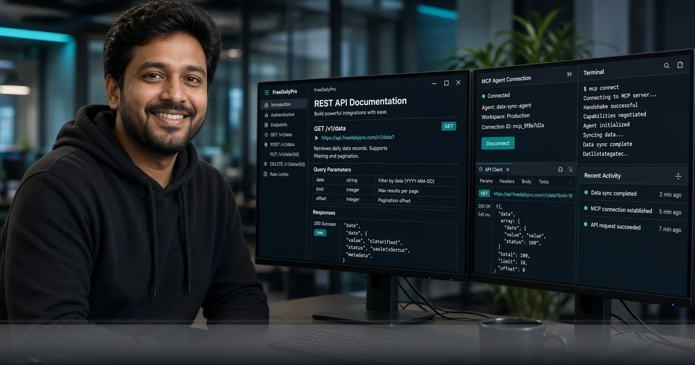

*One key, REST + MCP, free tier with 20,000 calls per month — server-side power when the browser is not enough.*

[FreeDailyPro.com](https://www.freedailypro.com) -- Browser tools changed how millions of people edit PDFs, clean images, and format text. Now the same toolkit ships for code and AI agents. FreeDailyPro API and MCP let you call productivity tools from your server, script, or agent when local browser processing is not the right fit.

This is not a vaporware landing page. Listings are live on RapidAPI, a full Postman collection is ready to run, and the official MCP Registry lists **com.freedailypro/tools**. Directories such as Smithery, Glama, and mcp.so sync from that registry automatically. One key unlocks both REST and MCP.

## Why API and MCP Matter Next to Browser Tools

Most FreeDailyPro tools still run 100% in your browser with no login for everyday use. That privacy story stays the core product. API and MCP exist for the moments browser-only cannot cover: batch jobs, backend pipelines, CI steps, multi-user SaaS features, and AI agents that need deterministic tool calls.

Think of a support bot that must count words, format JSON, hash a string, or convert units without shipping files to a random third-party SaaS. Or a small internal service that generates slugs, UUIDs, and base64 payloads while your team works. Same family of utilities you already trust on [FreeDailyPro.com](https://www.freedailypro.com), now callable server-side.

Privacy still matters. Browser tools never upload your documents for core work. API calls are intentional: you choose what text or parameters leave your network. That is the right trade for automation, and it is honest about when data must travel.

## What You Get Today

The public Utility API surface already exposes text, security, converter, and SEO-style helpers. Endpoints include word count, case convert, slug generation, password helpers, lorem text, reverse and sort for text; hash, UUID, base64, JSON format, regex, URL helpers, and timestamp tools for developers; plus percentage, tip, BMI, length, weight, and temperature converters.

MCP packages dozens of those tools so Claude Desktop, Cursor, VS Code agents, and any streamable-HTTP MCP client can discover and call them on one host. The registry description is blunt: text, security, converter, calculator, and PDF-oriented tools callable via MCP on one host.

Explore the developer hub at [https://www.freedailypro.com/developers](https://www.freedailypro.com/developers). Pricing is transparent: free API and MCP usage starts at 20,000 calls per month. Paid tiers scale to 200,000, 750,000, and 2,000,000 calls with priority on the top plan. No mystery quotas.

## REST for Any Language, MCP for Agents

REST is the universal path. Python, Node, Go, PHP, Java, shell scripts with curl — anything that can POST JSON can hit the endpoints with your API key. One key for everything. Document the collection once in Postman (135 ready requests with docs) and share it with your team.

MCP is the agent path. Instead of hand-writing tool wrappers for every model host, you connect FreeDailyPro as an MCP server. The agent lists tools, picks the right one, and calls it with structured arguments. That is how modern coding agents stay useful without inventing fragile custom plugins.

Whether you ship a customer-facing product or a private ops bot, you can mix modes. Humans still open [Merge PDF](https://www.freedailypro.com/tool/merge-pdf) or [Compress Image](https://www.freedailypro.com/tool/compress-image) in the browser for sensitive one-offs. Services call the API for high volume. Agents use MCP for conversational workflows.

## Real Workflows You Can Build This Week

Automate content hygiene: an agent receives messy titles, calls case convert and slug tools, then stores clean paths. A reporting job posts text to word-count before publishing. A security review script hashes strings and formats JSON before tickets close.

Finance and ops teams can chain converters for tips, percentages, and unit math without spinning up another micro-service. Product engineers can generate UUIDs and base64 tokens during setup scripts. SEO helpers fit into static site pipelines that still need quick, deterministic transforms.

Pair the API with client-side favorites. Designers keep using [Favicon Generator](https://www.freedailypro.com/tool/favicon-generator) and [Bulk Image](https://www.freedailypro.com/tool/bulk-image) locally. Developers wire [JWT Decoder](https://www.freedailypro.com/tool/jwt-decoder), [Hash Generator](https://www.freedailypro.com/tool/hash-generator), and [Diff Checker](https://www.freedailypro.com/tool/diff-checker) into browser debugging, then mirror the same ideas in server jobs via API endpoints.

## How FreeDailyPro Fits the Corporate-Safe Story

Many companies block consumer AI chat for document work. FreeDailyPro’s browser tools already help because files stay on device. API and MCP give IT-friendly options: keys you control, rate plans you can budget, and tools that do one job well instead of sending whole contracts into a chat model.

Use the free 20,000 calls to prove value. Move to a paid tier only when volume justifies it. Keep Day Pass and Monthly Pro for unlimited browser file tools when people still prefer the UI. One platform, no multi-subscription maze — the same promise on the homepage.

## Getting Started Without Drama

Open [https://www.freedailypro.com/developers](https://www.freedailypro.com/developers). Grab a key, try Postman or RapidAPI playgrounds, and confirm a simple word-count or hash call. For MCP, add the FreeDailyPro tools server from the official registry (com.freedailypro/tools) or the listed remote streamable HTTP URL in your agent config.

Start with non-sensitive sample strings. Measure latency and error handling. Then promote production traffic. If you need PDF-heavy or media-heavy paths, keep using the browser suite first — [PDF Tools](https://www.freedailypro.com/category/pdf-tools), [Image Tools](https://www.freedailypro.com/category/image-tools), [Video Tools](https://www.freedailypro.com/category/video-tools) — while the API covers the deterministic utilities best suited to HTTP.

## Honest Scope, Real Momentum

Not every browser UI is mirrored as an API call on day one. The live product focuses on text, security, converters, and expanding MCP coverage where agents get the most leverage. That is better than promising every click as a remote endpoint and shipping half of them.

As coverage grows, the same one-key model stays. You will not juggle separate accounts for every utility. You will not rebuild auth for each tool. That is the point of FreeDailyPro: one platform for daily work, now with a developer surface that matches the brand’s free and transparent ethos.

## Call to Action

Ready to wire tools into your stack? Visit the [developers page](https://www.freedailypro.com/developers), create your key, and run your first call. Connect MCP if you use Claude, Cursor, or any agent host. Keep solving one-off human tasks in the browser with zero login friction and full client-side privacy.

Tool-specific YouTube videos are coming soon so you can see both the browser UIs and developer flows in action. Tell us which endpoints or agent workflows you want next — more PDF automation, richer SEO tools, batch media, or deeper calculator packs. Your feedback shapes the roadmap.

Build faster, keep control, and stay free where it matters. FreeDailyPro API and MCP are live — go use them.
