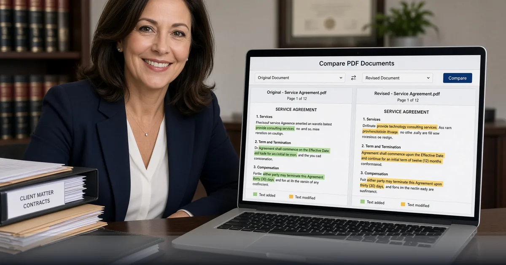

*See what changed between document versions in your browser — FreeDailyPro Compare PDF for reviews and legal packs.*

[FreeDailyPro.com](https://www.freedailypro.com) -- Version two of a contract arrives at 4:55 p.m. Someone swears “only the dates changed.” FreeDailyPro’s [Compare PDF](https://www.freedailypro.com/tool/compare-pdf) helps you verify that claim without printing both stacks or trusting a mystery cloud viewer with confidential clauses.

Load the two PDFs. Review differences in the browser. Core processing stays on your device — the same privacy model that powers FreeDailyPro’s wider PDF suite. That is essential when NDAs, offer letters, board decks, and customer MSAs cannot casually leave the laptop.

## Why Manual Diffs Fail

Humans miss single-word swaps in indemnity language. Font reflows hide deletions. “Final_final_v7.pdf” naming does not prove content. Automated visual or structural comparison catches what tired eyes skip after a long negotiation day.

Compare PDF pairs perfectly with [Diff Checker](https://www.freedailypro.com/tool/diff-checker) for plain text, [Redact PDF](https://www.freedailypro.com/tool/redact-pdf) for removing sensitive spans before wider sharing, and [Organize PDF](https://www.freedailypro.com/tool/organize-pdf) when page order itself is the dispute.

## A Review Workflow That Scales

Receive the counterparty file. Compare against your last approved version with [Compare PDF](https://www.freedailypro.com/tool/compare-pdf). Extract disputed pages via [Extract PDF](https://www.freedailypro.com/tool/extract-pdf) or [Split PDF](https://www.freedailypro.com/tool/split-pdf). Annotate with [PDF Editor](https://www.freedailypro.com/tool/pdf-editor) if you mark comments visually. Sign the agreed version using [Sign PDF](https://www.freedailypro.com/tool/sign-pdf).

For forms-heavy packs, [Fillable Forms](https://www.freedailypro.com/tool/fillable-forms) keeps structured fields editable. Password-protect the outbound file with [PDF Password](https://www.freedailypro.com/tool/pdf-password). Compress email-ready copies via [Compress PDF](https://www.freedailypro.com/tool/compress-pdf).

## Teams That Live in Document Diffs

Legal and compliance. Procurement. Finance controllers. HR offer letter cycles. Agencies reviewing client markups. Engineers shipping PDF specs to manufacturers. Researchers reconciling paper revisions. Freelancers protecting scope in SOWs.

Corporate AI blocks make browser-local tools even more valuable. You stay productive when chatbots are banned from document content but you still need a trustworthy comparison pass.

## Connect to FreeDailyPro’s Broader Privacy Story

Most FreeDailyPro file tools process in the browser with free daily uses and optional Day Pass or Monthly Pro for unlimited days. No multi-tool subscription maze. When you need server automation for non-sensitive transforms, the [developers](https://www.freedailypro.com/developers) API and MCP layer is available with a free call allowance.

Until then, keep the sensitive compare step local. That is the high-trust path.

## Negotiation Psychology and Evidence

In tough negotiations, people remember the last verbal promise. Written diffs protect both sides. When you can point to a concrete change in a PDF, discussions stay factual. Compare PDF becomes a shared screen artifact in video calls: “Here is the clause that moved.”

Keep an archive of compared milestones: term sheet, first full draft, redline round, final. FreeDailyPro does not replace your DMS, but it makes each milestone reviewable without expensive desktop licenses for every stakeholder.

## Education, Research, and Publishing

Teachers compare student submission versions. Researchers reconcile manuscript proofs. Open-source docs maintainers check PDF builds of RFCs or design notes. The same tool that helps lawyers helps academia. Privacy still matters when student data or unpublished research is involved — browser processing is the right default.

## Engineering Specs and Manufacturing

Hardware teams ship PDF drawings. A one-pixel note change can cost a production run. Comparing revisions before release is cheaper than scrap. Pair Compare PDF with [Extract PDF](https://www.freedailypro.com/tool/extract-pdf) to isolate the page that changed, then send only that exhibit to the vendor.

Compress large drawing sets with [Compress PDF](https://www.freedailypro.com/tool/compress-pdf). Merge related exhibits with [Merge PDF](https://www.freedailypro.com/tool/merge-pdf). Sign approvals with [Sign PDF](https://www.freedailypro.com/tool/sign-pdf). FreeDailyPro covers the operational layer around the comparison itself.

## Building a Lightweight Review SOP

1. Name files with dates and versions. 2. Compare against the last approved PDF. 3. List material changes in a short note. 4. Redact if sharing externally. 5. Sign only after checklist complete. Tools linked above support each step without leaving FreeDailyPro.

When your SOP needs automation for non-sensitive text, API and MCP on the developers page can assist. Keep confidential compare sessions interactive and local.

## Client Communication Templates

After a compare pass, send a short email: “Material changes are on pages 3, 7, and 12. No change to payment terms. Please confirm by Friday.” Attach only the compared understanding, not a vague “see redlines.” FreeDailyPro helps you find the pages; your note closes the loop.

Agencies can bill fewer hours on version archaeology when juniors run compare first. Law firms can train paralegals on a standard tool instead of ad-hoc desktop plugins. Freelancers can protect scope when clients claim “we only changed the logo.”

## Audit Trails Without Heavy Software

Even small teams benefit from a compare log: date, files compared, reviewer, outcome. A shared spreadsheet plus FreeDailyPro compare sessions is enough for many SMBs. When you grow into enterprise DMS features, you still keep compare as a personal power tool for quick checks.

Never email both unredacted confidential versions to personal Gmail accounts “just to compare.” Use the local tool, then share only necessary excerpts. That habit alone prevents many amateur leaks.

## Why FreeDailyPro Beats Fragmented Free Sites

Scattered “one tool” websites train you to accept trackers, surprise signups, and inconsistent privacy stories. FreeDailyPro consolidates everyday work under one brand with transparent free limits, optional Day Pass and Monthly Pro for heavy file days, and a real developer surface for API and MCP when automation matters.

You bookmark fewer domains. You train teammates once. You keep client-side processing for sensitive files and intentional server calls only when you choose them. That architecture is the product, not a side note.

Internal links across tools are deliberate: each post points you to companion utilities so a single job — cleanup audio, ship a catalog, compare a contract, batch images — finishes without leaving the platform. Explore categories for PDF, image, video, audio, text, and calculators whenever you need the next step.

If a workflow is still missing, tell us. The roadmap responds to real users who actually ship work, not vanity feature lists. YouTube videos for individual tools are coming so visual learners can follow along. Until then, the tools are live, free to start, and ready for your next deadline.

## Call to Action

Run your next revision through [Compare PDF](https://www.freedailypro.com/tool/compare-pdf) before you approve. Explore the full [PDF Tools](https://www.freedailypro.com/category/pdf-tools) category for merge, redact, watermark, and convert utilities that finish the negotiation pack.

Videos for PDF workflows are coming soon. What comparison feature do you need most — multi-file queues, exportable change reports, or tighter legal templates? Share feedback and keep reviewing with confidence on FreeDailyPro.
