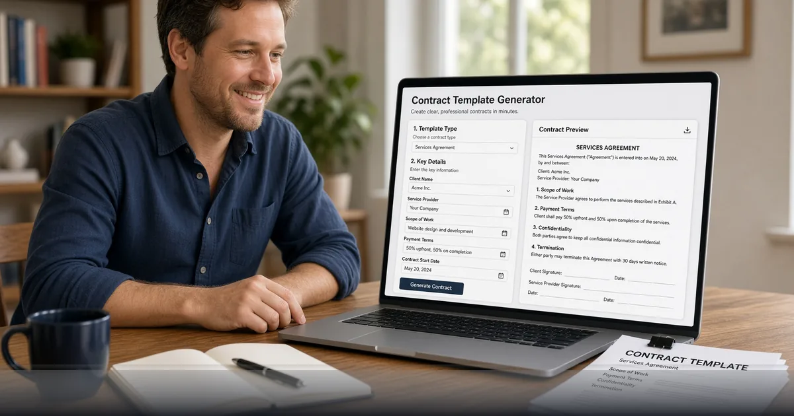

*Draft professional starting points in your browser with FreeDailyPro contract templates — then customize and sign.*

[FreeDailyPro.com](https://www.freedailypro.com) -- Blank pages slow deals. FreeDailyPro’s [Contract Templates](https://www.freedailypro.com/tool/contract-templates) give small teams a structured starting point for common agreements so you spend energy on the terms that matter, not on reinventing section headers at midnight.

Templates are a launchpad, not a lawyer. Always have qualified counsel review anything material. That disclaimer is non-negotiable. Still, a clean draft beats a chaotic email chain when you need an NDA before a product demo or a simple lease outline before a walkthrough.

## What You Can Start From

Business document tools on FreeDailyPro cover NDAs, lease-style agreements, power of attorney style forms, bills of sale, promissory notes, employment offer letters, eviction notices, and more related paperwork. Use [Bill of Sale Generator](https://www.freedailypro.com/tool/bill-of-sale-generator) when asset transfer is the job. Pair with [Receipt Maker](https://www.freedailypro.com/tool/receipt-maker) for payment records.

Move drafts into PDF for sharing. Fill structured PDFs with [Fillable Forms](https://www.freedailypro.com/tool/fillable-forms). Capture signatures via [Sign PDF](https://www.freedailypro.com/tool/sign-pdf). Protect outbound copies with [PDF Password](https://www.freedailypro.com/tool/pdf-password). Watermark “DRAFT” using [PDF Watermark](https://www.freedailypro.com/tool/pdf-watermark) until counsel signs off.

## A Responsible Small-Business Flow

Select a template close to your use case on [Contract Templates](https://www.freedailypro.com/tool/contract-templates). Customize names, dates, and jurisdiction notes. Export or print to PDF. Run a version compare later with [Compare PDF](https://www.freedailypro.com/tool/compare-pdf) when the other party redlines. Redact accidental personal data with [Redact PDF](https://www.freedailypro.com/tool/redact-pdf) before wider distribution.

Store signed finals carefully on your own systems. FreeDailyPro focuses on creation and transformation without turning into your document archive. That keeps the product simple and privacy-aligned.

## Who These Templates Help

Freelancers locking scope. Agencies onboarding clients. Landlords organizing basics. Startups exchanging mutual NDAs. Side hustles selling equipment with a bill of sale. HR teams drafting first-pass offer language before legal polish.

Corporate-safe positioning still applies: you are not forced into an AI chat that retains confidential deal terms. Browser tools and clear free limits keep work moving when AI policies are strict.

## Connect Documents to the Rest of FreeDailyPro

After signature, assemble onboarding packs with [Merge PDF](https://www.freedailypro.com/tool/merge-pdf) and [Document Assembler](https://www.freedailypro.com/tool/document-assembler). Build employee handbooks with [Book Maker](https://www.freedailypro.com/tool/book-maker). Clean ID scans with image tools. Calculate payment schedules with [Loan Calculator](https://www.freedailypro.com/tool/loan-calculator) when financing is involved.

Developers automating non-sensitive text transforms can explore API and MCP on [developers](https://www.freedailypro.com/developers). Humans keep the high-trust contract edits in the UI.

## What “Template” Should Mean in Practice

A good template is structured, readable, and incomplete on purpose. It forces you to fill parties, dates, and commercial terms. It should not pretend to be jurisdiction-perfect for every country. FreeDailyPro positions templates as accelerators with a clear legal review step.

If a deal is high stakes, counsel first, template second. If a deal is a standard low-dollar NDA before a casual demo, a template plus careful reading may be enough to start — still with eyes open.

## International and Cross-Border Care

Clauses that work in one state may fail in another. Data protection, governing law, and dispute venues need human judgment. Use templates to avoid blank-page delay, then customize. Redact experimental clauses with [Redact PDF](https://www.freedailypro.com/tool/redact-pdf) before wide email forwards.

Compare counterparty paper with [Compare PDF](https://www.freedailypro.com/tool/compare-pdf). Keep a clean final with [Organize PDF](https://www.freedailypro.com/tool/organize-pdf) so exhibits order correctly. Sign last, not first.

## Freelancer Stack: Scope, Invoice, Receipt

Many freelancers need three documents: a simple agreement, an invoice, and a receipt. FreeDailyPro covers the set. Contract templates start the relationship. Invoice and [Receipt Maker](https://www.freedailypro.com/tool/receipt-maker) close the payment loop. [Bill of Sale Generator](https://www.freedailypro.com/tool/bill-of-sale-generator) handles equipment sales on the side.

That stack reduces dependency on five different SaaS trials that expire mid-client.

## Recordkeeping Without Becoming a Vault

Download signed PDFs to your own drive or DMS. FreeDailyPro is not trying to be permanent storage. That boundary protects the product mission: free transformation tools, not a custodial archive with enterprise retention promises it does not make.

## Risk Tiers for Template Use

Tier A: mutual NDA before a casual chat — template plus careful read may suffice to start. Tier B: client MSA with payment terms — template plus counsel review. Tier C: equity, IP assignment, regulated industry — counsel-led drafting with templates only as reference. Label your internal process so staff do not over-rely on free forms.

FreeDailyPro’s job is to remove blank-page friction and provide PDF finishing tools. Your job is to match the tier to the risk. That partnership is how free tools stay useful without becoming dangerous shortcuts.

## Collaboration Between Ops and Legal

Ops can assemble a first draft with FreeDailyPro. Legal can mark required changes. Ops can re-export and sign logistics. Compare PDF keeps everyone honest about what moved between rounds. This division of labor respects expertise while removing waiting time on blank pages.

Document which templates are approved for which deal sizes. Update quarterly. Free tools work best inside a lightweight policy, not as a free-for-all.

## Why FreeDailyPro Beats Fragmented Free Sites

Scattered “one tool” websites train you to accept trackers, surprise signups, and inconsistent privacy stories. FreeDailyPro consolidates everyday work under one brand with transparent free limits, optional Day Pass and Monthly Pro for heavy file days, and a real developer surface for API and MCP when automation matters.

You bookmark fewer domains. You train teammates once. You keep client-side processing for sensitive files and intentional server calls only when you choose them. That architecture is the product, not a side note.

Internal links across tools are deliberate: each post points you to companion utilities so a single job — cleanup audio, ship a catalog, compare a contract, batch images — finishes without leaving the platform. Explore categories for PDF, image, video, audio, text, and calculators whenever you need the next step.

If a workflow is still missing, tell us. The roadmap responds to real users who actually ship work, not vanity feature lists. YouTube videos for individual tools are coming so visual learners can follow along. Until then, the tools are live, free to start, and ready for your next deadline.

## Call to Action

Open [Contract Templates](https://www.freedailypro.com/tool/contract-templates) and draft the agreement you have been postponing. Finish with [Sign PDF](https://www.freedailypro.com/tool/sign-pdf) and [Fillable Forms](https://www.freedailypro.com/tool/fillable-forms) when the packet is ready. Browse more business document tools on FreeDailyPro for invoices, resumes, and expense tracking.

Videos for document workflows are coming soon. Which template should we improve next — creator contracts, consulting MSAs, or rental addenda? Send feedback and keep closing loops with FreeDailyPro.
