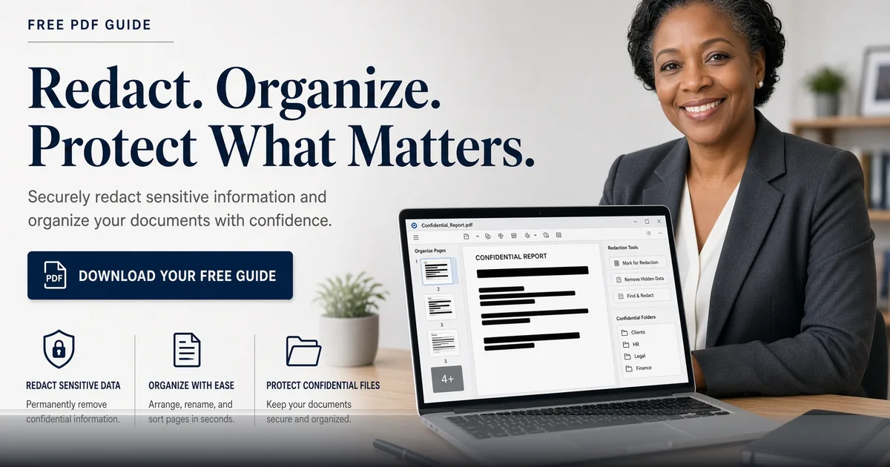

*Black out secrets and reorganize pages in the browser with FreeDailyPro Redact PDF and Organize PDF.*

[FreeDailyPro.com](https://www.freedailypro.com) -- A single unredacted SSN or customer email can turn a helpful PDF share into an incident. FreeDailyPro’s [Redact PDF](https://www.freedailypro.com/tool/redact-pdf) and [Organize PDF](https://www.freedailypro.com/tool/organize-pdf) give you local control: remove what must stay private, reorder what must read cleanly, download a safer file.

Both tools run in the browser for core work. That is the FreeDailyPro privacy standard — free daily uses, optional Day Pass or Monthly Pro when you need unlimited file-tool volume, no requirement to upload confidential pages to a stranger’s OCR farm for simple blackout boxes.

## Redaction Done Seriously

True redaction is not a black rectangle floating over text that still exists underneath. Use proper redaction workflows so content is removed from the file, not just covered. FreeDailyPro’s redact tool is built for that everyday need: strip sensitive spans before a PDF leaves your desk.

Common targets include account numbers, medical notes, student IDs, home addresses, internal pricing, and witness names. After redaction, re-check with search and visual review. Then password-protect if policy requires using [PDF Password](https://www.freedailypro.com/tool/pdf-password).

## Organization Prevents Chaos

Courts, schools, and clients reject jumbled exhibits. [Organize PDF](https://www.freedailypro.com/tool/organize-pdf) helps you reorder, rotate context, and structure pages before a deadline. Combine with [Rotate PDF](https://www.freedailypro.com/tool/rotate-pdf), [Split PDF](https://www.freedailypro.com/tool/split-pdf), [Merge PDF](https://www.freedailypro.com/tool/merge-pdf), and [Extract PDF](https://www.freedailypro.com/tool/extract-pdf) for surgical control.

Add page numbers with [Add Page Numbers](https://www.freedailypro.com/tool/add-page-numbers). Compress for portals with [Compress PDF](https://www.freedailypro.com/tool/compress-pdf). Compare final vs prior using [Compare PDF](https://www.freedailypro.com/tool/compare-pdf). Sign when authorized via [Sign PDF](https://www.freedailypro.com/tool/sign-pdf).

## Who Needs This Duo Weekly

Legal ops. Healthcare admin. HR case files. Finance audits. Journalism source protection. Teachers sharing anonymized examples. Support teams attaching sanitized logs. Founders sending board excerpts without salary tabs.

When AI tools are blocked for document content, these deterministic browser utilities keep work moving. Corporate-safe is not a slogan here; it is the product design.

## Extend With FreeDailyPro’s Full PDF Category

Convert to Word when heavy edits are needed with [PDF to Word](https://www.freedailypro.com/tool/pdf-to-word). Pull tables via [PDF to Excel](https://www.freedailypro.com/tool/pdf-to-excel). Build books and catalogs with [Book Maker](https://www.freedailypro.com/tool/book-maker) and [Catalog Maker](https://www.freedailypro.com/tool/catalog-maker). Fill government-style forms with [Fillable Forms](https://www.freedailypro.com/tool/fillable-forms).

For developer automation of non-sensitive transforms, see [API and MCP](https://www.freedailypro.com/developers). Keep highly sensitive redaction interactive and local.

## Common Redaction Failures to Avoid

People draw black boxes in image editors and call it redaction. Text remains selectable. Metadata remains. Layers remain. Use purpose-built redaction, then verify by searching the output and trying copy-paste. If text still appears, you are not done.

Also watch for screenshots inside PDFs, header/footer repeats, and attachments. Organize pages so sensitive appendices are removed entirely when they should not ship.

## Healthcare, Education, and Finance Patterns

HIPAA-minded workflows, FERPA-minded student records, and financial KYC packs all need careful sharing. FreeDailyPro cannot replace your compliance program, but it gives staff a practical browser tool for everyday blackouts and page order fixes when policy allows local processing.

Train teams with a five-minute SOP video (coming on YouTube) and a written checklist. Consistency beats heroics.

## Litigation and Discovery Hygiene

Exporting discovery subsets often requires dropping privileged pages and reordering exhibits. Organize PDF plus redact plus compress becomes a daily triad. Compare against the production set with [Compare PDF](https://www.freedailypro.com/tool/compare-pdf) before exchange.

Password protect productions with [PDF Password](https://www.freedailypro.com/tool/pdf-password). Number pages for cite-ability. Merge related exhibits only after redaction is complete.

## Why Local Beats Random Upload Sites

Sensitive PDFs attract bad actors and accidental leaks. FreeDailyPro’s client-side story reduces that surface for core edits. Combined with corporate-safe messaging, it is easier to standardize than twenty unknown “free redact” domains with unclear jurisdictions.

## Training Micro-Moments

Add a five-minute redaction drill to onboarding: take a sample PDF with fake SSNs, redact, verify search is clean, organize pages, compress, password-protect. New hires learn the FreeDailyPro path before they touch real customer files.

Managers should spot-check outputs quarterly. Tools do not replace culture. Culture plus good tools is how leaks get prevented. FreeDailyPro is the practical layer that makes the culture executable on deadline days.

## External Counsel and Vendor Packs

When you send files to outside counsel or vendors, redact first, organize second, compress third, password fourth. That order prevents shipping privileged pages “because they were at the end of the PDF.” FreeDailyPro makes the order cheap to follow every time.

If a vendor demands a portal upload, you still control what the file contains. Local redaction before upload is non-negotiable hygiene.

## Why FreeDailyPro Beats Fragmented Free Sites

Scattered “one tool” websites train you to accept trackers, surprise signups, and inconsistent privacy stories. FreeDailyPro consolidates everyday work under one brand with transparent free limits, optional Day Pass and Monthly Pro for heavy file days, and a real developer surface for API and MCP when automation matters.

You bookmark fewer domains. You train teammates once. You keep client-side processing for sensitive files and intentional server calls only when you choose them. That architecture is the product, not a side note.

Internal links across tools are deliberate: each post points you to companion utilities so a single job — cleanup audio, ship a catalog, compare a contract, batch images — finishes without leaving the platform. Explore categories for PDF, image, video, audio, text, and calculators whenever you need the next step.

If a workflow is still missing, tell us. The roadmap responds to real users who actually ship work, not vanity feature lists. YouTube videos for individual tools are coming so visual learners can follow along. Until then, the tools are live, free to start, and ready for your next deadline.

Teams that standardize on FreeDailyPro spend less time hunting tools and more time finishing work. That is the real productivity gain behind free, private, multi-category utilities with a growing API and MCP layer for developers.

## Call to Action

Open [Redact PDF](https://www.freedailypro.com/tool/redact-pdf) on your next sensitive export, then tidy structure with [Organize PDF](https://www.freedailypro.com/tool/organize-pdf). Review the complete [PDF Tools](https://www.freedailypro.com/category/pdf-tools) list so your team shares one bookmark instead of ten risky sites.

YouTube walkthroughs for redaction and organization are coming. Tell us what compliance feature you need next — batch redaction presets, audit logs, or template page orders. Protect people, ship clean PDFs, stay with FreeDailyPro.
