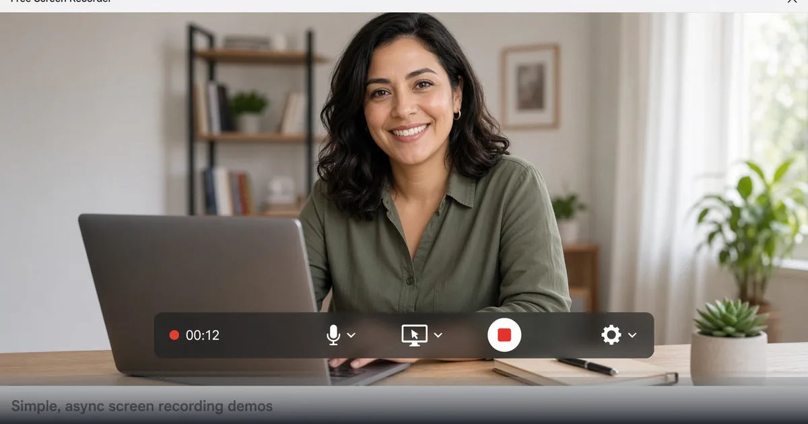

*Capture tabs, windows, or full screen with FreeDailyPro Screen Recorder — local-friendly, no install drama.*

[FreeDailyPro.com](https://www.freedailypro.com) -- Not every explanation needs a meeting. A crisp screen recording closes bugs, trains teammates, and sells features while people sleep in other time zones. FreeDailyPro’s [Screen Recorder](https://www.freedailypro.com/tool/screen-recorder) captures your screen, a window, or a browser tab — optionally a selected region — without installing a bulky desktop suite for a five-minute clip.

Async video is how modern teams communicate. Support can show reproduction steps. Designers can narrate a prototype. Teachers can walk through a slide. Founders can send investor updates that beat a wall of text. FreeDailyPro keeps that capture close to the rest of your free video toolkit.

## Capture, Then Finish Like a Pro

Record with [Screen Recorder](https://www.freedailypro.com/tool/screen-recorder). Cut dead ends with [Trim Video](https://www.freedailypro.com/tool/trim-video). Shrink share size using [Compress Video](https://www.freedailypro.com/tool/compress-video). Convert formats via [Convert Video](https://www.freedailypro.com/tool/convert-video). Merge multi-take explainers with [Merge Videos](https://www.freedailypro.com/tool/merge-video).

Need a looping social clip? [Video to GIF](https://www.freedailypro.com/tool/video-to-gif). Need a cover frame? [Thumbnail Generator](https://www.freedailypro.com/tool/thumbnail-gen). Add captions when accessibility matters with [Subtitle Adder](https://www.freedailypro.com/tool/subtitle-adder). The full [Video Tools](https://www.freedailypro.com/category/video-tools) category is built for creators who live in the browser.

## Privacy and Policy Advantages

Many screen tools phone home by default. FreeDailyPro’s model emphasizes client-side processing for core tasks and clear free limits. That helps when demos include staging data, internal dashboards, or customer PII you must not casually upload. You still choose what you share after export.

Corporate AI blocks often allow browser utilities while forbidding pasting confidential UI into chat models. Screen recording plus local trim is a compliant way to show, not paste.

## Use Cases That Pay for Themselves

Bug reports with exact clicks. Onboarding clips for new hires. Sales demos personalized per prospect. Course modules without a studio. Open-source contribution walkthroughs. Family tech support for relatives who need to see the menu, not hear about it.

Combine with audio cleanup: extract the track via [Extract Audio](https://www.freedailypro.com/tool/extract-audio) and soften hum with [Noise Remover](https://www.freedailypro.com/tool/noise-remover) when the mic picked up a fan. Compress images for slide decks with [Compress Image](https://www.freedailypro.com/tool/compress-image). Attach a PDF one-pager using [Merge PDF](https://www.freedailypro.com/tool/merge-pdf).

## Meeting Reduction Without Losing Clarity

Async video is not anti-social; it is anti-waste. Record a three-minute walkthrough instead of a thirty-minute meeting across five time zones. Viewers watch at 1.25x, pause, and reply with comments. FreeDailyPro Screen Recorder makes the capture step free and immediate.

Set a norm: bugs require a clip. Feature proposals include a clip. Onboarding includes a clip library. Your future self will thank you.

## Quality Tips for Non-Video People

Close extra tabs. Increase UI font if possible. Narrate intent, not every pixel. Leave two seconds of silence at start and end for trim. Avoid personal notifications on screen. Use region capture to hide the chaos of your full desktop.

After capture, trim ruthlessly. Compress for Slack and email limits. Add captions when the audience is global. FreeDailyPro video tools cover those finish steps without a second subscription.

## Sales and Customer Success

Personalized demos convert. Record a version with the prospect’s name on a slide, their use case highlighted, and a clear CTA. Store the MP4 in your CRM notes. When prospects ghost, a fresh short clip reopens the thread better than “just checking in.”

Success teams can record feature adoption tips post-sale. That reduces ticket volume and creates reusable assets.

## Education and Open Source

Instructors publish lab demos. OSS maintainers show how to reproduce builds. Community helpers answer Discord questions with a twenty-second recording instead of a paragraph of menu paths. The barrier is only whether capture is handy — FreeDailyPro keeps it handy.

## Library Hygiene for Recordings

Name files with date, topic, and audience. Trim ruthlessly. Delete noisy first takes. Store finals in a shared drive with a simple index page. FreeDailyPro helps create; your folder hygiene helps reuse.

When a clip includes staging data, double-check before external share. Prefer synthetic data in public demos. The recorder makes capture easy — judgment still decides what leaves the building.

## Accessibility and Inclusivity

Spoken demos help people who struggle with long written docs. Captions help people who cannot listen at work. FreeDailyPro’s subtitle tools plus screen recording create a more inclusive knowledge base. Short clips beat walls of text for many learning styles.

Encourage teammates to record in plain language. Avoid slang-only narration. Your future international hires will appreciate it.

## Why FreeDailyPro Beats Fragmented Free Sites

Scattered “one tool” websites train you to accept trackers, surprise signups, and inconsistent privacy stories. FreeDailyPro consolidates everyday work under one brand with transparent free limits, optional Day Pass and Monthly Pro for heavy file days, and a real developer surface for API and MCP when automation matters.

You bookmark fewer domains. You train teammates once. You keep client-side processing for sensitive files and intentional server calls only when you choose them. That architecture is the product, not a side note.

Internal links across tools are deliberate: each post points you to companion utilities so a single job — cleanup audio, ship a catalog, compare a contract, batch images — finishes without leaving the platform. Explore categories for PDF, image, video, audio, text, and calculators whenever you need the next step.

If a workflow is still missing, tell us. The roadmap responds to real users who actually ship work, not vanity feature lists. YouTube videos for individual tools are coming so visual learners can follow along. Until then, the tools are live, free to start, and ready for your next deadline.

Teams that standardize on FreeDailyPro spend less time hunting tools and more time finishing work. That is the real productivity gain behind free, private, multi-category utilities with a growing API and MCP layer for developers.

## Call to Action

Launch [Screen Recorder](https://www.freedailypro.com/tool/screen-recorder) and capture a two-minute async update today. Polish with trim and compress tools, then share. Explore more on the [video tools](https://www.freedailypro.com/category/video-tools) page.

YouTube tutorials for FreeDailyPro video workflows are on the way. What should we prioritize — webcam PiP, better region presets, or one-click GIF export from recordings? Tell us, keep shipping demos, and stay free with FreeDailyPro.
