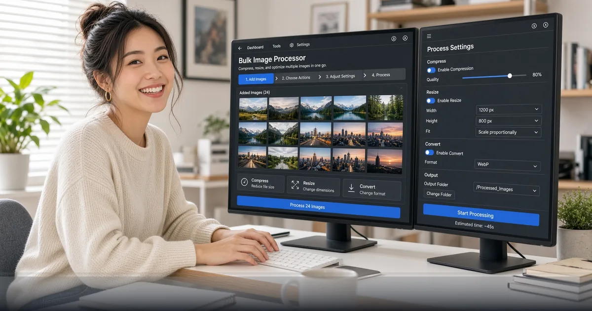

*Batch resize, convert, and clean image sets in the browser with FreeDailyPro Bulk Image — no upload farm required.*

[FreeDailyPro.com](https://www.freedailypro.com) -- One image is easy. Eighty product shots before a launch is a different sport. FreeDailyPro’s [Bulk Image](https://www.freedailypro.com/tool/bulk-image) tool is built for those stacks: process multiple files in one flow so you stop opening the same dialog eighty times.

Browser-based batch work means your catalog photos, event galleries, and UI screenshots stay under your control during transforms. That privacy edge matters for unreleased products, face-heavy event albums, and internal design systems. Free daily uses cover light runs; Day Pass or Monthly Pro handle crunch weeks.

## Why Bulk Beats One-Off Forever

Marketplaces reject wrong dimensions. Email newsletters choke on multi-megabyte heroes. Design handoffs need consistent formats. Doing it file-by-file guarantees inconsistency and burnout. Bulk processing enforces the same settings across a set so the storefront looks intentional.

Pair bulk flows with precision tools. [Compress Image](https://www.freedailypro.com/tool/compress-image) hits target sizes. [Resize Crop](https://www.freedailypro.com/tool/resize-crop) locks aspect ratios. [Convert Image](https://www.freedailypro.com/tool/convert-image) moves between JPG, PNG, WebP. [Flip Rotate Image](https://www.freedailypro.com/tool/flip-rotate-image) fixes orientation. [Image Filters](https://www.freedailypro.com/tool/image-filters) applies cohesive looks.

## Ecommerce and Creator Playbooks

Photographers export a shoot, bulk-compress for clients, then build a PDF proof with [Image to PDF](https://www.freedailypro.com/tool/image-to-pdf) or [Catalog Maker](https://www.freedailypro.com/tool/catalog-maker). Sellers standardize white-background SKUs before listing. Social teams produce WebP sets for faster pages. Agencies deliver resized brand kits without a separate DAM seat for every intern.

Need a favicon pack from a logo? [Favicon Generator](https://www.freedailypro.com/tool/favicon-generator). Need a quick mock screenshot? Camera and document scanner tools on FreeDailyPro help capture. For HEIC phone dumps, conversion tools in the image category clear the path before bulk work.

## Privacy, AI Policies, and Team Reality

Uploading entire catalogs to unknown compressors is a risk. FreeDailyPro’s client-side emphasis keeps core processing local. Teams blocked from consumer AI image services can still ship resized assets for the website. That corporate-safe angle is why FreeDailyPro lists roles and policies-friendly messaging on the homepage.

When you later automate non-sensitive transforms in pipelines, check [developers](https://www.freedailypro.com/developers) for API and MCP options. Human batch days stay in the bulk UI.

## Finish the Asset Pipeline

After images are ready, compress supporting PDFs with [Compress PDF](https://www.freedailypro.com/tool/compress-pdf). Build lookbooks with [Magazine Maker](https://www.freedailypro.com/tool/magazine-maker) or [Book Maker](https://www.freedailypro.com/tool/book-maker). Record a listing demo with [Screen Recorder](https://www.freedailypro.com/tool/screen-recorder). Generate GIFs for motion details via [Video to GIF](https://www.freedailypro.com/tool/video-to-gif) or [GIF Maker](https://www.freedailypro.com/tool/gif-maker).

One platform replaces a fragile stack of free-with-watermark sites.

## Marketplace Dimension Reality

Amazon, Etsy, Shopify themes, and ad networks all want different sizes. Maintaining five export presets is painful if you do it one file at a time. Bulk Image plus resize/compress tools let you define the rule once per batch. Name outputs clearly so developers can hook the right assets.

Create a simple house standard: master at high res, web hero, card thumb, social square. Run bulk jobs per standard. Store masters offline; ship derivatives.

## Event and Media Teams

Wedding photographers, conference crews, and sports parents dump hundreds of images. Clients want galleries fast. Bulk compress for delivery, then optionally PDF contact sheets. FreeDailyPro image and PDF tools cooperate without forcing a Lightroom seat for every assistant.

Always keep originals. Bulk tools are for derivatives. That discipline prevents irreversible quality loss.

## Design Systems and Engineering Handoff

Product designers export icon sets and marketing stills. Engineers need WebP and correct dimensions in git. A bulk pass before PR reduces back-and-forth. Pair with [Favicon Generator](https://www.freedailypro.com/tool/favicon-generator) for site chrome and [Compress Image](https://www.freedailypro.com/tool/compress-image) for Lighthouse budgets.

Document the pipeline in a short internal page. New hires run the same FreeDailyPro steps on day one.

## Sustainability of Free Tooling

Teams abandon free tools when limits are unclear or uploads feel sketchy. FreeDailyPro states free daily uses, Day Pass, Monthly Pro, and separate API pricing. That transparency keeps bulk image work viable for real businesses, not only hobbyists.

## Performance Budgets and SEO

Heavy images slow Largest Contentful Paint. Bulk compress to WebP or optimized JPG before deploy. Keep a maximum dimension for blog heroes (FreeDailyPro itself uses 1200×630 brand images for posts). Consistent bulk settings keep Core Web Vitals happier without a dedicated media engineer on every team.

Marketers can run monthly audits: download the worst offenders, bulk recompress, re-upload. That is a FreeDailyPro afternoon, not a quarter-long project.

## Backup and Version Discipline

Before bulk overwrites, copy masters to a dated folder. Never bulk-save over RAW or master exports. FreeDailyPro speeds derivatives; it should not become the only copy of irreplaceable photos. Teach that rule to every intern on day one.

When a batch looks wrong, stop and fix the preset. Re-running eighty images is still cheaper than publishing eighty wrong crops to production.

## Why FreeDailyPro Beats Fragmented Free Sites

Scattered “one tool” websites train you to accept trackers, surprise signups, and inconsistent privacy stories. FreeDailyPro consolidates everyday work under one brand with transparent free limits, optional Day Pass and Monthly Pro for heavy file days, and a real developer surface for API and MCP when automation matters.

You bookmark fewer domains. You train teammates once. You keep client-side processing for sensitive files and intentional server calls only when you choose them. That architecture is the product, not a side note.

Internal links across tools are deliberate: each post points you to companion utilities so a single job — cleanup audio, ship a catalog, compare a contract, batch images — finishes without leaving the platform. Explore categories for PDF, image, video, audio, text, and calculators whenever you need the next step.

If a workflow is still missing, tell us. The roadmap responds to real users who actually ship work, not vanity feature lists. YouTube videos for individual tools are coming so visual learners can follow along. Until then, the tools are live, free to start, and ready for your next deadline.

## Call to Action

Open [Bulk Image](https://www.freedailypro.com/tool/bulk-image) and run your next product set through a consistent resize and compress path. Explore [Image Tools](https://www.freedailypro.com/category/image-tools) for every single-file companion utility.

Tool videos are coming soon so you can watch bulk workflows end to end. What batch feature do you want next — smarter naming, ZIP download presets, or background removal queues? Share feedback, ship cleaner catalogs, and stay free with FreeDailyPro.
