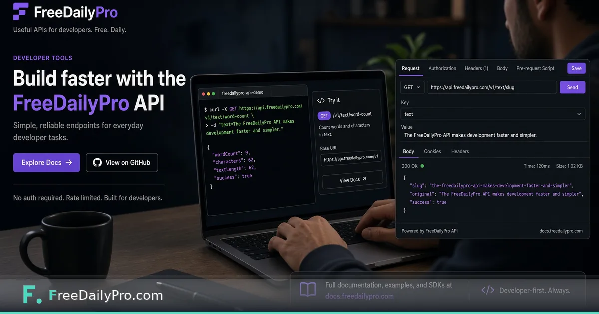

*A concrete word-count + slug walkthrough — not another API announcement.*

[FreeDailyPro.com](https://www.freedailypro.com) -- The September API and MCP launch covered the map. This post is a single trail: call word-count style analysis and slug generation patterns from code in about ten minutes. Start at the [developers](https://www.freedailypro.com/developers) page for keys, docs, and current endpoint details.

## Why these two operations

Word counts gate editorial SLAs. Slugs gate CMS uniqueness. Both are boring, frequent, and easy to automate. The browser [Word Counter](https://www.freedailypro.com/tool/word-counter) remains the no-code equivalent when you do not want to write a script.

## Ten-minute shape

1. Create or copy an API key from the developers flow.
2. Read the current REST docs for text analysis endpoints you need.
3. Send a small POST with sample prose.
4. Parse word and character counts from JSON.
5. Generate a slug from the title field using the documented slug helper or your own normalization if that lives client-side.
6. Log results and handle non-2xx cleanly.

Exact paths and payloads change with docs — always copy from [developers](https://www.freedailypro.com/developers) rather than from a blog that might lag.

## MCP note

If your agent stack speaks MCP, FreeDailyPro's registry entry exists for tool access from agents. This example stays REST-simple on purpose so a human developer can finish without an agent runtime.

## Limits

Free tiers have call caps. Do not scrape. Do not send secrets you would not store in logs. Browser Word Counter is enough for one-off edits; API is for pipelines.

## Result

A script that prints counts and a slug for each draft folder is a real automation win. Keep it small, test with fixtures, and read the live developers docs whenever signatures change.

## Practical depth that usually gets skipped

Most mistakes happen after the tool works. People close the tab without saving, send the wrong export, or trust a first result without changing one input to see sensitivity. Build a tiny habit: export, rename with a date, and re-run once with a slightly worse assumption.

If you share results with someone else, include the inputs, not only the outputs. A monthly savings number without the tuition target is trivia. A similarity percentage without the two texts is noise. A merge without the clip order is a future argument.

FreeDailyPro is designed so these jobs stay in the browser with low ceremony. That only helps if you treat the output as a work product. Save it. Label it. Move on with a clearer decision than you had before you opened the tool.

When the stakes are high, do a second pass the next morning. Fatigue makes people accept bad numbers and bad files. A second pass is cheaper than shipping a mistake.

## Practical depth that usually gets skipped

Most mistakes happen after the tool works. People close the tab without saving, send the wrong export, or trust a first result without changing one input to see sensitivity. Build a tiny habit: export, rename with a date, and re-run once with a slightly worse assumption.

If you share results with someone else, include the inputs, not only the outputs. A monthly savings number without the tuition target is trivia. A similarity percentage without the two texts is noise. A merge without the clip order is a future argument.

FreeDailyPro is designed so these jobs stay in the browser with low ceremony. That only helps if you treat the output as a work product. Save it. Label it. Move on with a clearer decision than you had before you opened the tool.

When the stakes are high, do a second pass the next morning. Fatigue makes people accept bad numbers and bad files. A second pass is cheaper than shipping a mistake.

## Practical depth that usually gets skipped

Most mistakes happen after the tool works. People close the tab without saving, send the wrong export, or trust a first result without changing one input to see sensitivity. Build a tiny habit: export, rename with a date, and re-run once with a slightly worse assumption.

If you share results with someone else, include the inputs, not only the outputs. A monthly savings number without the tuition target is trivia. A similarity percentage without the two texts is noise. A merge without the clip order is a future argument.

FreeDailyPro is designed so these jobs stay in the browser with low ceremony. That only helps if you treat the output as a work product. Save it. Label it. Move on with a clearer decision than you had before you opened the tool.

When the stakes are high, do a second pass the next morning. Fatigue makes people accept bad numbers and bad files. A second pass is cheaper than shipping a mistake.

## Practical depth that usually gets skipped

Most mistakes happen after the tool works. People close the tab without saving, send the wrong export, or trust a first result without changing one input to see sensitivity. Build a tiny habit: export, rename with a date, and re-run once with a slightly worse assumption.

If you share results with someone else, include the inputs, not only the outputs. A monthly savings number without the tuition target is trivia. A similarity percentage without the two texts is noise. A merge without the clip order is a future argument.

FreeDailyPro is designed so these jobs stay in the browser with low ceremony. That only helps if you treat the output as a work product. Save it. Label it. Move on with a clearer decision than you had before you opened the tool.

When the stakes are high, do a second pass the next morning. Fatigue makes people accept bad numbers and bad files. A second pass is cheaper than shipping a mistake.

## Practical depth that usually gets skipped

Most mistakes happen after the tool works. People close the tab without saving, send the wrong export, or trust a first result without changing one input to see sensitivity. Build a tiny habit: export, rename with a date, and re-run once with a slightly worse assumption.

If you share results with someone else, include the inputs, not only the outputs. A monthly savings number without the tuition target is trivia. A similarity percentage without the two texts is noise. A merge without the clip order is a future argument.

FreeDailyPro is designed so these jobs stay in the browser with low ceremony. That only helps if you treat the output as a work product. Save it. Label it. Move on with a clearer decision than you had before you opened the tool.

When the stakes are high, do a second pass the next morning. Fatigue makes people accept bad numbers and bad files. A second pass is cheaper than shipping a mistake.
