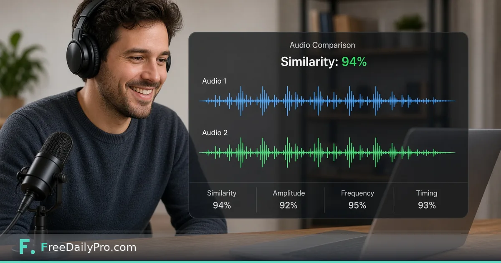

*Get a similarity read on two clips before you archive, publish, or dispute a take.*

[FreeDailyPro.com](https://www.freedailypro.com) -- Two files can look identical in a folder and still be different takes, exports, or noise floors. Listening twice is weak when clips are long. A comparison tool gives a similarity signal you can act on.

FreeDailyPro's [audio comparer](https://www.freedailypro.com/tool/audio-comparer) compares two audio clips and shows similarity. Use it for archive matches, final versus final_v3, or disputed re-records. Real usage and search interest both show up for this tool.

## Prepare fairly

Compare similar lengths. If loudness differs, try [Audio Normalizer](https://www.freedailypro.com/tool/audio-normalizer) first. If hum dominates, [Noise Remover](https://www.freedailypro.com/tool/noise-remover) can clean steady noise before comparing content. Skip preprocessing when the question is exact export sameness including noise.

## Interpreting scores

High similarity suggests same performance or light re-encode. Mid may mean edits or different takes. Low usually means different content. Always spot-listen. Percentages guide; they are not courtroom verdicts.

## Limits

Not forensic chain-of-custody authentication. Not speaker identification against databases. It compares the two files you provide. That narrow job still improves production hygiene.

## Category

See [audio tools](https://www.freedailypro.com/category/audio-tools) for neighbors. Comparer answers sameness. Normalizer and noise remover answer readiness.

## Practical depth that usually gets skipped

Most mistakes happen after the tool works. People close the tab without saving, send the wrong export, or trust a first result without changing one input to see sensitivity. Build a tiny habit: export, rename with a date, and re-run once with a slightly worse assumption.

If you share results with someone else, include the inputs, not only the outputs. A monthly savings number without the tuition target is trivia. A similarity percentage without the two texts is noise. A merge without the clip order is a future argument.

FreeDailyPro is designed so these jobs stay in the browser with low ceremony. That only helps if you treat the output as a work product. Save it. Label it. Move on with a clearer decision than you had before you opened the tool.

When the stakes are high, do a second pass the next morning. Fatigue makes people accept bad numbers and bad files. A second pass is cheaper than shipping a mistake.

## Practical depth that usually gets skipped

Most mistakes happen after the tool works. People close the tab without saving, send the wrong export, or trust a first result without changing one input to see sensitivity. Build a tiny habit: export, rename with a date, and re-run once with a slightly worse assumption.

If you share results with someone else, include the inputs, not only the outputs. A monthly savings number without the tuition target is trivia. A similarity percentage without the two texts is noise. A merge without the clip order is a future argument.

FreeDailyPro is designed so these jobs stay in the browser with low ceremony. That only helps if you treat the output as a work product. Save it. Label it. Move on with a clearer decision than you had before you opened the tool.

When the stakes are high, do a second pass the next morning. Fatigue makes people accept bad numbers and bad files. A second pass is cheaper than shipping a mistake.

## Practical depth that usually gets skipped

Most mistakes happen after the tool works. People close the tab without saving, send the wrong export, or trust a first result without changing one input to see sensitivity. Build a tiny habit: export, rename with a date, and re-run once with a slightly worse assumption.

If you share results with someone else, include the inputs, not only the outputs. A monthly savings number without the tuition target is trivia. A similarity percentage without the two texts is noise. A merge without the clip order is a future argument.

FreeDailyPro is designed so these jobs stay in the browser with low ceremony. That only helps if you treat the output as a work product. Save it. Label it. Move on with a clearer decision than you had before you opened the tool.

When the stakes are high, do a second pass the next morning. Fatigue makes people accept bad numbers and bad files. A second pass is cheaper than shipping a mistake.

## Practical depth that usually gets skipped

Most mistakes happen after the tool works. People close the tab without saving, send the wrong export, or trust a first result without changing one input to see sensitivity. Build a tiny habit: export, rename with a date, and re-run once with a slightly worse assumption.

If you share results with someone else, include the inputs, not only the outputs. A monthly savings number without the tuition target is trivia. A similarity percentage without the two texts is noise. A merge without the clip order is a future argument.

FreeDailyPro is designed so these jobs stay in the browser with low ceremony. That only helps if you treat the output as a work product. Save it. Label it. Move on with a clearer decision than you had before you opened the tool.

When the stakes are high, do a second pass the next morning. Fatigue makes people accept bad numbers and bad files. A second pass is cheaper than shipping a mistake.

## Practical depth that usually gets skipped

Most mistakes happen after the tool works. People close the tab without saving, send the wrong export, or trust a first result without changing one input to see sensitivity. Build a tiny habit: export, rename with a date, and re-run once with a slightly worse assumption.

If you share results with someone else, include the inputs, not only the outputs. A monthly savings number without the tuition target is trivia. A similarity percentage without the two texts is noise. A merge without the clip order is a future argument.

FreeDailyPro is designed so these jobs stay in the browser with low ceremony. That only helps if you treat the output as a work product. Save it. Label it. Move on with a clearer decision than you had before you opened the tool.

When the stakes are high, do a second pass the next morning. Fatigue makes people accept bad numbers and bad files. A second pass is cheaper than shipping a mistake.
