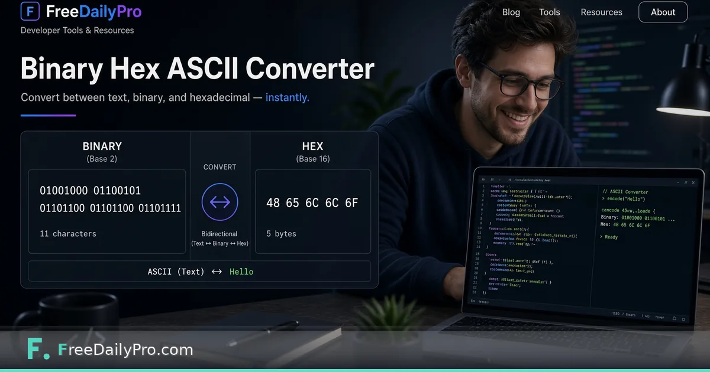

*Learn the mapping once, then convert reliably when speed matters.*

[FreeDailyPro.com](https://www.freedailypro.com) -- Every developer should convert "A" to binary by hand once. Nobody should do it for a whole payload during an outage. FreeDailyPro's [Binary / Hex / ASCII Converter](https://www.freedailypro.com/tool/binary-ascii-converter) converts text between binary, hexadecimal, and decimal ASCII codes quickly.

## Learning versus shipping

Hand conversion teaches place value and encoding assumptions. Converters prevent transcription errors when the string is long. Use both modes of thinking.

## Nearby tools

Decode auth tokens with [JWT Decoder](https://www.freedailypro.com/tool/jwt-decoder). Fingerprint content with [Hash Generator](https://www.freedailypro.com/tool/hash-generator). Encoding, tokens, and hashes are related but not interchangeable.

## Limits

Encoding is not encryption. ASCII is not Unicode for all languages. Binary dumps of UTF-8 text need the right interpretation. The converter is a scalpel for classic ASCII/hex/binary jobs.

## Practical depth that usually gets skipped

Most mistakes happen after the tool works. People close the tab without saving, send the wrong export, or trust a first result without changing one input to see sensitivity. Build a tiny habit: export, rename with a date, and re-run once with a slightly worse assumption.

If you share results with someone else, include the inputs, not only the outputs. A monthly savings number without the tuition target is trivia. A similarity percentage without the two texts is noise. A merge without the clip order is a future argument.

FreeDailyPro is designed so these jobs stay in the browser with low ceremony. That only helps if you treat the output as a work product. Save it. Label it. Move on with a clearer decision than you had before you opened the tool.

When the stakes are high, do a second pass the next morning. Fatigue makes people accept bad numbers and bad files. A second pass is cheaper than shipping a mistake.

## Practical depth that usually gets skipped

Most mistakes happen after the tool works. People close the tab without saving, send the wrong export, or trust a first result without changing one input to see sensitivity. Build a tiny habit: export, rename with a date, and re-run once with a slightly worse assumption.

If you share results with someone else, include the inputs, not only the outputs. A monthly savings number without the tuition target is trivia. A similarity percentage without the two texts is noise. A merge without the clip order is a future argument.

FreeDailyPro is designed so these jobs stay in the browser with low ceremony. That only helps if you treat the output as a work product. Save it. Label it. Move on with a clearer decision than you had before you opened the tool.

When the stakes are high, do a second pass the next morning. Fatigue makes people accept bad numbers and bad files. A second pass is cheaper than shipping a mistake.

## Practical depth that usually gets skipped

Most mistakes happen after the tool works. People close the tab without saving, send the wrong export, or trust a first result without changing one input to see sensitivity. Build a tiny habit: export, rename with a date, and re-run once with a slightly worse assumption.

If you share results with someone else, include the inputs, not only the outputs. A monthly savings number without the tuition target is trivia. A similarity percentage without the two texts is noise. A merge without the clip order is a future argument.

FreeDailyPro is designed so these jobs stay in the browser with low ceremony. That only helps if you treat the output as a work product. Save it. Label it. Move on with a clearer decision than you had before you opened the tool.

When the stakes are high, do a second pass the next morning. Fatigue makes people accept bad numbers and bad files. A second pass is cheaper than shipping a mistake.

## Practical depth that usually gets skipped

Most mistakes happen after the tool works. People close the tab without saving, send the wrong export, or trust a first result without changing one input to see sensitivity. Build a tiny habit: export, rename with a date, and re-run once with a slightly worse assumption.

If you share results with someone else, include the inputs, not only the outputs. A monthly savings number without the tuition target is trivia. A similarity percentage without the two texts is noise. A merge without the clip order is a future argument.

FreeDailyPro is designed so these jobs stay in the browser with low ceremony. That only helps if you treat the output as a work product. Save it. Label it. Move on with a clearer decision than you had before you opened the tool.

When the stakes are high, do a second pass the next morning. Fatigue makes people accept bad numbers and bad files. A second pass is cheaper than shipping a mistake.

## Practical depth that usually gets skipped

Most mistakes happen after the tool works. People close the tab without saving, send the wrong export, or trust a first result without changing one input to see sensitivity. Build a tiny habit: export, rename with a date, and re-run once with a slightly worse assumption.

If you share results with someone else, include the inputs, not only the outputs. A monthly savings number without the tuition target is trivia. A similarity percentage without the two texts is noise. A merge without the clip order is a future argument.

FreeDailyPro is designed so these jobs stay in the browser with low ceremony. That only helps if you treat the output as a work product. Save it. Label it. Move on with a clearer decision than you had before you opened the tool.

When the stakes are high, do a second pass the next morning. Fatigue makes people accept bad numbers and bad files. A second pass is cheaper than shipping a mistake.

## Practical depth that usually gets skipped

Most mistakes happen after the tool works. People close the tab without saving, send the wrong export, or trust a first result without changing one input to see sensitivity. Build a tiny habit: export, rename with a date, and re-run once with a slightly worse assumption.

If you share results with someone else, include the inputs, not only the outputs. A monthly savings number without the tuition target is trivia. A similarity percentage without the two texts is noise. A merge without the clip order is a future argument.

FreeDailyPro is designed so these jobs stay in the browser with low ceremony. That only helps if you treat the output as a work product. Save it. Label it. Move on with a clearer decision than you had before you opened the tool.

When the stakes are high, do a second pass the next morning. Fatigue makes people accept bad numbers and bad files. A second pass is cheaper than shipping a mistake.
