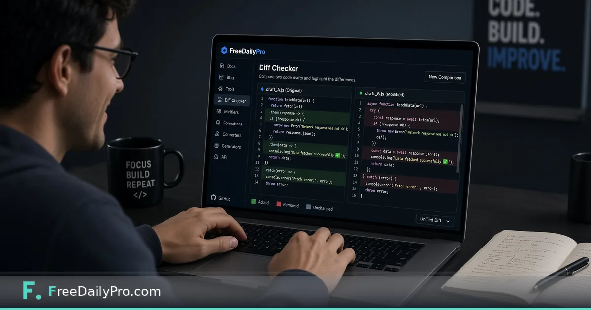

*Compare two text versions side by side and see the real edits, not the vibes.*

[FreeDailyPro.com](https://www.freedailypro.com) -- "What changed?" is the most expensive question in writing and code when you answer it by rereading entire documents. Eyes skip. Memory invents. A proper diff shows insertions and deletions line by line so you can approve a contract clause or a function rewrite with evidence.

FreeDailyPro's [Diff Checker](https://www.freedailypro.com/tool/diff-checker) compares two blocks of text or code and highlights differences. Paste version A and version B. Read the delta. That is the whole product promise, and it is enough for a surprising number of professional reviews.

## Writers: contracts, policies, and blog drafts

Legal and policy text is where silent edits hide. A single "not" added or removed changes obligations. Diff Checker makes that visible. Blog and documentation drafts benefit too when a collaborator "just cleaned it up" and you need to know how much meaning moved.

If you also need a sense of overall overlap rather than a line diff, FreeDailyPro's [Text Similarity Checker](https://www.freedailypro.com/tool/text-similarity-checker) answers a different question. Similarity scores do not replace diffs. Use both when the situation calls for it.

## Developers: config, SQL, and small patches

Not every change deserves a full IDE. Sometimes you have two JSON blobs from staging and production, or two nginx snippets from chat. Paste them into Diff Checker and stop guessing. For token payloads and auth debugging, pair with the [JWT Decoder](https://www.freedailypro.com/tool/jwt-decoder) when the text is a token rather than source.

## How to run a clean comparison

Normalize boring differences first when possible: trailing spaces, line ending debates, and accidental sort order in lists. Otherwise the diff lights up with noise and you miss the one business-critical line.

Compare the smallest unit that still makes sense. Diff two sections of a contract rather than hundred-page PDFs converted poorly to text. Garbage in still produces garbage highlights.

## Honesty about limits

Diff Checker is not a legal redline system with clause numbering and MS Word track-changes semantics. It is not git. It will not merge conflicts for you. It shows textual differences clearly so humans can decide.

That honesty is useful. Many people only need clarity, not a platform.

## Workflow that sticks

Save dated copies of drafts with boring filenames. When someone asks what changed since Tuesday, paste Tuesday and today. Store the conclusion in the email, not only in your head. Reviews go faster when the delta is shared as fact.

## When similarity is the better first pass

If you suspect two student submissions or two marketing variants are nearly copies, start with Text Similarity Checker for a percentage, then Diff Checker for the exact shared spans. Do not confuse the two tools' jobs.

Diff is for exact change visibility. Similarity is for overlap magnitude between two texts you provide. FreeDailyPro keeps both available without turning your drafts into training fodder on a random upload site.

## Keep the workflow short and honest

When you finish a pass in the tool, write one conclusion in plain language. If you cannot explain the result without looking back at the screen, change one input and re-run. FreeDailyPro tools are built for that kind of fast iteration in the browser without forcing an account wall.

Download or copy the result as soon as it is good enough. Browser sessions end. Phone calls interrupt. A saved file or note beats a perfect setup you planned to finish later. Use related FreeDailyPro tools that match the same job so you stay in one privacy model.

## A second pass worth doing

Come back to the same inputs the next day if the decision is expensive. Fatigue makes people accept bad packaging, bad drafts, and bad numbers. A second pass with fresh eyes is cheaper than shipping the wrong thing or submitting the wrong file.

If you work with a teammate, share the exported result rather than a vague description of what the tool said. Screenshots help, but the actual file or the exact number is better. FreeDailyPro is free for these daily browser jobs so the friction stays low enough that good process actually happens.

## Practical depth that usually gets skipped

Most mistakes happen after the tool works. People close the tab without saving, send the wrong export, or trust a first result without changing one input to see sensitivity. Build a tiny habit: export, rename with a date, and re-run once with a slightly worse assumption.

If you share results with someone else, include the inputs, not only the outputs. FreeDailyPro is designed so these jobs stay in the browser with low ceremony. That only helps if you treat the output as a work product. Save it. Label it. Move on with a clearer decision than you had before you opened the tool.

When the stakes are high, do a second pass the next morning. Fatigue makes people accept bad numbers and bad files. A second pass is cheaper than shipping a mistake. Keep related FreeDailyPro tools in the same workflow so you are not bouncing between unrelated privacy models and upload sites.

## Practical depth that usually gets skipped

Most mistakes happen after the tool works. People close the tab without saving, send the wrong export, or trust a first result without changing one input to see sensitivity. Build a tiny habit: export, rename with a date, and re-run once with a slightly worse assumption.

If you share results with someone else, include the inputs, not only the outputs. FreeDailyPro is designed so these jobs stay in the browser with low ceremony. That only helps if you treat the output as a work product. Save it. Label it. Move on with a clearer decision than you had before you opened the tool.

When the stakes are high, do a second pass the next morning. Fatigue makes people accept bad numbers and bad files. A second pass is cheaper than shipping a mistake. Keep related FreeDailyPro tools in the same workflow so you are not bouncing between unrelated privacy models and upload sites.

## Practical depth that usually gets skipped

Most mistakes happen after the tool works. People close the tab without saving, send the wrong export, or trust a first result without changing one input to see sensitivity. Build a tiny habit: export, rename with a date, and re-run once with a slightly worse assumption.

If you share results with someone else, include the inputs, not only the outputs. FreeDailyPro is designed so these jobs stay in the browser with low ceremony. That only helps if you treat the output as a work product. Save it. Label it. Move on with a clearer decision than you had before you opened the tool.

When the stakes are high, do a second pass the next morning. Fatigue makes people accept bad numbers and bad files. A second pass is cheaper than shipping a mistake. Keep related FreeDailyPro tools in the same workflow so you are not bouncing between unrelated privacy models and upload sites.
