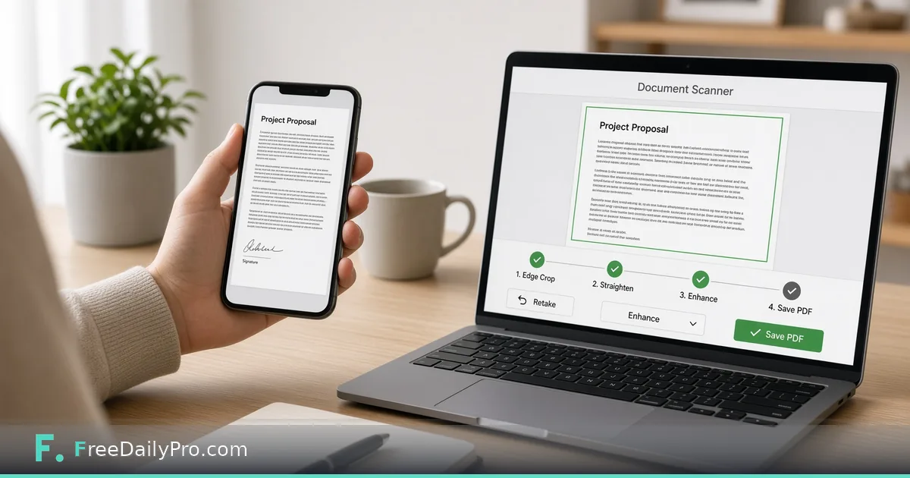

*Crop, straighten, and save a clean scan PDF from a photo in the browser.*

[FreeDailyPro.com](https://www.freedailypro.com) -- Hardware scanners are great until you travel, share an office, or refuse another device on the desk. Phones already photograph paper. What you need is edge crop, straighten, enhancement, and a PDF — not another app store install if a browser tool will do.

FreeDailyPro's [Document Scanner](https://www.freedailypro.com/tool/document-scanner) turns a photo of a document into a cleaner scanned look: crop, straighten, rotate, save as PDF. It is a MultiTool App; see the [MultiTool Apps](https://www.freedailypro.com/multitool-apps) page for the family.

## Capture tips

Parallel to the page, even light, fill the frame, avoid heavy shadows. Multiple pages: shoot consistently, then combine with [Image to PDF](https://www.freedailypro.com/tool/image-to-pdf) or [Merge PDF](https://www.freedailypro.com/tool/merge-pdf).

## What it fixes

Perspective warp, messy backgrounds, rotation. What it cannot invent: text from an unreadable blur.

## Privacy

IDs and contracts are sensitive. Browser-side processing models reduce the need to upload private paper to unknown scanners.

## Limits

Not a full duplex ADF replacement for hundred-page batches. For a few pages on the go, it is the right shape of tool.

## Practical depth that usually gets skipped

Most mistakes happen after the tool works. People close the tab without saving, send the wrong export, or trust a first result without changing one input to see sensitivity. Build a tiny habit: export, rename with a date, and re-run once with a slightly worse assumption.

If you share results with someone else, include the inputs, not only the outputs. A monthly savings number without the tuition target is trivia. A similarity percentage without the two texts is noise. A merge without the clip order is a future argument.

FreeDailyPro is designed so these jobs stay in the browser with low ceremony. That only helps if you treat the output as a work product. Save it. Label it. Move on with a clearer decision than you had before you opened the tool.

When the stakes are high, do a second pass the next morning. Fatigue makes people accept bad numbers and bad files. A second pass is cheaper than shipping a mistake.

## Practical depth that usually gets skipped

Most mistakes happen after the tool works. People close the tab without saving, send the wrong export, or trust a first result without changing one input to see sensitivity. Build a tiny habit: export, rename with a date, and re-run once with a slightly worse assumption.

If you share results with someone else, include the inputs, not only the outputs. A monthly savings number without the tuition target is trivia. A similarity percentage without the two texts is noise. A merge without the clip order is a future argument.

FreeDailyPro is designed so these jobs stay in the browser with low ceremony. That only helps if you treat the output as a work product. Save it. Label it. Move on with a clearer decision than you had before you opened the tool.

When the stakes are high, do a second pass the next morning. Fatigue makes people accept bad numbers and bad files. A second pass is cheaper than shipping a mistake.

## Practical depth that usually gets skipped

Most mistakes happen after the tool works. People close the tab without saving, send the wrong export, or trust a first result without changing one input to see sensitivity. Build a tiny habit: export, rename with a date, and re-run once with a slightly worse assumption.

If you share results with someone else, include the inputs, not only the outputs. A monthly savings number without the tuition target is trivia. A similarity percentage without the two texts is noise. A merge without the clip order is a future argument.

FreeDailyPro is designed so these jobs stay in the browser with low ceremony. That only helps if you treat the output as a work product. Save it. Label it. Move on with a clearer decision than you had before you opened the tool.

When the stakes are high, do a second pass the next morning. Fatigue makes people accept bad numbers and bad files. A second pass is cheaper than shipping a mistake.

## Practical depth that usually gets skipped

Most mistakes happen after the tool works. People close the tab without saving, send the wrong export, or trust a first result without changing one input to see sensitivity. Build a tiny habit: export, rename with a date, and re-run once with a slightly worse assumption.

If you share results with someone else, include the inputs, not only the outputs. A monthly savings number without the tuition target is trivia. A similarity percentage without the two texts is noise. A merge without the clip order is a future argument.

FreeDailyPro is designed so these jobs stay in the browser with low ceremony. That only helps if you treat the output as a work product. Save it. Label it. Move on with a clearer decision than you had before you opened the tool.

When the stakes are high, do a second pass the next morning. Fatigue makes people accept bad numbers and bad files. A second pass is cheaper than shipping a mistake.

## Practical depth that usually gets skipped

Most mistakes happen after the tool works. People close the tab without saving, send the wrong export, or trust a first result without changing one input to see sensitivity. Build a tiny habit: export, rename with a date, and re-run once with a slightly worse assumption.

If you share results with someone else, include the inputs, not only the outputs. A monthly savings number without the tuition target is trivia. A similarity percentage without the two texts is noise. A merge without the clip order is a future argument.

FreeDailyPro is designed so these jobs stay in the browser with low ceremony. That only helps if you treat the output as a work product. Save it. Label it. Move on with a clearer decision than you had before you opened the tool.

When the stakes are high, do a second pass the next morning. Fatigue makes people accept bad numbers and bad files. A second pass is cheaper than shipping a mistake.
