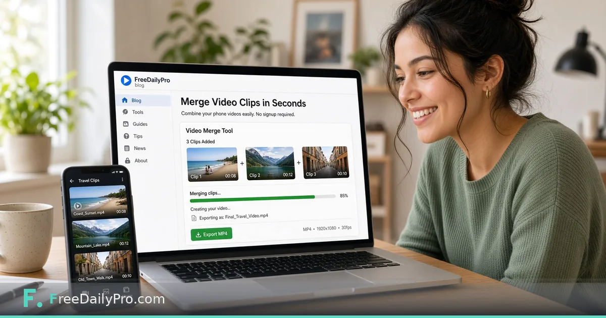

*Stitch travel clips or demo segments in the browser without a heavy editor.*

[FreeDailyPro.com](https://www.freedailypro.com) -- Phone cameras make it easy to capture five short clips and hard to share them as one coherent file. Email compresses the wrong things. Social apps re-encode everything. A simple merge is often all you need before a client demo, a family album, or a bug report.

FreeDailyPro's [Merge Video](https://www.freedailypro.com/tool/merge-video) tool combines multiple video clips into one file in the browser. You order the clips, merge, and download. No timeline drama required when your goal is concatenation rather than a Hollywood grade.

## When merge is the right tool

Use merge when clips are already the length you want and you only need them in sequence. Product walkthroughs, travel days, classroom takes, and support recordings fit that pattern. If you need cuts inside a clip, trim first or record cleaner next time.

If the source is a live demo on your computer, capture with the [Screen Recorder](https://www.freedailypro.com/tool/screen-recorder) first, then merge any additional phone b-roll. Keeping capture and merge in one toolkit reduces format roulette.

## A practical order of operations

1. Copy the clips off the phone with original quality when possible.
2. Name them in the order you want, even temporarily.
3. Drop them into Merge Video in that order.
4. Preview if the tool offers a quick check.
5. Download the merged file and watch it once end to end.

Watching once catches silent gaps, upside-down segments, and a clip that still has the shopping-list audio in the background.

## Audio and format realities

Phone clips may mix frame rates or orientations. Most simple mergers handle common cases, but extreme mixes can produce odd results. If audio sounds wrong after a merge, convert or normalize the soundtrack with FreeDailyPro's [Audio Converter](https://www.freedailypro.com/tool/audio-converter) pathway rather than re-shooting everything.

Do not expect a free browser merge to replace a full editor for multi-track music beds and motion titles. That is not the job. The job is one file from many clips without installing suite software for a ten-minute task.

## Privacy and large files

Video files are large. Browser tools still have practical memory and time limits on modest devices. Merge fewer long clips at a time if your laptop struggles. That is a hardware limit, not a moral failing.

Because FreeDailyPro runs tools in the browser model used across the site, your clips are not being uploaded as a permanent cloud project by default the way some consumer editors work. That matters for internal demos and anything with customer data on screen.

## Common mistakes

Merging compressed social downloads instead of camera originals. Forgetting a clip is vertical while others are horizontal. Adding ten near-duplicates "just in case." Skipping the final full watch. Any of those create a file you will not actually send.

## Where it sits in the video category

Explore the broader [video tools category](https://www.freedailypro.com/category/video-tools) when merge is only step one. You may still compress for email limits or convert for a specific player. Start with merge when the only problem is "too many clips."

## A realistic scenario

You filmed four segments of a feature walkthrough on your phone between meetings. The client wants one link, not a folder. Merge Video produces a single MP4 you can host or attach after a compress step if needed. Total time should be minutes, not an evening of learning a new timeline UI.

That is the standard FreeDailyPro aims for: finish the job, keep the files under your control, and move on.

## Keep the workflow short and honest

When you finish a pass in the tool, write one conclusion in plain language. If you cannot explain the result without looking back at the screen, change one input and re-run. FreeDailyPro tools are built for that kind of fast iteration in the browser without forcing an account wall.

Download or copy the result as soon as it is good enough. Browser sessions end. Phone calls interrupt. A saved file or note beats a perfect setup you planned to finish later. Use related FreeDailyPro tools that match the same job so you stay in one privacy model.

## A second pass worth doing

Come back to the same inputs the next day if the decision is expensive. Fatigue makes people accept bad packaging, bad drafts, and bad numbers. A second pass with fresh eyes is cheaper than shipping the wrong thing or submitting the wrong file.

If you work with a teammate, share the exported result rather than a vague description of what the tool said. Screenshots help, but the actual file or the exact number is better. FreeDailyPro is free for these daily browser jobs so the friction stays low enough that good process actually happens.

## Practical depth that usually gets skipped

Most mistakes happen after the tool works. People close the tab without saving, send the wrong export, or trust a first result without changing one input to see sensitivity. Build a tiny habit: export, rename with a date, and re-run once with a slightly worse assumption.

If you share results with someone else, include the inputs, not only the outputs. FreeDailyPro is designed so these jobs stay in the browser with low ceremony. That only helps if you treat the output as a work product. Save it. Label it. Move on with a clearer decision than you had before you opened the tool.

When the stakes are high, do a second pass the next morning. Fatigue makes people accept bad numbers and bad files. A second pass is cheaper than shipping a mistake. Keep related FreeDailyPro tools in the same workflow so you are not bouncing between unrelated privacy models and upload sites.

## Practical depth that usually gets skipped

Most mistakes happen after the tool works. People close the tab without saving, send the wrong export, or trust a first result without changing one input to see sensitivity. Build a tiny habit: export, rename with a date, and re-run once with a slightly worse assumption.

If you share results with someone else, include the inputs, not only the outputs. FreeDailyPro is designed so these jobs stay in the browser with low ceremony. That only helps if you treat the output as a work product. Save it. Label it. Move on with a clearer decision than you had before you opened the tool.

When the stakes are high, do a second pass the next morning. Fatigue makes people accept bad numbers and bad files. A second pass is cheaper than shipping a mistake. Keep related FreeDailyPro tools in the same workflow so you are not bouncing between unrelated privacy models and upload sites.
