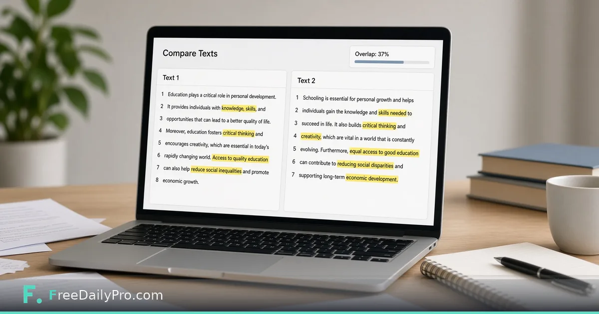

*Compare two texts you provide for overlapping phrases — not a web plagiarism database.*

[FreeDailyPro.com](https://www.freedailypro.com) -- Before you submit a draft, you may want a straight answer to a narrow question: how much do these two texts overlap? That is different from searching the entire internet for plagiarism. Confusing those jobs causes panic or false safety.

FreeDailyPro's [Text Similarity Checker](https://www.freedailypro.com/tool/text-similarity-checker) compares two texts for overlapping phrases. It is not a web-search plagiarism checker. The product description says so on purpose. You paste text A and text B. You get an overlap-oriented result for those two inputs only.

## What this tool is for

Self-check against your own earlier draft. Compare a rewrite to source notes you may paraphrase. Review marketing variants for accidental near-duplication. Check whether teammate sections collide before a combined document ships.

Students may want a private first look before a school-required service. That can be a writing aid. It is not a substitute for institutional rules, citation standards, or school databases.

## What this tool is not

It does not crawl the web. It does not contain a publisher corpus. It cannot swear a paper is original against documents it has never seen. Claims otherwise are overclaiming.

For line-by-line edits use the [Diff Checker](https://www.freedailypro.com/tool/diff-checker). For language cleanup use the [Grammar Checker](https://www.freedailypro.com/tool/grammar-checker). Separate tools for separate questions.

## How to use it honestly

Paste full sections that matter. Remove bibliographies if they inflate boring overlap. Read overlapping regions, not only the percentage. A moderate score with one copied paragraph still matters. Rewrite from understanding, not synonym roulette.

## Professional uses

Policy teams comparing versioned language. Support teams checking canned replies. Researchers checking summaries against sources. You always control both texts.

## Privacy

Pasting unpublished drafts into random plagiarism sites can store your work. FreeDailyPro's browser-oriented tooling keeps everyday text jobs closer to your device. For sensitive drafts that difference matters.

## Limits

Short texts produce unstable percentages. Translations need humans. Code and poetry differ from prose. No similarity tool replaces editors or professors. Use it for overlap between two texts you provide — nothing more.

## Practical depth that usually gets skipped

Most mistakes happen after the tool works. People close the tab without saving, send the wrong export, or trust a first result without changing one input to see sensitivity. Build a tiny habit: export, rename with a date, and re-run once with a slightly worse assumption.

If you share results with someone else, include the inputs, not only the outputs. A monthly savings number without the tuition target is trivia. A similarity percentage without the two texts is noise. A merge without the clip order is a future argument.

FreeDailyPro is designed so these jobs stay in the browser with low ceremony. That only helps if you treat the output as a work product. Save it. Label it. Move on with a clearer decision than you had before you opened the tool.

When the stakes are high, do a second pass the next morning. Fatigue makes people accept bad numbers and bad files. A second pass is cheaper than shipping a mistake.

## Practical depth that usually gets skipped

Most mistakes happen after the tool works. People close the tab without saving, send the wrong export, or trust a first result without changing one input to see sensitivity. Build a tiny habit: export, rename with a date, and re-run once with a slightly worse assumption.

If you share results with someone else, include the inputs, not only the outputs. A monthly savings number without the tuition target is trivia. A similarity percentage without the two texts is noise. A merge without the clip order is a future argument.

FreeDailyPro is designed so these jobs stay in the browser with low ceremony. That only helps if you treat the output as a work product. Save it. Label it. Move on with a clearer decision than you had before you opened the tool.

When the stakes are high, do a second pass the next morning. Fatigue makes people accept bad numbers and bad files. A second pass is cheaper than shipping a mistake.

## Practical depth that usually gets skipped

Most mistakes happen after the tool works. People close the tab without saving, send the wrong export, or trust a first result without changing one input to see sensitivity. Build a tiny habit: export, rename with a date, and re-run once with a slightly worse assumption.

If you share results with someone else, include the inputs, not only the outputs. A monthly savings number without the tuition target is trivia. A similarity percentage without the two texts is noise. A merge without the clip order is a future argument.

FreeDailyPro is designed so these jobs stay in the browser with low ceremony. That only helps if you treat the output as a work product. Save it. Label it. Move on with a clearer decision than you had before you opened the tool.

When the stakes are high, do a second pass the next morning. Fatigue makes people accept bad numbers and bad files. A second pass is cheaper than shipping a mistake.

## Practical depth that usually gets skipped

Most mistakes happen after the tool works. People close the tab without saving, send the wrong export, or trust a first result without changing one input to see sensitivity. Build a tiny habit: export, rename with a date, and re-run once with a slightly worse assumption.

If you share results with someone else, include the inputs, not only the outputs. A monthly savings number without the tuition target is trivia. A similarity percentage without the two texts is noise. A merge without the clip order is a future argument.

FreeDailyPro is designed so these jobs stay in the browser with low ceremony. That only helps if you treat the output as a work product. Save it. Label it. Move on with a clearer decision than you had before you opened the tool.

When the stakes are high, do a second pass the next morning. Fatigue makes people accept bad numbers and bad files. A second pass is cheaper than shipping a mistake.
