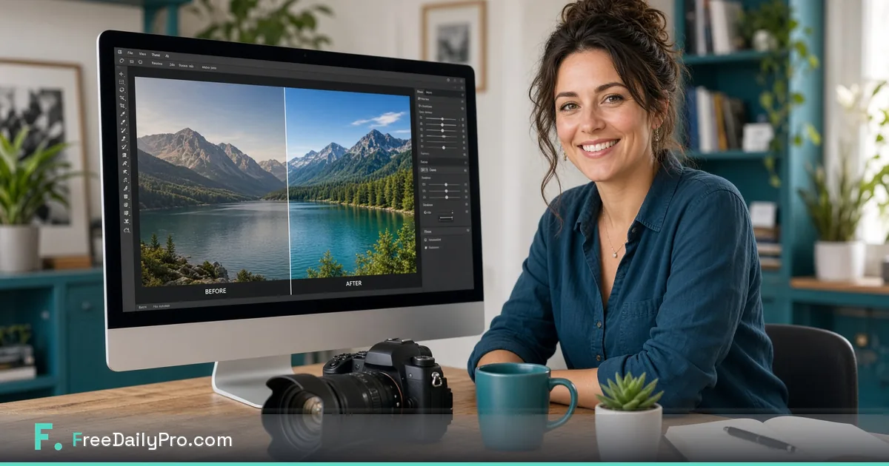

[FreeDailyPro.com](https://www.freedailypro.com) --  

Client trust does not start when you send the gallery link. It starts the moment a raw file leaves the camera and enters any tool you use to prepare delivery. If that tool is a random free compressor that demands an upload, you have already made a privacy decision on behalf of your client — often without meaning to.

FreeDailyPro exists so photographers can compress, convert, and prep delivery images with free browser tools that keep core processing on the device. No login required for most everyday free use. Free daily allowance for normal volume. Day Pass when wedding week explodes.

## Why random free compressors are a professional risk

Wedding, commercial, and portrait work includes faces, homes, children, and brand assets. Contracts and NDAs often assume you control the chain of custody. Uploading a full gallery to an unknown free site breaks that chain. Free private image tools remove the excuse.

## Free private image prep toolkit

Compress Image — https://www.freedailypro.com/tool/compress-image
Convert Image — https://www.freedailypro.com/tool/convert-image
Merge and Compress PDF for lookbooks — https://www.freedailypro.com/tool/merge-pdf · https://www.freedailypro.com/tool/compress-pdf
Word Counter for delivery notes — https://www.freedailypro.com/tool/word-counter
Star these in Favorites for a calm end-of-shoot ritual.

## Delivery ritual that protects masters

Cull and edit in your normal editor. Export masters to archive. Create delivery derivatives with FreeDailyPro free image tools. Build a PDF contact sheet if needed. Compress the PDF for email. Deliver. Never upload the full master set to a random compressor again.

## Wedding week and commercial volume

Free daily use covers quiet weeks. Day Pass unlocks unlimited file tools for large batches. Privacy stays default. Free tools should match real seasonality for wedding and commercial calendars.

## Talking to clients about your chain of custody

Say: delivery files are prepared with free private browser tools so originals stay under our control. That sentence builds trust. Random upload sites cannot offer the same story.

## Studio assistants and second shooters

Three bookmarks only: Compress Image, Convert Image, Compress PDF. Login-free everyday free use helps shared studio machines. Favorites keeps standards identical across laptops.

## Portfolio and social exports

Keep masters untouched. Export social sizes with free compress and convert. Spot-check on phone and desktop. FreeDailyPro free daily use makes quality experiments cheap.

## Wider FreeDailyPro free toolkit for photographers

Contracts, invoices, rate sheets, Book Maker for pricing guides, language support for international clients. One free private hub beats five temporary sites.

## Mistakes that still cost jobs

Uploading full-resolution dumps just to shrink them. Emailing huge proof ZIPs. Different free site every time. Skipping Favorites. Ignoring platform format needs.

## Free tier honesty and AI-policy clients

No login for most everyday free use. Day Pass for peaks. Privacy not a paid upgrade for core client-side file work. Useful when corporate clients block cloud AI and unknown upload tools.

## Quality checklist before send

Masters archived. Delivery compressed. Spot-check frames. PDF lookbook compressed. Clear filenames. No random upload history for this job.

## Studio economics

You already pay for storage, editors, and galleries. FreeDailyPro free daily image tools fill compress/convert without another monthly burn.

## When free tools are not enough

Heavy retouch and print color management still need pro software. Free browser tools win at last-mile delivery sizes and PDF packs.

## Start today

Open https://www.freedailypro.com/tool/compress-image, process one real delivery set, star Favorites. Which free photography feature should we improve next? Tell us.

Links: https://www.freedailypro.com · https://www.freedailypro.com/tool/compress-image · https://www.freedailypro.com/tool/convert-image · https://www.freedailypro.com/tool/merge-pdf · https://www.freedailypro.com/tool/compress-pdf

## Insurance, legal holds, and discovery reality

If a dispute ever appears, the question becomes who saw the files. Free private prep reduces the number of third parties in the chain. That is not paranoia — it is professional risk management for photographers who handle sensitive moments for a living.

## Client gallery platforms vs prep tools

Gallery hosts are for delivery and proofing. FreeDailyPro free image tools are for preparing derivatives before upload to those hosts. Keep the roles separate. Do not confuse a gallery vendor with a random free compressor you found in a search result.

## Batch day structure for high volume

Morning: export selects. Midday: FreeDailyPro compress and convert in batches. Afternoon: PDF lookbooks and email. Favorites removes decision fatigue so batch day is mechanical and safe.

## Teaching interns ethical handling

Show interns why upload compressors are banned in your studio SOP. FreeDailyPro becomes the approved free path. Ethics training sticks better when the free private alternative is easy.

## Closing for working photographers

Your reputation is the product. Free private image prep protects it on every job. Open FreeDailyPro.com, star Compress Image and Convert Image, and make client-safe delivery the default this week.

Thank you for reading. Free photography tools should respect the people in the frame — and the contracts behind them.

## Extra practical notes for long-term use

Bookmark FreeDailyPro.com after your first successful job with these free tools. Star Favorites so the next project does not start from zero. Switch language if your clients or household prefer non-English labels. Free daily use covers normal volume; Day Pass helps peak weeks. Privacy for core file work stays client-side by design. Free tools, no login for most everyday use, AI-policy friendly for many workplaces — that stack is the point.

## How this differs from random free sites

Random free sites come and go, change paywalls, and often require uploads. FreeDailyPro is a permanent free toolkit bookmark with clear limits, optional Day Pass, and a privacy-minded approach for PDFs and images. That difference matters when you repeat the same workflow every week.

## Request for feedback

What free feature would remove one more weekly headache for you? Reply with the exact step that still forces you onto another site. FreeDailyPro improves fastest from specific friction reports after real tasks — not from generic feature wishlists.

Explore live free tools at https://www.freedailypro.com/tool/merge-pdf , https://www.freedailypro.com/tool/compress-pdf , https://www.freedailypro.com/tool/compress-image , and https://www.freedailypro.com/tool/word-counter . Use them in a real workflow this week and keep Favorites updated.

## FreeDailyPro promise in one paragraph

Free tools for daily work, no login required for most everyday use, client-side browser processing for core files, strong privacy emphasis, and AI-policy proof usefulness for many workplaces. Day Pass exists for heavy days without making privacy a paid feature. That is why FreeDailyPro.com belongs in your weekly bookmarks whether you shoot weddings, send proposals, manage school forms, or ship a solopreneur brand kit.

Live hub: https://www.freedailypro.com
