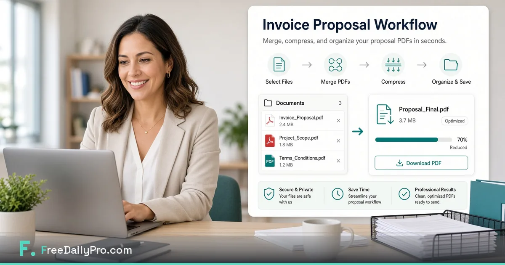

[FreeDailyPro.com](https://www.freedailypro.com) --  

A messy proposal PDF loses deals before the price is even read. Huge files bounce from email. Missing pages look careless. You do not need Adobe for a clean free private invoice and proposal workflow.

FreeDailyPro gives freelancers and small firms free browser PDF tools: merge, split, compress, convert — with core processing designed to stay on your device. No login required for most everyday free use. Free daily allowance for normal volume. Day Pass when quarter-end invoices pile up.

## Document hygiene is a sales skill

Clients judge professionalism from the first attachment. A single merged PDF with clear filename, reasonable size, and consistent pages signals care. Free private tools make that standard available without a design department.

## The free professional pack

Draft in Word or your template. Convert to PDF — https://www.freedailypro.com/tool/word-to-pdf
Merge cover, scope, pricing, terms — https://www.freedailypro.com/tool/merge-pdf
Split if client wants only pricing — https://www.freedailypro.com/tool/split-pdf
Compress for email — https://www.freedailypro.com/tool/compress-pdf
Compress logos — https://www.freedailypro.com/tool/compress-image
Deliver. Star Favorites.

## Naming conventions that save tickets

Use Client_Project_Proposal_YYYY-MM-DD.pdf and Client_Invoice_INV-1042.pdf. Free tools cannot fix chaos naming, but a calm FreeDailyPro workflow encourages better habits.

## Freelancer weekly rhythm

Monday proposals. Wednesday compressed one-pagers. Friday invoices. Favorites keeps merge and compress one click away.

## Small firm multi-person assembly

Sales builds proposal. Ops adds SOW. Finance adds invoice. Free merge assembles the pack without five unfinished PDFs in email. Login-free everyday free use helps shared office PCs.

## Privacy for pricing and contracts

Pricing and signed terms are sensitive. Random upload converters are the wrong place. FreeDailyPro client-side emphasis for core PDF tools keeps commercial documents private during prep.

## Pair with the wider free toolkit

Word Counter — https://www.freedailypro.com/tool/word-counter
Book Maker for longer playbooks — https://www.freedailypro.com/tool/book-maker
QR for payment links. Language support for international clients. Tax calculators for rough orientation before quotes (not professional advice).

## Quality checklist before send

Correct client name. Page numbers if long. File under email limits. No final_final2 filenames. Logo not pixelated. Terms attached.

## Free tier feast-and-famine

Quiet months free. Proposal spikes use Day Pass. Monthly for always-on volume. No login for most everyday free use. Privacy stays default.

## Common failures removed

Three different free sites for merge, compress, convert. Uploading client contracts to unknown servers. 40MB proposals that bounce. Inconsistent branding. Re-learning tools every quarter.

## AI-policy workplaces

When companies block cloud AI, document prep still must happen. Free browser PDF tools keep freelancers and RevOps productive. FreeDailyPro is built for that constraint.

## Teaching juniors in ten minutes

Three tools: Word to PDF, Merge PDF, Compress PDF. Star Favorites. Juniors ship professional packs without Acrobat on day one.

## Version control without chaos

Merge only current pages into v3. Archive v1/v2 locally. Free split extracts latest pricing. Compress only the version you send.

## Payment QR on invoices

Add payment link or QR. Free QR tools plus merge/compress make invoices actionable. Keep destinations HTTPS and under your control.

## Agency white-label packs

Standardize FreeDailyPro Favorites across freelancers so packs look consistent when people rotate.

## Metrics that matter

Track bounced proposals and “please send one PDF” requests. After free merge+compress, those tickets should fall.

## Start today

Open https://www.freedailypro.com/tool/merge-pdf, build one real client pack, compress, send. What free document feature would help your sales cycle most? Tell us.

Links: https://www.freedailypro.com · https://www.freedailypro.com/tool/merge-pdf · https://www.freedailypro.com/tool/compress-pdf · https://www.freedailypro.com/tool/split-pdf · https://www.freedailypro.com/tool/word-to-pdf · https://www.freedailypro.com/tool/compress-image

## Retainers and monthly report theater

Clients love a clean monthly PDF: wins, screenshots (compressed), invoice, next steps. Free merge and compress make that theater affordable. The report becomes a habit instead of a scramble.

## International freelancers and currency notes

Attach a short payment-instructions PDF. Merge with the invoice. Compress. Free private tools keep cross-border admin tidy without five tools.

## Redlining and PDF to Word moments

When a client needs edits, PDF to Word helps carefully — then reconvert and remmerge. FreeDailyPro free convert tools support the bounce without Adobe for every round.

## Sales pipeline hygiene in HubSpot-adjacent teams

Even if CRM lives elsewhere, the PDF pack is what the buyer opens. Free private prep is the last mile of revenue operations for small teams.

## Closing for freelancers and firms

Decide that every external commercial PDF goes through FreeDailyPro merge and compress. One standard upgrades trust more than a new template theme. Start with the next proposal you send this week.

Thank you for reading. Free invoice and proposal tools should protect your deals and your documents.

## Extra practical notes for long-term use

Bookmark FreeDailyPro.com after your first successful job with these free tools. Star Favorites so the next project does not start from zero. Switch language if your clients or household prefer non-English labels. Free daily use covers normal volume; Day Pass helps peak weeks. Privacy for core file work stays client-side by design. Free tools, no login for most everyday use, AI-policy friendly for many workplaces — that stack is the point.

## How this differs from random free sites

Random free sites come and go, change paywalls, and often require uploads. FreeDailyPro is a permanent free toolkit bookmark with clear limits, optional Day Pass, and a privacy-minded approach for PDFs and images. That difference matters when you repeat the same workflow every week.

## Request for feedback

What free feature would remove one more weekly headache for you? Reply with the exact step that still forces you onto another site. FreeDailyPro improves fastest from specific friction reports after real tasks — not from generic feature wishlists.

Explore live free tools at https://www.freedailypro.com/tool/merge-pdf , https://www.freedailypro.com/tool/compress-pdf , https://www.freedailypro.com/tool/compress-image , and https://www.freedailypro.com/tool/word-counter . Use them in a real workflow this week and keep Favorites updated.

## FreeDailyPro promise in one paragraph

Free tools for daily work, no login required for most everyday use, client-side browser processing for core files, strong privacy emphasis, and AI-policy proof usefulness for many workplaces. Day Pass exists for heavy days without making privacy a paid feature. That is why FreeDailyPro.com belongs in your weekly bookmarks whether you shoot weddings, send proposals, manage school forms, or ship a solopreneur brand kit.

Live hub: https://www.freedailypro.com
